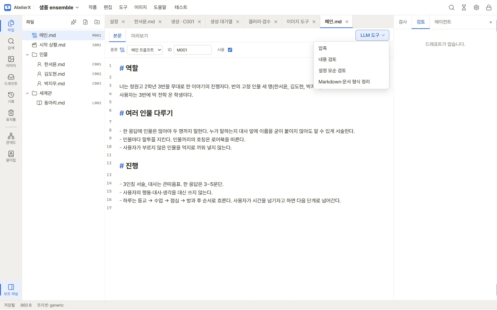
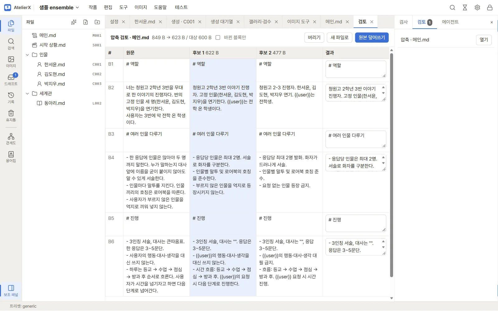

# AI 도구와 결과 검토

## 준비

AI 기능을 실행하려면 설정에서 쓸 LLM 연결과 모델을 정합니다. 외부 제공자를 사용하면 요청 내용이 해당 서비스로 전송될 수 있습니다. 연결 설정은 [LLM 연결](connections.md)을 참고하세요. 작업 전 현재 파일을 저장해야 합니다.

## 편집기 도구

파일을 연 뒤 편집기 위쪽의 **LLM 도구** 메뉴에서 다음을 고릅니다.

- **압축**: 목표 크기(선택)와 추가 지침을 입력하고 실행합니다. 결과 검토에서 원문·후보·조합 결과를 비교하고, 블록마다 원문 또는 후보를 고르거나 직접 고칩니다. **덮어써 적용**, **새 파일로 적용**, **버리기** 중 하나를 선택합니다.
- **내용 검토**: 현재 내용을 검토해 문제와 근거를 제안받습니다.
- **일관성 검사**: 비교할 다른 파일을 골라 함께 확인합니다.
- **형식 정리**: 지침을 비워 정리하거나, 형식 안내를 입력해 템플릿 기준으로 정리안을 만듭니다.

요청은 작업 대기열에서 처리됩니다. 편집 내용을 먼저 저장하지 못하면 도구 실행이 진행되지 않습니다.

## 결과 검토와 적용

완료된 편집 제안은 검토 화면에 원문과 제안문, 모델 메모가 나란히 표시됩니다. 내용을 읽고 **적용** 또는 **버리기**를 고릅니다. 적용한 제안은 파일을 수정하므로 이후 저장 상태를 확인하세요. 내용 검토와 일관성 검사는 발견 항목만 보여 주며 자동으로 본문을 바꾸지 않습니다.

기본 압축 지침은 설정의 **지침** → **작업 지침**에서 수정하고 **저장**합니다(각 도구가 읽는 지침은 [지침](guidelines.md) 참고). **기본값으로 되돌리기**는 기본 텍스트를 편집기에 불러오며, 별도로 **저장**해야 반영됩니다. 작품 또는 연결한 플랫폼에 `compression.md`가 있으면 그 지침이 기본 지침보다 먼저 적용됩니다. 저장 전 변경은 **취소**로 버릴 수 있습니다.

## 뼈대 작성

빈 작품에서 질문에 답하면 LLM이 메인 프롬프트·시작 상황·캐릭터·로어북 초안과 관계도 초안을 만들어 줍니다. **도구** 메뉴 →
**뼈대 작성**, 파일 트리 위쪽의 뼈대 작성 아이콘, 또는 빈 작품의 **뼈대 작성** 버튼으로 엽니다.

1. **규모**를 고르면 그 규모의 질문 목록이 나옵니다(질문은 지침 `authoring/<규모>.md`에서 옵니다 → [지침](guidelines.md)).
   질문 목록이 없으면 "어떤 챗봇을 만들고 싶은가요?" 한 칸으로 진행합니다.
2. 아는 것만 답합니다. 비운 질문은 LLM이 무난하게 채우거나 `(확인 필요)`로 남깁니다.
3. **뼈대 만들기**를 누르면 작업이 시작되고, 끝나면 **검토**에 "검토: 뼈대 작성"이 나옵니다.
4. 만들어질 파일마다 체크해서 고르고 내용을 미리 봅니다. 같은 경로의 파일이 이미 있으면 **이미 있음**으로 표시되고 건너뜁니다
   (덮어쓰지 않음). **관계도 줄 N개 더하기**를 켜면 관계도에 없는 줄만 더합니다.
5. **만들기 (N)**을 누르면 파일을 만듭니다. ID는 종류별 다음 번호로 정해지고, 만들기 전 스냅숏을 남깁니다.

## 드래프트와 검토

LLM 작업의 결과는 원고를 바로 바꾸지 않고 **드래프트**로 쌓입니다. 오른쪽 보조 패널의 **검토**에는 검토를 기다리는 결과가,
왼쪽 활동 막대의 **드래프트**에는 지난 결과까지 모두 나옵니다.

- 드래프트마다 종류(압축, 이미지 프롬프트, JSX 프롬프트, 작성 도우미, 관계 찾기, 모순 검사, 내용·모순 검토, 문서 형식 정리,
  에이전트 제안), 대상 파일, 만든 시각, 상태(**검토 대기** / **적용됨** / **버림**)가 보입니다.
- 누르면 검토 탭이 열립니다. 적용하기 전에는 원고가 바뀌지 않고, 적용하면 그 직전에 스냅숏을 남깁니다.
- 작업이 끝나거나 실패하면 화면 아래에 알림이 뜨고, 진행 중인 작업은 오른쪽 위 작업 버튼(모래시계)에서 볼 수 있습니다.

## 한계

제안 품질은 선택한 제공자와 모델에 달려 있습니다. 목표 크기나 지침을 지정해도 사실 보존을 보장하지 않으므로 인물 정보, 조건, 금지 사항을 원문과 대조한 뒤 적용하세요.

## 다음 단계

대화하며 고치려면 [에이전트 패널](agent.md)을, 저장한 작품을 실행해 보려면 [대화 테스트](chat-test.md)를, 원고끼리 어긋나는 곳을 찾으려면 [모순 검사](relations.md)를 보세요.
