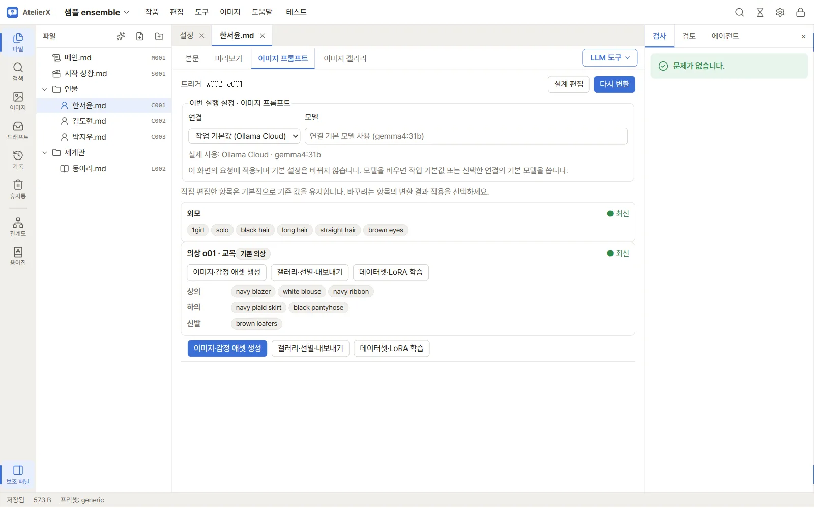
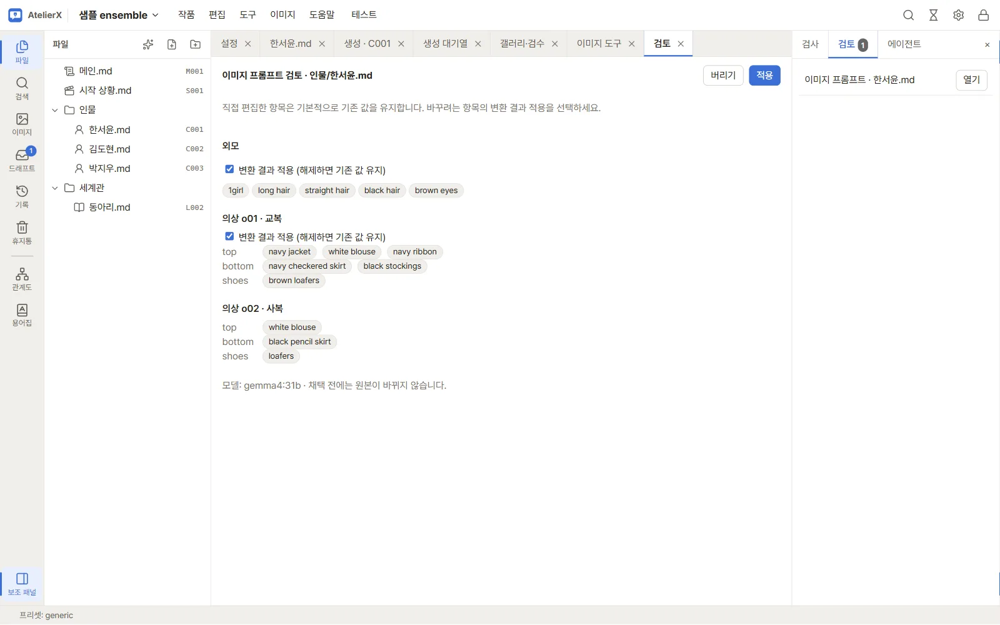
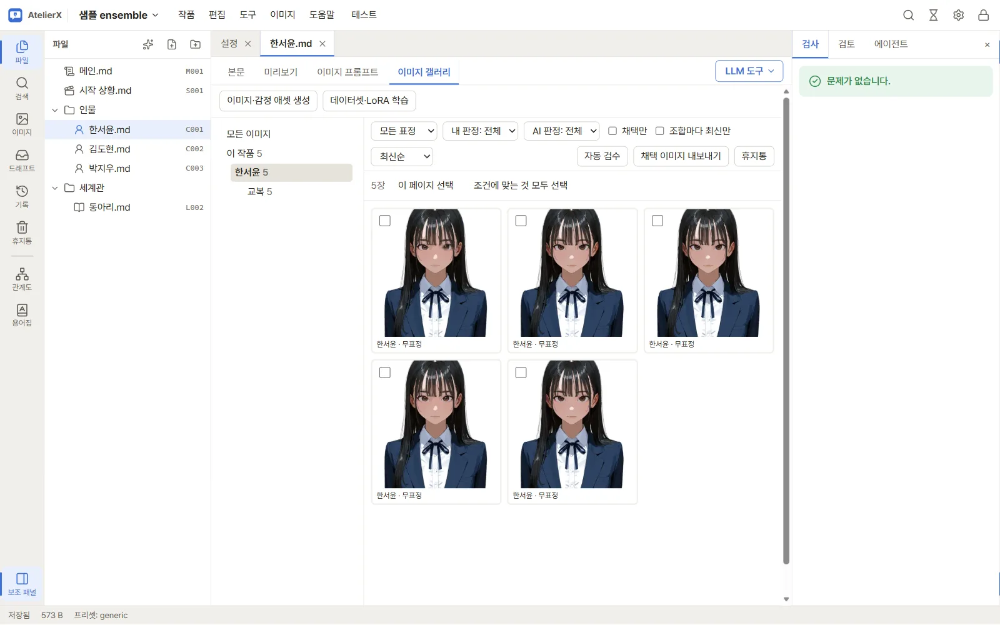

# 캐릭터 이미지 설계

## 캐릭터 항목 열기

작품의 캐릭터 파일을 열고 상단 **ID**를 확인한 다음 **이미지** 안쪽 탭으로 이동합니다. 캐릭터 ID가 없으면 이미지 설계 화면에서 연결할 수 없으므로 파일 메타데이터에 ID를 지정하고 저장하세요. 이미지 환경은 [이미지 환경 준비](image-setup.md) 페이지를 참고합니다.

## 캐릭터 문서에서 이미지 설계 만들기

캐릭터 문서에 정해진 구역(`## 외모` 등)이 없어도 됩니다. 두 가지 방법을 함께 씁니다.

- **본문 전체 변환**: 이미지 설계 화면에서 **프롬프트로 변환**(또는 **다시 변환**)을 누르면 캐릭터 문서 전체를 LLM에 보내 외모와 의상을 찾게 합니다. 처음에 한꺼번에 만들 때 씁니다. 이 인물의 지금 모습만 쓰고, 다른 인물·과거·가정은 뺍니다. 이미 있는 의상과 같은 옷이면 같은 이름으로 짝지어 갱신하고, 새 옷만 새 의상이 됩니다.
- **범위 지정 변환**: 본문에서 글을 고르고 우클릭(또는 **Alt+P**) → **이미지 프롬프트로** → **외모**, **의상**(기존 의상 또는 **새 의상…**), **외모에 범위 추가**를 고릅니다. 고른 글만 그 부분의 태그로 바꿉니다. 틀린 부분을 정확히 고칠 때 씁니다. 외모 묘사가 여러 문단에 흩어져 있으면 **외모에 범위 추가**로 조각을 더합니다(이전 조각과 함께 다시 바꿉니다). 저장하지 않은 글은 먼저 저장합니다.

어느 쪽이든 결과는 검토 화면에 나옵니다. 부분마다 태그와 **원문**(근거가 된 본문 문장, 또는 고른 범위)을 펼쳐 보고, 의상에는 **갱신**/**새 의상**이 표시됩니다. 항목별 **변환 결과 적용** 선택을 확인한 뒤 **적용**을 누르면 `design.json`에 저장됩니다. **버리기**를 누르면 적용하지 않습니다.

이 기능은 캐릭터 문서의 외모·의상 설명을 이미지 생성용 태그로 제안하는 기능입니다. 아래의 **프롬프트 문법 변환**과는 다른 도구입니다.

## 외모와 의상

이미지 설계 화면에서 **설계 편집**을 눌러 외모 태그를 편집하고 의상 항목을 추가해 이름·**배포 코드**·슬롯별 태그·제외 태그를 관리합니다. 배포 코드는 채택 이미지를 배포 대상에 올릴 때 의상 자리에 쓰는 코드입니다(예: `uniform`, `01`). 같은 캐릭터의 다른 의상과 같은 코드를 쓰면 알려 주고, 코드를 바꿔도 원문과의 연결(**최신** 표시)은 유지됩니다. 쉼표나 줄바꿈으로 태그를 나눕니다. 괄호로 묶은 가중치 `(…:1.2)` 안의 쉼표에서는 나누지 않습니다. 의상 변경은 **저장**을 눌러야 반영됩니다. 삭제 확인이 표시되면 해당 의상 ID를 참조하는 이미지 데이터가 필요한지 먼저 살펴보세요. 표정 항목은 이미지 라이브러리에서 따로 관리합니다.

변환 제안은 원본 캐릭터 문서를 바꾸지 않습니다. 이미 변환한 설계에서는 검토 화면에 **변환 결과 적용** 선택 항목이 나타납니다. 선택을 해제하면 기존 설계 값을 유지하고, 선택하면 그 항목을 새 제안으로 바꿉니다. 직접 고친 항목과 범위 지정으로 만든 항목은 본문 전체를 다시 변환해도 처음에는 해제되어 있어 그대로 남습니다.

적용 후 각 부분 옆에 상태가 표시됩니다.

| 상태 | 뜻 |
|---|---|
| **최신** | 원문 조각이 모두 본문에 그대로 있습니다. 관계없는 문단을 고치거나 줄바꿈만 바꾼 것은 최신입니다 |
| **원문 변경됨** | 원문 조각 일부가 바뀌었거나 사라졌습니다. 그 글을 골라 범위 지정으로 다시 바꾸거나 직접 고치세요 |
| **직접 수정** | 설계 편집으로 고친 부분입니다 |
| **근거 없음** | 변환 결과가 본문 문장을 그대로 옮기지 않아 원문을 확인할 수 없습니다 |
| **연결 끊김** | 0.3.0 전에 변환한 설계에서 원문 구역을 찾지 못했습니다. 다시 변환하면 새 방식이 됩니다 |

## 프롬프트 문법 변환

이미지 메뉴의 **도구** 화면에서 **프롬프트 형식** 탭을 열면 NovelAI V4.5, Anima, SDXL 사이의 기존 프롬프트 문법을 변환할 수 있습니다. 원본·대상 형식을 고르고 **변환**을 누른 뒤 변경 목록과 경고를 확인합니다. 인식한 가중치·작가 표기만 바뀌며, 일반 문장·태그 순서·모르는 표기는 그대로 남을 수 있습니다. 결과를 복사하거나 지원되는 생성 화면으로 보냅니다. 이 도구는 캐릭터 문서를 읽거나 `design.json`을 만들지 않습니다.

## 갤러리 탭

캐릭터 파일의 **갤러리** 탭에서는 해당 캐릭터의 이미지 기록을 보고 생성 화면, LoRA 또는 이미지 도구로 이동할 수 있습니다. 실제 생성에는 연결된 이미지 서버와 모델이 필요합니다. [이미지 생성](generation.md)에서 옵션을 설정하세요.

## 다음 단계

[이미지 생성](generation.md)에서 등록한 외모·의상을 사용해 이미지를 만드세요.
