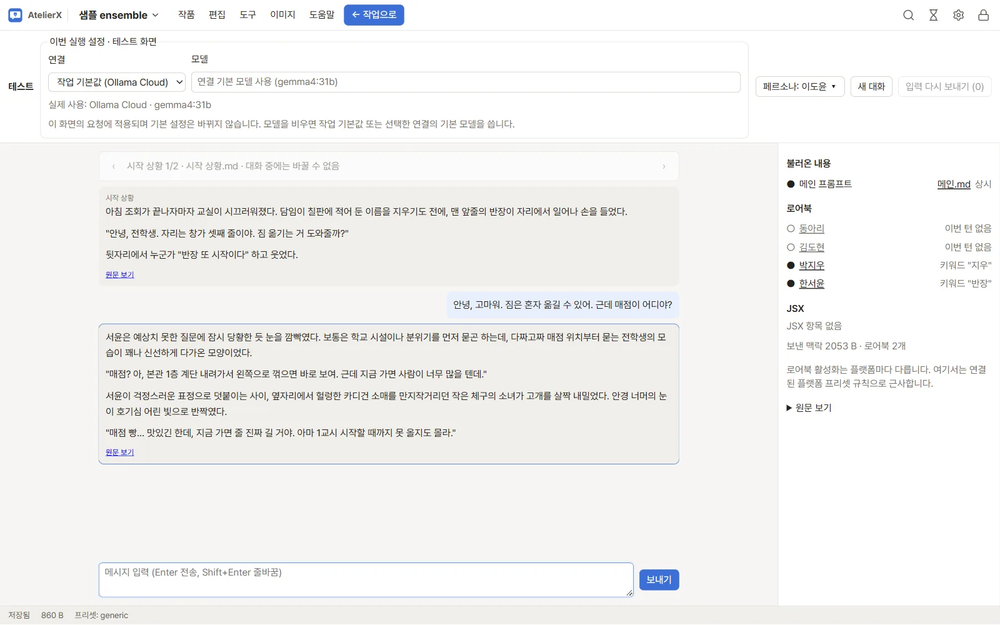
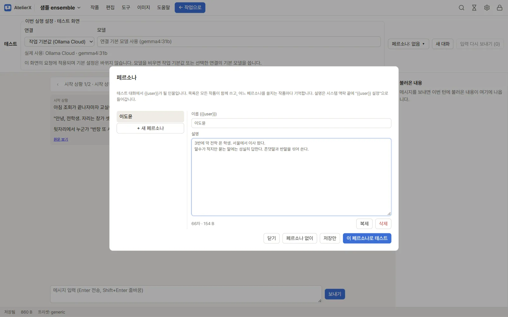

# 대화 테스트

## 준비

작품에 메인 프롬프트와 테스트할 시작 상황을 작성하고, 필요한 로어북 항목의 키워드·사용 여부를 확인합니다. 설정의 LLM 연결에서 **대화 테스트** 작업에 사용할 제공자와 모델을 지정합니다. 외부 제공자를 선택하면 대화 내용이 외부로 전송됩니다.

## 테스트 시작

1. 작품 화면 상단의 **테스트**를 누릅니다.
2. 시작 상황 선택 화면이 나오면 대화에 사용할 항목을 고릅니다. 메인 프롬프트는 항상 포함되고, 로어북은 입력과 키워드가 맞는 항목을 기준으로 구성됩니다.
3. 화면에 표시되는 맥락과 호출된 항목을 확인한 뒤 메시지를 입력해 보냅니다.
4. 응답이 나오면 이어서 대화하거나 해당 입력을 고쳐 다시 보냅니다.
5. **← 작업으로**를 눌러 편집 화면으로 돌아갑니다.

## 페르소나

테스트에서 `{{user}}`가 될 인물은 위쪽 막대의 **페르소나: … ▾** 버튼으로 정합니다.

1. 버튼을 누르면 페르소나 창이 열립니다. **새 페르소나**를 누르고 이름과 설명을 씁니다. 설명은 여러 줄로 쓸 수 있습니다.
2. **이 페르소나로 테스트**를 누르면 목록이 저장되고 이 작품의 테스트에 쓰입니다. **페르소나 없이**를 고를 수도 있습니다.
3. 목록은 모든 작품이 함께 씁니다. 어느 페르소나를 쓸지는 작품마다 기억합니다.

이름은 대화의 `{{user}}` 자리에 들어가고, 설명은 시스템 맥락 끝에 `{{user}} 설정` 절로 들어갑니다. 페르소나는 테스트에만 쓰고 내보내기에는 들어가지 않습니다.

## 테스트 세트로 바꾸기 전후 비교하기

같은 질문으로 원고나 모델을 바꾸기 전후의 응답을 비교하려면 **테스트 세트**를 씁니다.

1. 테스트 화면에서 몇 번 대화한 뒤 위쪽 **테스트 세트** → **지금 대화로 새 세트**를 누르면 보낸 입력, 지금의 시작 상황과 페르소나로 세트가 만들어집니다. 이름을 붙이고 입력을 고친 뒤 **저장**합니다. **빈 세트**로 처음부터 쓸 수도 있습니다.
2. 세트의 **실행**을 누르면 입력 수를 확인한 뒤 대화를 새로 시작해 입력을 차례로 보냅니다. 외부 연결이면 입력 수만큼 요청이 나갑니다. **중지**를 누르면 남은 입력은 보내지 않습니다.
3. 원고나 모델을 바꾼 뒤 다시 **실행**합니다. 실행마다 쓴 모델과 원고 시점(스냅숏)이 기록됩니다.
4. **기록**에서 실행 두 개를 고르고 **나란히 비교**를 누르면 입력마다 두 응답이 나란히 보입니다. 점수는 매기지 않습니다.

## 결과 해석

테스트는 작품의 현재 파일 내용을 바탕으로 요청을 구성합니다. 사용자·캐릭터 참조는 테스트 맥락에서 치환될 수 있지만 내보낸 파일은 원래 참조 표현을 유지합니다. 응답 생성은 설정한 모델에 따라 다릅니다. 실제 연결과 모델이 준비되어 있지 않으면 응답이 나오지 않습니다.

플랫폼 프리셋이 작품에 연결되어 있으면 관련 규칙을 참고 정보로 확인할 수 있습니다. 플랫폼별 길이·규칙 검사는 별도 결과를 확인해야 합니다. [플랫폼 프리셋](platforms.md) 안내도 함께 참고하세요.

## 문제 해결

요청이 실패하면 설정에서 제공자 주소, 인증 정보, 기본 모델을 확인하고 **모델 목록** 또는 **응답 테스트**을 실행합니다. 응답이 비어 있거나 예상과 다르면 작업별 모델 설정, 메인 프롬프트, 시작 상황, 선택된 로어북 항목을 각각 살펴보세요.

## 다음 단계

[LLM 연결](connections.md)을 점검하거나 [AI 도구](ai-tools.md)로 프롬프트 내용을 검토하세요.
