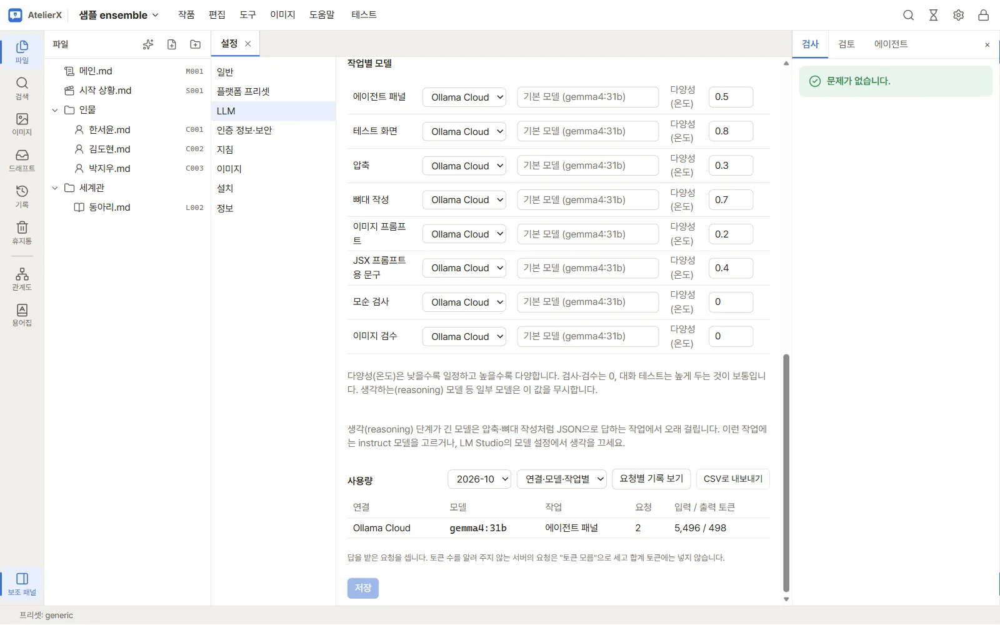
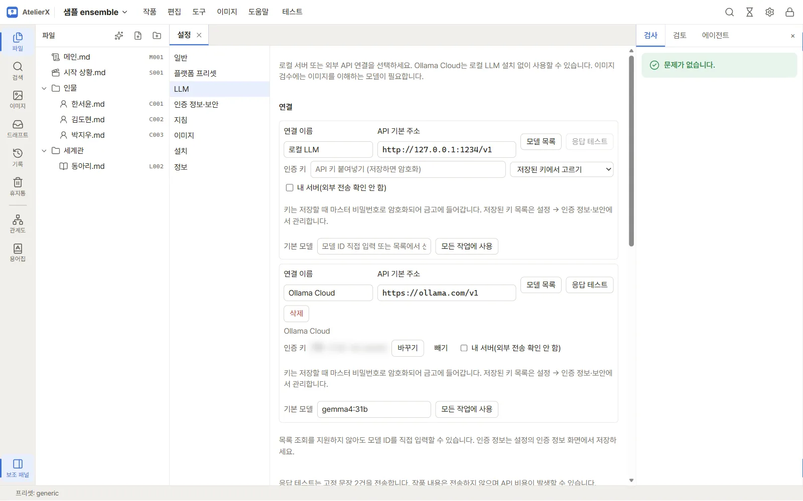

# LLM 연결

## 제공자 추가

작품 화면 상단의 설정에서 **LLM** 화면을 엽니다. 기본 로컬 연결을 수정하거나 제공자 프리셋을 선택하고 **연결 추가**를 누릅니다. 제공자는 Ollama Cloud, Google Gemini API (AI Studio), Google Vertex AI (OAuth), OpenRouter, DeepSeek, OpenAI-compatible을 지원합니다. 프리셋은 연결 설정을 시작하는 값이며 서비스 계정이나 접근 권한은 별도로 준비해야 합니다.

일반 호환 연결은 서비스의 API 주소, 인증 정보, 기본 모델을 입력합니다. 인증 값은 화면의 안내에 따라 설정 → API 키·인증 정보에 저장한 뒤 연결 화면에서 선택합니다. Vertex AI는 프로젝트 ID와 위치를 입력해 주소를 구성하고 Vertex OAuth 액세스 토큰을 인증 정보로 넣습니다. 토큰 만료 시 직접 갱신해야 합니다. 자동 갱신, Express API 키, 서비스 계정 JSON은 지원하지 않습니다. 모델 ID는 `google/모델ID` 형식입니다.

## 입력값

| 항목 | 입력 방법 |
|---|---|
| 연결 이름 | 구분하기 쉬운 이름. 예: 개인 Gemini |
| API 기본 주소 | 프리셋 기본값을 사용하거나 호환 서버의 기본 주소 입력 |
| 인증 정보 | 별도로 저장한 키 이름 선택. Vertex는 OAuth 액세스 토큰 |
| 기본 모델 | 해당 계정에서 사용할 수 있는 모델 ID. 목록 조회 없이 직접 입력 가능 |
| Vertex 프로젝트 ID·리전 | Google Cloud 프로젝트 ID와 `global` 또는 모델이 제공되는 리전 |

Gemini API는 AI Studio API 키, Vertex는 Google Cloud OAuth 토큰을 사용합니다. 서로 바꿔 사용할 수 없습니다. 새 연결은 외부 전송 동의가 필요한 상태로 생성됩니다.

## 이 PC의 GPU 사용

연결 카드의 **이 PC의 GPU 사용**은 그 연결의 모델이 이미지 생성과 같은 GPU에서 도는지 정합니다. 주소가 이 PC(`127.0.0.1`, `localhost`)면 기본으로 켜집니다.

- 켜진 연결의 요청은 진행 중인 이미지가 끝난 뒤 시작하고, 응답이 끝날 때까지 새 이미지·VLM 검수·LoRA 학습은 기다립니다. 기다리는 동안 대화 테스트와 에이전트 패널에 **GPU를 기다리는 중**과 무엇을 기다리는지가 보입니다.
- 같은 네트워크의 다른 PC에서 도는 서버라면 끕니다. 이 PC의 GPU를 쓰는데 주소가 다르면(예: 다른 이름으로 연결) 켭니다.
- 꺼진 연결(외부 서비스 등)은 GPU를 기다리지 않고, 설정의 동시 요청 수(기본 2개)만큼 함께 보냅니다.

## 연결 확인

변경 사항이 있으면 먼저 **저장**합니다. 그 뒤 **모델 목록**으로 모델 카탈로그를 조회하고, 기본 모델을 지정하고 다시 저장한 다음 **응답 테스트**를 눌러 합성 응답 요청을 확인합니다. 모델 목록 조회는 제공자마다 지원 방식이 다를 수 있습니다. Vertex AI에서는 카탈로그 자동 조회가 아니라 수동 모델 지정 안내가 표시됩니다.

응답 테스트는 작품 내용 없이 고정 문장 2건으로 일반 응답과 스트리밍을 확인하며 API 비용이 발생할 수 있습니다. 성공하면 **일반 응답 · 스트리밍 정상**이 표시됩니다. 목록 조회 성공만으로 생성 권한이나 모든 모델 호환이 확인되지는 않습니다.

## 작업별 기본 모델

화면 하단의 작업 표에서 대화 테스트, 압축, 작성, 이미지 프롬프트, JSX 프롬프트, 일관성, 이미지 검수 작업마다 제공자와 모델을 선택합니다. 모델 칸을 비워 두면 제공자의 기본 모델을 씁니다. 연결 카드의 **모든 작업에 사용**은 그 연결을 전체 작업에 지정합니다. 마지막에 **저장**을 눌러 변경 내용을 보존합니다.

## 실행할 때 연결 바꾸기

편집기의 LLM 도구, 캐릭터 이미지 프롬프트 변환, 뼈대 작성, 관계 추출·일관성 검사, JSX 프롬프트 창과 대화 테스트 화면에서 **이번 실행 설정**을 선택할 수 있습니다.

1. 처음에는 **작업 기본값**으로 해당 작업에 저장된 연결과 모델을 사용합니다.
2. 다른 연결을 선택하면 그 연결의 기본 모델로 바뀝니다. 모델 ID를 직접 입력해 지정할 수도 있습니다.
3. 표시된 연결·모델을 확인한 뒤 실행합니다. 선택은 이 화면의 요청에만 적용되며 설정의 작업별 기본값을 바꾸지 않습니다.
4. 기본 설정으로 돌아가려면 연결에서 **작업 기본값**을 다시 선택합니다.

대화 테스트에서는 화면에서 고른 모델을 이후 메시지와 입력 다시 보내기에 사용합니다. 기존 대화 기록은 유지되므로 같은 입력을 비교하려면 대화를 초기화한 뒤 다시 보내세요. 응답 중에는 선택을 변경할 수 없습니다.

외부 연결은 선택한 작업의 입력과 문맥을 서비스로 보낼 수 있습니다. 제공자의 데이터 정책과 요금을 확인하고 사용하세요. 사용량 영역에는 월별 요청·입출력 토큰 집계가 나타날 수 있습니다.

이미지 자동 검수가 켜져 있으면 이미지 생성 화면에도 검수용 선택기가 표시됩니다. 이 선택은 생성된 이미지를 평가할 LLM을 정하며, 그림을 만드는 체크포인트·LoRA 설정과는 별개입니다. 갤러리의 수동 통과·실패 표시는 LLM을 호출하지 않습니다.

## 다음 단계

[대화 테스트](chat-test.md)를 실행하거나, 이미지 기능이라면 [이미지 환경 준비](image-setup.md)를 확인하세요.
