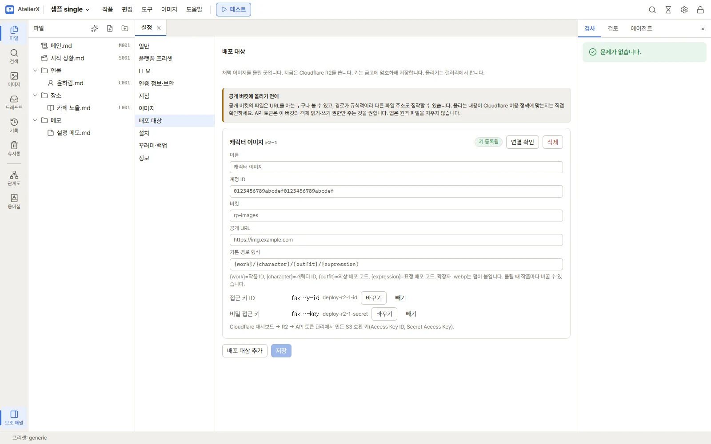
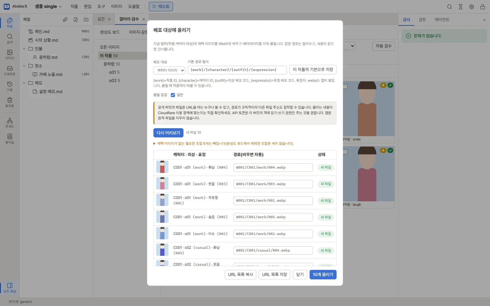
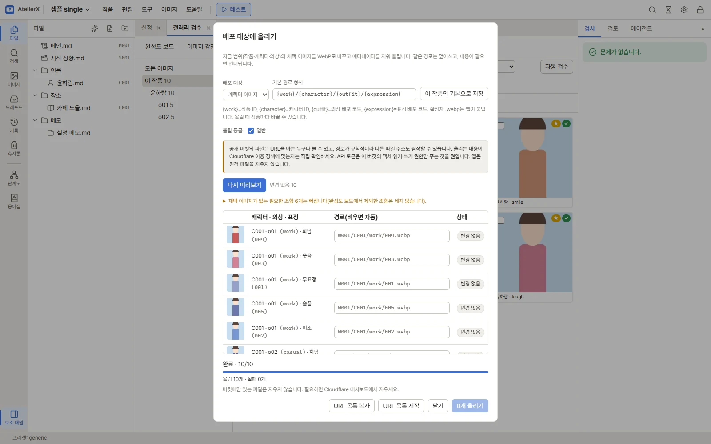

# 배포 대상에 올리기

채택한 캐릭터 이미지를 Cloudflare R2 버킷에 올려, 챗봇 플랫폼에서 쓸 URL을 얻습니다. 챗봇 작업의 마지막 단계입니다. 앱은 URL
목록만 만들어 주고, 그 URL을 프롬프트·로어북·JSX에 넣는 것은 직접 합니다.

## 준비

### 1. R2 버킷과 키

Cloudflare 대시보드에서 합니다.

1. **R2**에서 버킷을 만듭니다.
2. 이미지를 공개하려면 버킷에 **사용자 도메인**을 연결합니다(예: `img.example.com`). `r2.dev` 공개 주소도 쓸 수 있지만, 개발용이라
   속도 제한이 있고 캐시 지우기(Purge)를 쓸 수 없습니다.
3. **R2 → API 토큰 관리**에서 S3 호환 API 토큰을 만들고 **Access Key ID**와 **Secret Access Key**를 복사합니다. 권한은 이 버킷의
   객체 읽기·쓰기만 주기를 권합니다.
4. 대시보드에 보이는 **계정 ID**를 확인합니다.

### 2. 설정 → 배포 대상

1. 오른쪽 위 설정 → **배포 대상** → **배포 대상 추가**.
2. **이름**, **계정 ID**, **버킷**, **공개 URL**(사용자 도메인 또는 r2.dev 주소)을 적습니다.
3. **기본 경로 형식**: 올린 파일의 경로입니다. 기본은 `{work}/{character}/{outfit}/{expression}`이고 확장자 `.webp`는 앱이
   붙입니다.
   - `{work}` 작품 ID(`W001`), `{character}` 캐릭터 ID(`C001`), `{outfit}` 의상 배포 코드, `{expression}` 표정 배포 코드.
   - 예: `W001/C001/casual/002.webp`. 고정 폴더를 앞에 붙일 수도 있습니다(`chat/{character}/{expression}`).
4. **접근 키 ID**와 **비밀 접근 키**를 입력하고 **저장**합니다. 키는 금고에 암호화해 저장하고 설정 파일에는 남지 않습니다.
5. **연결 확인**을 누릅니다. 버킷을 읽을 수 있으면 성공입니다. 실패하면 원인(키 거절, 권한 없음, 버킷 없음, PC 시계 어긋남)을
   알려 줍니다.

### 3. 배포 코드

경로의 의상·표정 자리에는 **배포 코드**가 들어갑니다.

- **표정**: 프롬프트 라이브러리 → 표정에서 정합니다. 기본 표정은 `001`~`008`을 갖고 있습니다. → [프롬프트 라이브러리](image-library.md)
- **의상**: 캐릭터 문서의 이미지 프롬프트 탭 → **설계 편집** → 의상의 **배포 코드**. → [캐릭터 이미지](character-images.md)

자릿수·문자 종류 제한은 없고(`/ \ : * ? " < > |`만 불가), 같은 코드도 쓸 수 있습니다. 같은 경로가 되면 올릴 때 충돌로 알려 줍니다.

## 올리기

1. **이미지 → 갤러리·검수**에서 왼쪽 트리로 범위(작품, 캐릭터, 의상)를 고르고 **배포 대상에 올리기**를 누릅니다.
2. **배포 대상**과 **경로 형식**을 확인합니다. 이 작품만 다른 형식을 쓰려면 고친 뒤 **이 작품의 기본으로 저장**을 누릅니다.
3. **올릴 등급**: 기본은 모든 등급입니다. 빼고 싶은 등급의 체크를 끕니다.
4. **미리보기**를 누릅니다. 채택 이미지마다 경로와 상태가 나옵니다.

| 상태 | 뜻 |
|---|---|
| 새 파일 | 버킷에 없는 경로. 올립니다 |
| 덮어쓰기 | 같은 경로에 다른 파일이 있음. 덮어씁니다(URL은 그대로) |
| 변경 없음 | 같은 경로에 같은 파일이 있음. 건너뜁니다 |
| 코드 없음 | 의상·표정 배포 코드가 비어 경로를 만들 수 없음. 올리지 않습니다 |
| 경로 충돌 | 다른 이미지와 같은 경로. 올리지 않습니다 |

- **경로** 칸에 직접 적으면 그 이미지만 다른 경로로 올립니다. 고친 뒤 **다시 미리보기**로 상태를 확인하세요.
- 채택 이미지가 없는 필요한 조합은 경고로만 알려 줍니다(완성도 보드에서 제외한 조합은 세지 않음).
5. **N개 올리기**를 누릅니다. 새 파일과 덮어쓰기만 올리고, 진행률이 나오며 취소할 수 있습니다. 상단 작업 패널에도 보입니다.

6. 결과에서 성공·실패 수를 확인합니다. 실패한 파일은 원인이 나오고 **실패한 것만 다시 올리기**로 다시 보냅니다.
7. **URL 목록 복사** 또는 **URL 목록 저장**으로 URL을 가져가 프롬프트·로어북·JSX에 넣습니다.

올리는 파일은 WebP(품질 95)로 바꾸고 프롬프트·워크플로 메타데이터를 지웁니다. 크기는 그대로입니다.

## 다시 올리기와 캐시

이미지를 다시 채택했거나 후처리했다면 같은 순서로 다시 올립니다. 같은 경로에 덮어쓰므로 이미 넣은 URL을 고칠 필요가 없습니다.
다만 Cloudflare가 예전 이미지를 캐시하고 있으면 한동안 옛 이미지가 보일 수 있습니다. 결과 화면에 덮어쓴 URL이 나오니, 바뀌지
않아 보이면 Cloudflare 대시보드의 **Caching → Purge Cache → Custom Purge**에 그 URL을 넣어 캐시를 지우세요.

## 주의

- 공개 버킷의 파일은 URL을 아는 누구나 볼 수 있습니다. 경로가 규칙적이라 다른 이미지의 주소도 짐작할 수 있습니다.
- 올리는 이미지가 Cloudflare 이용 정책에 맞는지는 직접 확인하세요.
- 앱은 버킷의 파일을 지우지 않습니다. 경로를 바꿔 다시 올리면 옛 파일은 남으므로, 필요하면 Cloudflare 대시보드에서 지우세요.
- 실제 R2 연결은 사용자 계정으로만 확인할 수 있습니다. 문제가 있으면 [유지 관리와 문제 해결](maintenance.md)의 안내에 따라 제보해 주세요.
