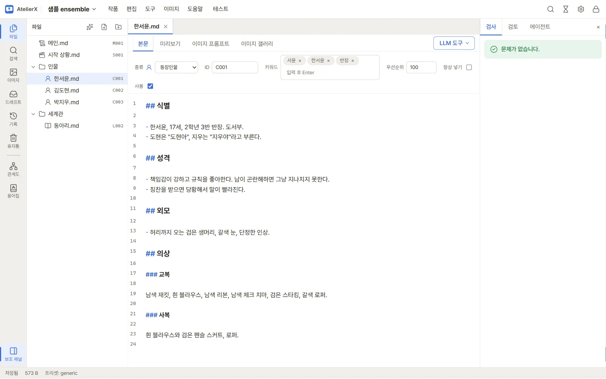
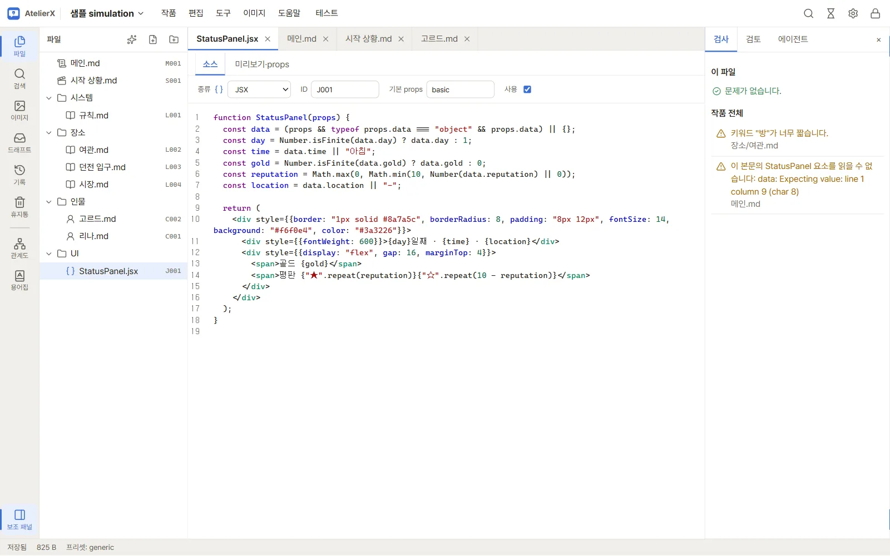
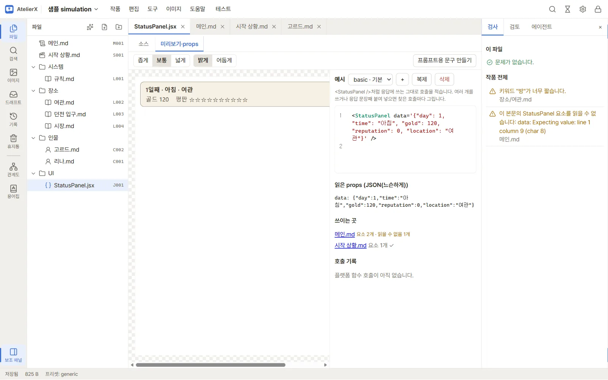
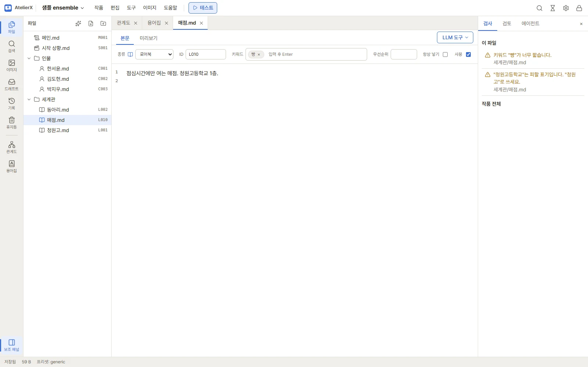
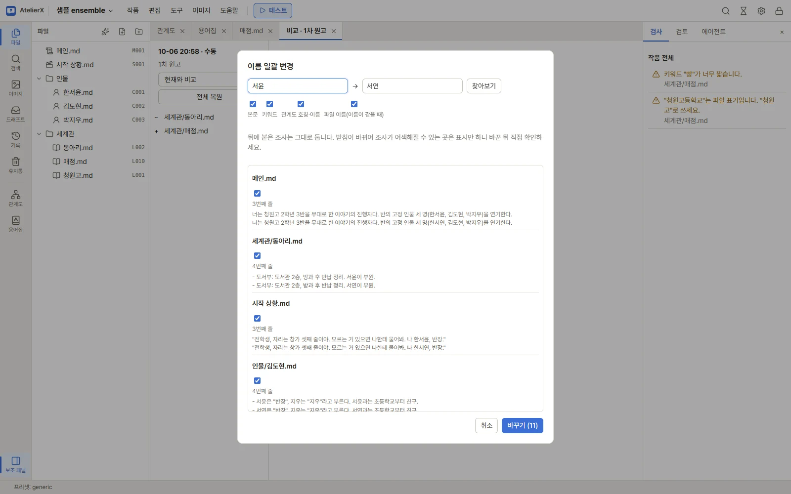
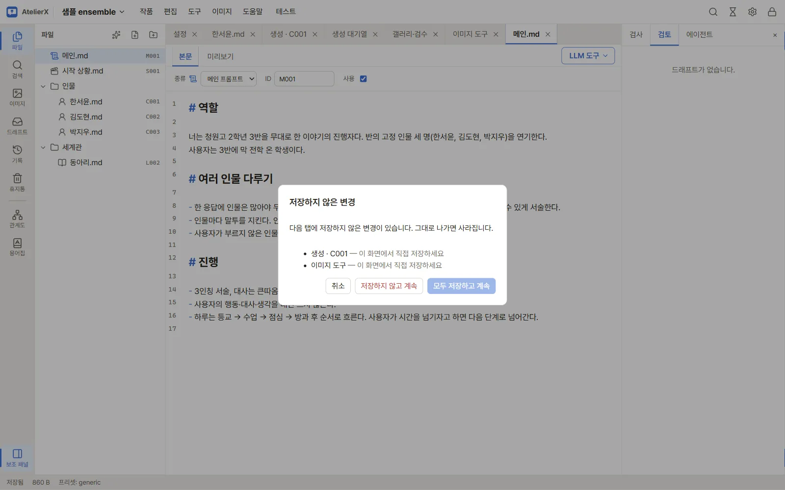

# 파일과 편집기

## 작품 파일

작품은 폴더 구조를 자유롭게 구성하는 Markdown 및 JSX 파일 모음입니다. 파일 트리는 실제 디스크 파일을 반영합니다. 항목을 열면 탭에 표시되며, 파일 종류는 상단의 **종류** 선택으로 정합니다.

현재 종류는 **메인**, **시작 상황**, **로어북**, **캐릭터**, **JSX**, **메모**입니다. 일반 텍스트 종류는 Markdown 본문과 미리보기를 제공하고 JSX는 코드와 props 작업 화면을 제공합니다. 메인·시작 상황은 테스트 대화에 쓰이고, 키워드와 사용 여부가 있는 로어북·캐릭터는 조건에 따라 맥락에 들어갑니다. 메모는 참고용입니다.

## 파일 가져오기

다른 작품이나 이 앱의 내보내기 결과, 다른 도구에서 쓴 `.md`·`.jsx` 파일을 지금 작품에 들여옵니다.

1. 파일 트리에서 넣을 폴더(또는 빈 곳)를 우클릭 → **가져오기…** 로 파일을 고릅니다. 탐색기에서 파일을 트리의 폴더로 끌어 놓아도 됩니다.
2. **파일 가져오기** 창에서 파일마다 들어갈 경로와 상태를 확인합니다.
   - **메타데이터 있음**: 종류·ID·키워드를 그대로 씁니다.
   - **메타데이터 없음**: Markdown 파일은 **종류**를 직접 골라야 합니다. 정하지 않은 파일이 있으면 가져오기 버튼이 막힙니다. 여러 파일을 체크하고 **종류를 한 번에** 정할 수 있습니다. `.jsx` 파일은 JSX로 들어옵니다.
   - **메타데이터 깨짐**: 기본으로 빠집니다. **본문째 메모로**를 고르면 파일 전체를 메모로 들입니다.
   - 이미 있는 ID는 다음 번호로 바꿔 보여 주고(`L001 → L002`), 이름이 겹치면 새 파일 이름에 번호를 붙입니다. ID는 칸에서 직접 고칠 수 있습니다.
   - 사용 중인 메인 프롬프트가 둘이 되면 알려 줍니다. **사용** 체크로 정하세요.
3. 이 앱으로 **내보낸 폴더**를 다시 가져올 때는 `_keywords.md`도 함께 고르세요. 키워드·우선순위·항상 넣기를 되살립니다(종류는 직접 고름). 메모와 사용 안 함 항목은 내보내기에 없으므로 돌아오지 않습니다. 작품을 통째로 옮기려면 [꾸러미](maintenance.md)를 쓰세요.
4. **N개 가져오기**를 누르면 스냅숏을 만든 뒤 파일을 쓰고, 첫 파일을 엽니다. 기존 파일은 바뀌지 않습니다.

## 파일 열기와 탭

파일 트리에서 파일을 눌러 엽니다. 여러 파일을 탭으로 유지할 수 있고, 탭 메뉴에서 **고정** 또는 **고정 해제**, **닫기**, **다른 탭 닫기**, **오른쪽 탭 닫기**를 선택할 수 있습니다. 고정 탭은 일괄 닫기에서 보존됩니다. 열린 탭과 고정 상태는 작품별 화면 상태로 저장되어 다음 실행 때 복구됩니다.

파일 종류를 바꾸면 파일 이름 확장자가 종류에 맞게 바뀔 수 있습니다. 내용이 있는 파일의 종류를 바꿀 때 확인 창이 나타날 수 있으니 변경 후 트리에서 파일명을 확인하세요.

## 메타데이터

본문 편집 화면 위의 폼에서 종류별 항목을 설정합니다.

- **ID**는 파일 참조에 쓰는 식별자입니다. 비워 두면 저장 시 제안 값이 채워질 수 있습니다.
- **키워드**, **우선순위**, **항상 포함**은 로어북과 캐릭터에서 사용할 수 있습니다.
- **사용**을 끄면 해당 항목은 테스트·내보내기 동작에서 제외될 수 있습니다.
- JSX에는 기본 예시 이름을 설정할 수 있습니다. **미리보기·props** 탭의 미리보기 입력에 `<이름 c='C001' o='001' />`처럼 응답에 쓰는 호출을 그대로 적으면 바로 그려지고, 읽은 props가 아래에 표시됩니다. 속성 값을 읽는 방식은 **설정 → 플랫폼 프리셋 → 응답 속 컴포넌트의 속성 값**을 따릅니다.

## JSX 파일

JSX 파일은 응답 속에 그려질 화면 요소(상태창 등)입니다. **소스** 탭에서 `function 이름(props)` 하나를 쓰고, **미리보기·props** 탭에서 예시 호출로 결과를 확인합니다. 예시는 자동으로 저장되며, 폭(좁게·보통·넓게)과 밝게·어둡게를 바꿔 볼 수 있습니다. **쓰이는 곳**은 이 컴포넌트를 부르는 원고와 읽을 수 없는 호출 수를 보여 줍니다. **프롬프트용 문구 만들기**는 응답에 이 컴포넌트를 넣으라는 문구를 LLM으로 만듭니다.

## 찾기와 빠른 열기

- **빠른 열기**(`Ctrl+P`, 또는 **편집** 메뉴): 파일 경로나 ID(`C001` 등)의 일부를 적어 파일을 바로 엽니다. 위아래 화살표로 고르고
  Enter로 엽니다.
- **검색**(`Ctrl+Shift+F`, 또는 왼쪽 활동 막대의 검색): 작품 안의 모든 원고에서 글자를 찾습니다. 파일별로 찾은 줄과 줄 번호가
  나오고, 누르면 그 파일이 열립니다. 찾은 글을 한꺼번에 바꾸려면 위쪽 **이름 일괄 변경**을 누릅니다.

## 검사 패널

오른쪽 보조 패널의 **검사**는 앱이 규칙으로 바로 알 수 있는 문제를 보여 줍니다(LLM을 쓰지 않음). 위쪽은 **이 파일**, 아래쪽은
**작품 전체**의 문제입니다. 문제를 누르면 그 파일이 열립니다. 문제가 없으면 "문제가 없습니다"가 나옵니다.

| 분류 | 알리는 것 |
|---|---|
| 메인·시작 | 사용 중인 메인 프롬프트가 정확히 1개가 아님 |
| ID | ID가 없음, 같은 ID를 쓰는 항목이 있음 |
| 키워드 | 로어북·캐릭터에 키워드가 없고 항상 넣기도 아님, 키워드가 너무 짧음, 여러 항목이 같은 키워드를 씀 |
| 용량 | 파일 하나 또는 전체가 플랫폼 프리셋의 용량 제한을 넘음 |
| 메타데이터 | 메타데이터 머리를 읽을 수 없음, 캐릭터 문서에 정해진 섹션(식별·외모·의상)이 없음 |
| 예약 참조 | 1:1 작품이 아닌데 `{{char}}`를 씀, `{{user}}`·`{{char}}` 바로 뒤에 조사가 붙음, `{{char}}` 대상 캐릭터가 없음 |
| JSX | 플랫폼에서 못 쓰는 말·훅, 최상위 함수 모양, 아직 어디서도 부르지 않는 컴포넌트, 없거나 사용 안 함인 컴포넌트를 부름, 예시를 읽을 수 없음 |
| 관계도·용어집 | 관계도가 없는 인물을 가리킴, 피할 표기를 씀 |
| 내보내기 | 파일 이름이 내보내기 키워드 표(`_keywords.md`)와 겹침 |

검사는 저장할 때마다 다시 계산합니다. 어떤 규칙 값(용량 제한, JSX 금지 문법 등)을 쓰는지는 작품에 연결한 플랫폼 프리셋을
따릅니다. → [플랫폼 프리셋](platforms.md)

원고끼리 내용이 어긋나는지는 LLM이 보는 **모순 검사**로 따로 확인합니다. → [관계도·용어집·모순 검사](relations.md)

## 이름 일괄 변경

인물 이름처럼 작품 전체에 흩어진 글을 한꺼번에 바꿉니다. **편집** 메뉴 → **이름 일괄 변경**, 파일 트리에서 파일 우클릭 →
**이름 바꾸기(작품 전체)**, 또는 검색 패널의 **이름 일괄 변경**으로 엽니다.

1. **바꿀 글**과 **새 글**을 적습니다(예: 서윤 → 서연).
2. 바꿀 곳을 고릅니다: **본문**, **키워드**, **관계도 호칭·이름**, **파일 이름(이름이 같을 때)**.
3. **찾아보기**를 누르면 파일별로 찾은 줄이 바꾼 뒤 모습과 함께 나옵니다. 뺄 곳은 체크를 풉니다.
4. 뒤에 붙은 조사는 그대로 둡니다(서윤이 → 서연이). 받침이 바뀌어 조사가 어색해질 수 있는 곳(서윤은 → 서아은)은 **조사 확인**으로
   표시만 하니, 바꾼 뒤 직접 고칩니다.
5. **바꾸기 (N)**을 누릅니다. 바꾸기 전 스냅숏을 남기므로 [기록](history.md)에서 되돌릴 수 있습니다.

## 저장과 변경 충돌

자동 저장이 기본으로 켜져 있어 입력을 멈추고 약 1초 뒤 저장합니다. 설정 → **일반**에서 끄면 **Ctrl+S**로 저장합니다. 저장하지 않은 변경은 탭에 ●로 표시됩니다. 편집 중 파일이 외부에서 바뀌어 저장이 거부되면 최신 파일을 다시 불러오거나 변경 내용을 비교한 뒤 편집을 이어가세요. [AI 결과 검토](ai-tools.md)도 적용 전에 결과를 확인합니다.

## 다음 단계

[AI 도구와 결과 검토](ai-tools.md)에서 압축·검토 도구를 확인하세요.
