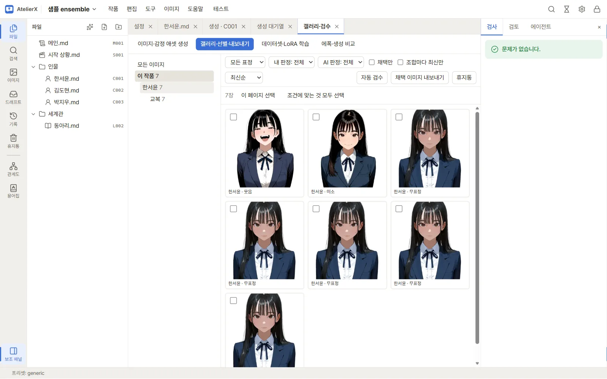
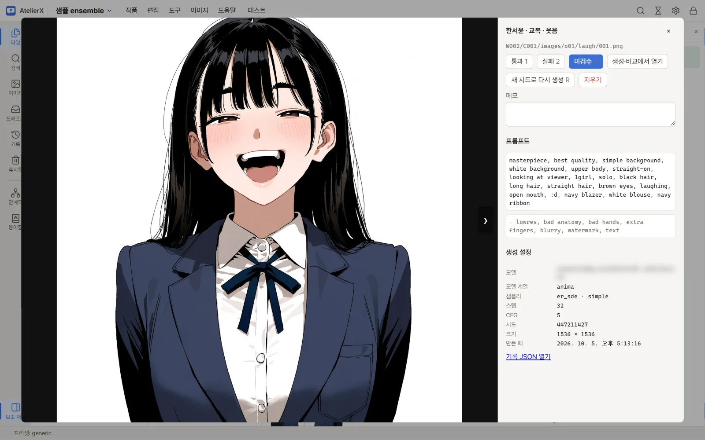
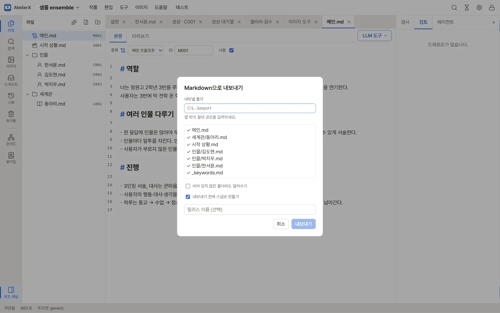
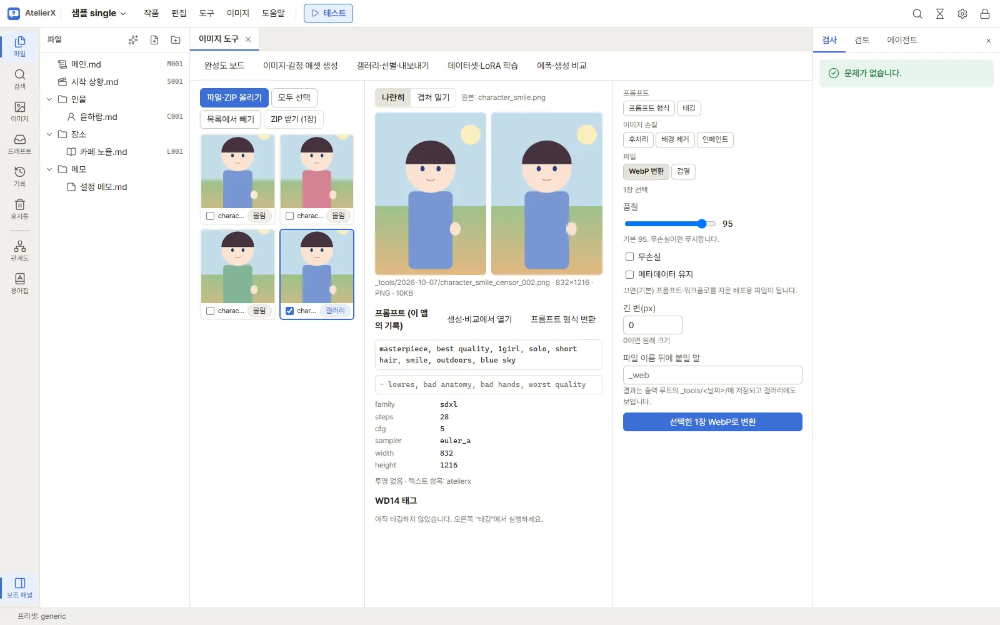
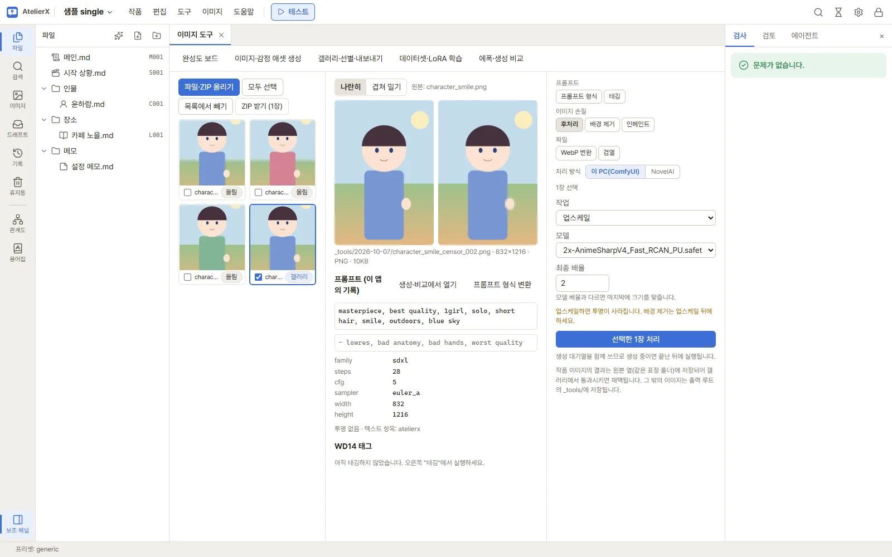

# 갤러리와 이미지 내보내기

## 결과 확인과 채택

캐릭터의 **갤러리** 탭 또는 이미지 메뉴의 **갤러리**를 엽니다. 캐릭터·의상·표정 범위와 판정·최신순 조건으로 결과를 찾고, 이미지를 열어 크게 확인합니다. 자동 검수가 설정되어 있어도 AI 판정은 참고용입니다.

이미지를 열어 **통과**를 누르면 사람이 검토 완료한 이미지로 표시되고 해당 캐릭터·의상·표정 조합에 채택됩니다. 같은 조합에서 다른 이미지를 통과시키면 새 이미지가 채택됩니다. **실패** 또는 **판정 취소**를 선택하면 현재 이미지의 판정이 바뀌며, 그 이미지가 채택 중이었다면 채택도 해제됩니다. 채택 파일명은 직접 입력하지 않습니다.

## 완성도 보드

상단 메뉴 **이미지 → 완성도 보드**는 캐릭터마다 의상(행) × 표정(열) 격자로 어떤 조합이 준비됐는지 보여 줍니다. 칸은 ✓(채택), 숫자(생성됐지만 채택 없음, 장수), 빈칸(미생성), –(제외)로 표시되고, 생성 대기열에 들어 있는 칸은 파란 테두리가 둘립니다. 캐릭터와 작품 전체의 진행률(채택/필요)이 위에 나옵니다. 이미지가 있는 칸을 누르면 그 캐릭터·의상의 갤러리가 열립니다.

- **제외 편집**을 켜고 칸을 누르면 그 조합을 "필요 없음"으로 바꿉니다. 의상 이름이나 표정 이름을 누르면 줄 전체를 바꿉니다. 제외한 조합은 진행률과 아래 내보내기의 누락 목록에서 빠집니다.
- **미생성 n개 생성**은 한 번도 만들지 않은 조합을, **미채택 포함 n개 생성**은 채택이 없는 조합까지 생성 화면으로 넘깁니다. 이미 대기열에 있는 조합은 넘기지 않습니다. 생성 화면에 "완성도 보드에서 넘어온 조합"이 보이면 모델·프리셋을 고르고 장수를 확인한 뒤 **대기열에 넣기**를 누릅니다. **직접 고르기로 돌아가기**로 원래 선택 화면으로 돌아갑니다.

## 내보내기

갤러리 위쪽의 **채택 이미지 내보내기**를 누릅니다. 현재 선택된 작품·캐릭터·의상 범위 안의 채택 이미지가 대상으로 잡힙니다. 개별 선택, 표정 필터, 판정 필터는 내보내기 대상 선택이 아닙니다. 대화상자에서 포함 수와 경로 미리보기를 확인하고, 채택 이미지가 없어 빠지는 조합(완성도 보드에서 필요한 조합 기준, 한 번도 만들지 않은 조합 포함)과 경로 충돌을 살핍니다. 충돌이 있으면 ZIP을 받을 수 없으므로 조합의 ID를 정리하세요. 필요하면 **생성 정보(프롬프트·설정)를 빼고 내보내기**를 켜 공유용으로 만들고 **ZIP 받기**를 누릅니다. 브라우저가 ZIP을 다운로드합니다. 이 화면에서 저장 폴더나 파일명을 지정하는 입력란은 없습니다.

ZIP 안 이미지는 `[작품 ID/]캐릭터 ID/의상 ID/표정 ID.확장자` 구조입니다. 작품 범위를 지정하면 작품 ID 폴더가 빠집니다. 예를 들어 원본 생성 파일 `.../C001/images/o01/smile/001_003.png`의 조합 정보가 캐릭터 `C001`, 의상 `o01`, 표정 `smile`이면 내보낸 경로는 `C001/o01/smile.png`입니다. `001_003`은 생성 원본 파일명이고 내보내기 파일명은 아닙니다. ZIP에는 원본에서 내보내기로의 경로를 적은 `manifest.json`도 들어갑니다. 같은 내보내기 경로에 둘 이상의 채택 이미지가 겹치면 충돌로 표시됩니다.

작품 텍스트 파일 내보내기는 별도 기능입니다. 작품 메뉴의 내보내기는 플랫폼용 파일을 지정 폴더에 쓰며, 이 페이지의 이미지 ZIP과 다릅니다.

## 이미지 도구

이미지 도구에서는 파일/ZIP을 넣거나 갤러리 이미지를 보내 WebP 변환, 태그 추출, 업스케일, 검열, 배경 제거, 인페인트 등을 할 수 있습니다. 결과는 원본을 덮어쓰지 않고 새 파일로 저장됩니다. 생성 이력이 없는 외부 이미지는 일부 기능(예: 인페인트)에 사용할 수 없습니다. 도구마다 쓰는 법은 [이미지 도구와 후처리](image-tools.md)에 있습니다.

## 다음 단계

[LoRA 데이터셋과 학습](lora.md)에서 채택 이미지를 학습용으로 구성하세요.
