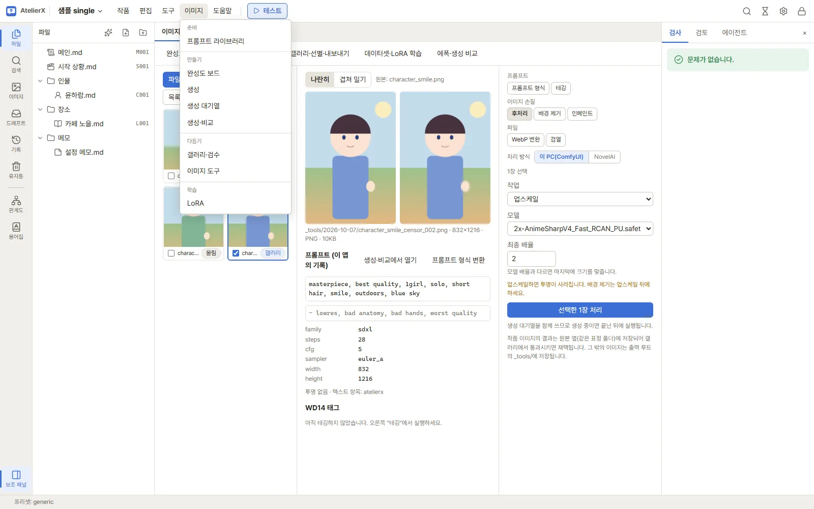
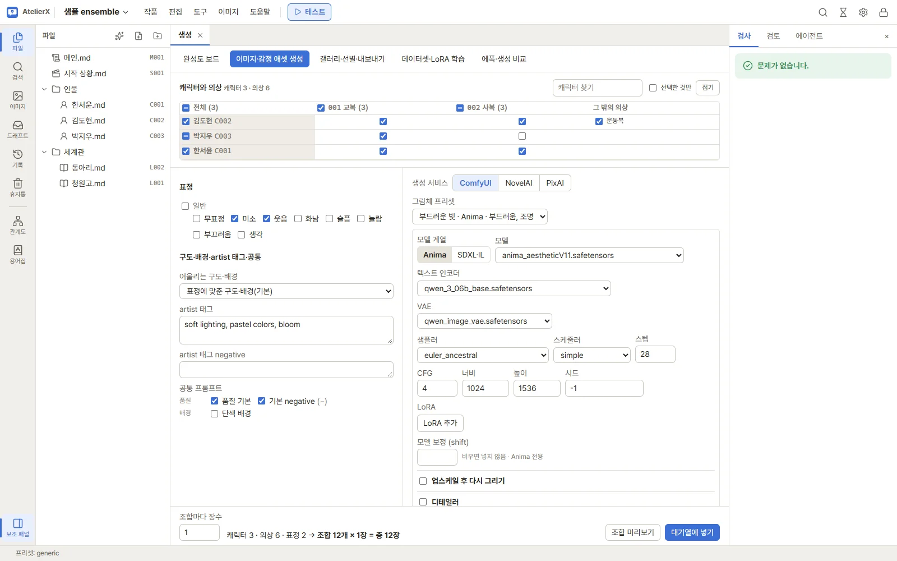
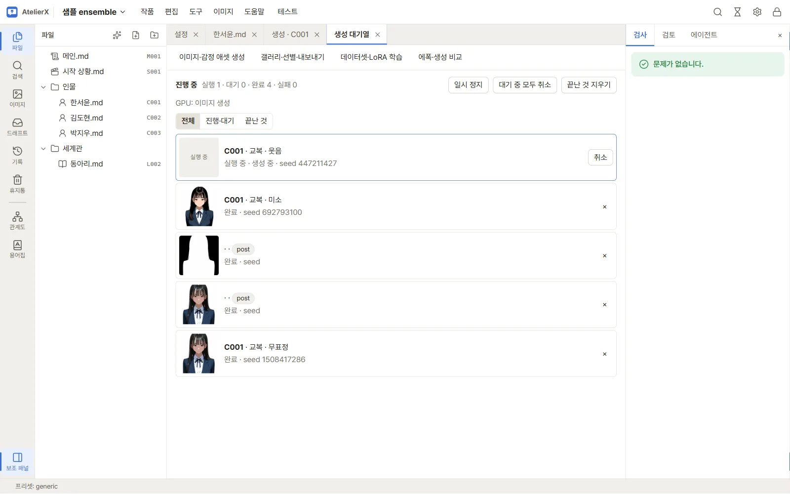

# 이미지 생성

## 준비 확인

생성 화면은 작품 상단 **이미지** 메뉴에서 **생성**을 엽니다. 이미지 설계가 있는 캐릭터가 있어야 대상에 체크할 수 있습니다. ComfyUI 연결, 지원 워크플로·모델·필요 노드가 준비되지 않으면 프리뷰나 대기열 실행이 실패할 수 있습니다. 사전 설정은 [이미지 환경 준비](image-setup.md)에서 확인하세요.

## 한 이미지 생성: 버튼 순서

1. 생성 화면 왼쪽 **캐릭터와 의상**에서 대상 캐릭터 체크박스를 켭니다. 캐릭터별로 기본 의상이 함께 선택됩니다. 사용할 의상 체크박스도 확인합니다.
2. **표정** 영역에서 하나 이상의 표정을 고릅니다. 여러 표정을 고르면 의상×표정 조합마다 생성 대상이 하나씩 만들어집니다.
3. **구도·화풍·공통**에서 구도는 기본적으로 표정별 기본 구도를 사용하거나 목록에서 지정합니다. 필요한 화풍을 체크하고 공통 positive/negative 항목을 확인합니다.
4. **생성 프리셋**을 선택하면 그 프리셋의 모델 계열·설정과 공통/화풍 선택이 화면에 반영됩니다. `프리셋 없이`를 선택하면 프리셋 설정을 적용하지 않습니다.
5. **모델 계열**에서 `Anima` 또는 `SDXL·IL`을 선택합니다. 다음 표의 기본값은 화면 초기값입니다. 실제 모델 드롭다운은 연결된 ComfyUI 카탈로그에서 가져옵니다.

| 설정 | 용도 | 초기값/입력 예시 |
|---|---|---|
| 모델 | 체크포인트 또는 Anima 모델 선택 | 현재 서버 카탈로그에서 선택 |
| 텍스트 인코더 | Anima 계열 인코더 | 카탈로그 선택 또는 기본값 |
| VAE | Anima VAE 또는 SDXL VAE 재정의 | 기본값/체크포인트 내장 |
| 샘플러, 스케줄러 | 생성 샘플링 방식 | 계열 기본값 또는 목록에서 선택 |
| 스텝, CFG | 샘플링 계산량과 안내 강도 | Anima 초기 32, CFG 5 |
| 너비, 높이 | 출력 크기, 16 단위 입력 | Anima 초기 1536×1536; SDXL·IL 1024×1024 |
| clip skip | SDXL·IL 텍스트 인코딩 옵션 | 계열 전환 시 2 |
| 시드 | 재현 시드; `-1`은 매 이미지 무작위 | 연습은 `-1` 권장 |
| LoRA | 현재 모델 계열에 맞는 LoRA와 세기 | 선택 사항, 세기 예 `0.8` |
| 조합마다 장수 | 각 대상 조합에서 만들 이미지 수 | `1`; UI 허용 범위 1–50 |

숫자 예시는 시작점일 뿐이며, 모델과 워크플로가 허용하는 크기·성능에 맞춰 조정해야 합니다. 계열 전환은 해당 계열의 기본 설정을 다시 적용하므로 전환 후 모델과 옵션을 재확인하세요.

6. 대상이 하나라면 **조합 미리보기**를 누릅니다. 생성된 공통, 화풍, 구도, 트리거, 외모, 표정, 의상, negative 항목을 검토하고 필요한 칸을 직접 고칩니다. 둘 이상의 조합에서는 프리뷰가 표시되지만 상세 항목을 한 조합씩 편집하는 칸은 제공되지 않습니다.
7. 미리보기 경고를 처리하고 설정을 확인한 다음 **대기열에 넣기**를 누릅니다. 화면의 `조합 N개 · 모두 M장` 표시가 예상 수량과 일치하는지 확인하세요.
8. 완료 안내의 대기열 열기 동작 또는 상단 **이미지 → 대기열**로 진행 상태를 봅니다. 끝나면 갤러리에서 결과를 엽니다.

## 가상 입력 예

다음은 사용법 설명을 위한 가상 예입니다. 앱의 기본 샘플 이름이나 라이브러리 데이터라는 뜻은 아닙니다.

- 캐릭터 `C001` 하나, 의상 `O001`, 표정 `E001` 하나
- 생성 프리셋 `Anima 기본` (예시 이름), 계열 `Anima`, 장수 `1`, 시드 `-1`
- 프리뷰의 외모/의상 문구를 확인하고, 필요하면 negative에 `blurry`를 추가

성공하면 미리보기에서 `C001 · <의상 이름> · <표정 이름>` 대상 카드와 경고/조합 문구를 볼 수 있고, 대기열에 `1장`이 들어갑니다. 생성 완료 이미지는 해당 캐릭터 갤러리의 생성 기록과 함께 나타납니다.

## 생성·비교 결과를 조합으로 가져오기

**이미지 → 생성·비교**에서 마음에 든 결과를 고른 뒤 **조합으로 가져오기**를 누릅니다. 캐릭터·의상·표정을 고르고 **가져오기**를 누르면 그 이미지가 생성 기록과 함께 그 조합의 이미지로 갤러리에 들어갑니다. **바로 채택**을 켜 두면 가져오면서 채택하므로, 다시 생성하지 않고 완성도 보드와 채택 이미지 내보내기에 반영됩니다. 생성·비교의 원본은 그대로 남습니다.

## 실패했을 때

- **서버에 연결되지 않음**: 설정 → 이미지에서 ComfyUI 주소·연결 상태를 확인합니다.
- **대상 캐릭터가 없음/체크 불가**: 캐릭터 파일에 ID를 주고 **이미지** 탭에서 이미지 설계를 저장합니다.
- **모델 목록이 비거나 미리보기 오류**: ComfyUI가 실행 중인지, 모델 경로와 워크플로를 찾는지 확인합니다.
- **노드/모델 누락**: 설정 → 설치의 노드 상태, 모델 항목과 설치 로그를 확인합니다.
- **작업이 대기 상태**: GPU를 쓰는 다른 작업이 끝날 때까지 대기열에서 기다립니다.
- **작업 실패**: 대기열의 오류 상세를 확인하고, 연결·모델·워크플로 문제를 고친 뒤 재시도합니다.

## 다음 단계

[갤러리와 이미지 내보내기](gallery-export.md)에서 결과를 사람이 확인하고 채택하세요.
