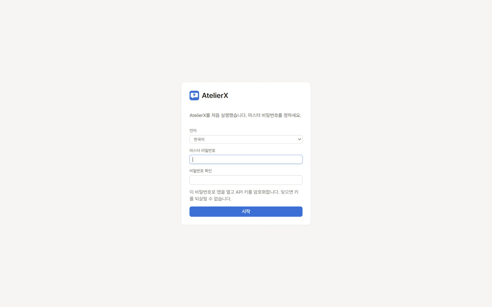
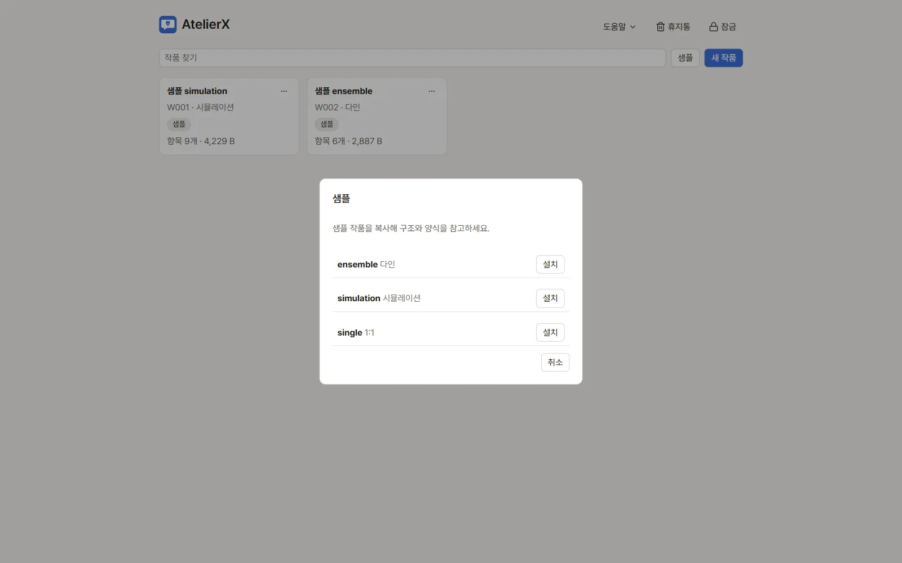

# 설치와 첫 실행

## 준비물

[릴리스 페이지](https://github.com/kiritype/AtelierX/releases/latest)의 Windows x64 포터블 패키지와 Windows 10/11 x64 PC가 필요합니다. PC에 Microsoft Edge WebView2 Runtime과 .NET Framework 4.8이 준비되어야 합니다. Python, Node.js, Git은 앱 실행에 필요하지 않습니다. 아직 테스트 단계의 버전이며 확인한 범위는 [검증 범위](release-status.md)에 있습니다. 처음이라면 [처음 사용하기](../tutorial/first-run.md)를 따라가는 편이 빠릅니다.

## 압축 풀고 실행

1. 다운로드한 ZIP의 **모든 파일**을 쓰기 가능한 폴더에 풉니다. 예: `D:\Apps\AtelierX`. `Program Files`처럼 앱이 파일을 쓰기 어려운 폴더는 피합니다.
2. 폴더 안에 `AtelierX.exe`와 `_internal` 폴더가 함께 있는지 확인합니다. 둘을 분리하거나 exe만 다른 곳으로 옮기지 마세요.
3. `AtelierX.exe`를 더블 클릭합니다. 관리자 권한은 필요하지 않습니다.
4. 창이 열리지 않고 WebView 오류가 보이면 Microsoft 공식 WebView2 배포처에서 Evergreen Runtime을 설치한 뒤 다시 실행합니다. .NET Framework 4.8 요구 사항도 확인합니다.

## 처음 한 번: 언어와 잠금 비밀번호

1. 첫 실행 카드의 언어를 **한국어** 또는 **English**로 고릅니다.
2. **마스터 비밀번호**와 **비밀번호 확인** 칸에 앱 전용 비밀번호를 입력합니다. 최소 4글자이고 두 칸이 같아야 합니다.
3. **시작**을 누릅니다. 이후 실행할 때마다 잠금 화면에서 이 비밀번호를 입력합니다.

비밀번호는 앱 잠금 해제와 인증 정보 금고를 여는 데 쓰입니다. 작품 파일은 암호화되지 않으므로 PC 계정과 포터블 폴더를 안전하게 관리하세요. 비밀번호를 분실하면 저장한 API 키 등 인증 정보를 초기화한 뒤 다시 입력해야 합니다.

## 샘플 작품 열기

1. 작품 선택 화면에서 **샘플**을 누릅니다.
2. 목록에서 연습할 샘플의 **설치**를 누릅니다. 앱은 샘플 원본을 직접 편집하지 않고 새 작품 복사본을 만듭니다.

3. 왼쪽 파일 트리에서 메인 또는 캐릭터 파일을 열어 봅니다.

화면에 작품이 하나도 없다면 **새 작품**으로 이름을 입력해 빈 작품을 만들 수도 있습니다. 설치된 패키지의 수동 안내는 `manual/index.html`로도 오프라인에서 열 수 있습니다.

## 어디에 저장되나요?

앱은 실행 파일 옆 `config`, `state`, `data`, `output` 폴더를 사용합니다. 다른 PC로 이동하거나 업데이트하기 전에 앱을 닫고 이 네 폴더를 백업하세요. 외부 LLM, 이미지 서버, 모델은 기본 패키지에 포함되지 않습니다.

## 다음 단계

[처음 사용하기](../tutorial/first-run.md)에서 샘플 작품 하나로 전체 흐름을 따라 하거나, [작품 목록과 작품 설정](works.md)과 [파일과 편집기](editing.md)에서 작품을 다루는 방법을 보세요. 설정 화면 전체는 [설정 한눈에 보기](settings.md)에 정리했습니다.
