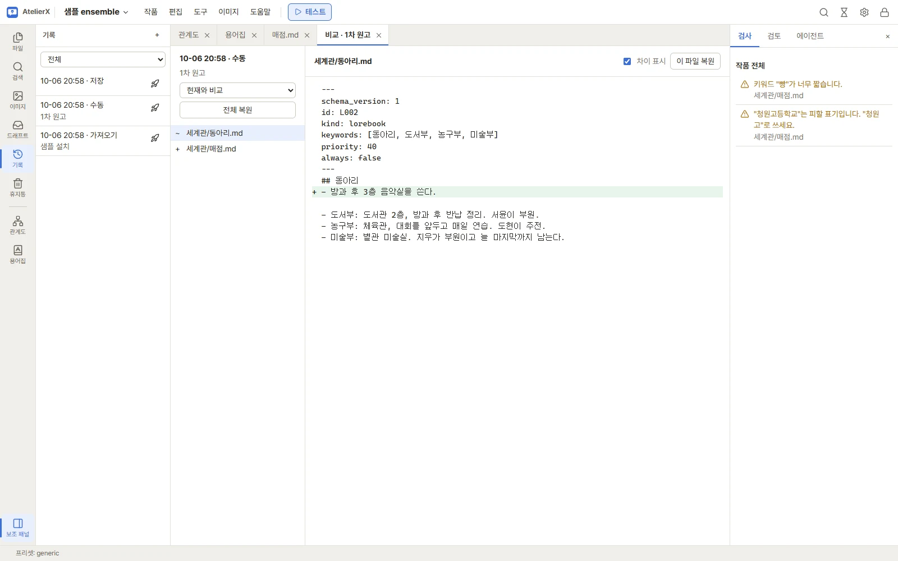

# 기록과 휴지통

작품의 원고는 앱 안의 기록(스냅숏)으로 언제든 이전 상태와 비교하고 되돌릴 수 있습니다. 지운 파일은 휴지통으로 갑니다.
기록은 Git 같은 외부 도구 없이 앱이 작품 폴더 안(`.atelierx/history/`)에 직접 남깁니다.

## 스냅숏이 생기는 때

| 이유 | 언제 |
|---|---|
| 저장 | 편집하며 저장할 때, 일정 간격으로 묶어서(설정 → 일반의 **자동 스냅숏 간격**, 기본 10분) |
| 직접 | 기록 패널의 **＋** 또는 **작품** 메뉴 → **지금 스냅숏**. 이름을 붙일 수 있습니다 |
| LLM 결과 채택 전 | 에이전트 제안·압축·모순 검사 제안 등을 원고에 적용하기 직전 |
| 한꺼번에 바꾸기 전 | 이름 일괄 변경, 폴더 이동, 휴지통에서 되살리기 등 여러 파일을 바꾸기 직전 |
| 되돌리기 전 | 스냅숏으로 되돌리기 직전(되돌린 것도 되돌릴 수 있게) |
| 가져오기 | 파일 가져오기 직전, 샘플 설치 직후 |
| 내보내기 | 내보낼 때 **내보내기 전에 스냅숏 만들기**를 켠 경우 |

스냅숏에는 원고 파일(`.md`·`.jsx`)과 작품의 앱 데이터(작품 설정, 관계도, 용어집, 이미지 설계 등)가 들어갑니다. 이미지 파일은
들어가지 않습니다. 같은 내용은 한 번만 저장하므로 스냅숏이 많아도 크게 늘지 않습니다.

## 기록 패널

왼쪽 활동 막대의 **기록**을 누릅니다.

- 목록에 시각, 이유, 이름이 보입니다. 위쪽 목록 상자로 **전체** / **지금 스냅숏**(직접 만든 것) / **릴리스**만 걸러 봅니다.
- **＋**: 지금 상태를 스냅숏으로 남깁니다. 이름(선택)을 물어봅니다.
- 줄 오른쪽의 표시 버튼(**릴리스로 표시**): 플랫폼에 올린 시점처럼 기억할 스냅숏에 릴리스 이름을 붙입니다. 다시 누르면 표시를
  뗍니다.
- 줄을 누르면 비교 탭이 열립니다.

## 비교하고 되돌리기

1. 위쪽에서 **현재와 비교**(지금 원고와) 또는 **직전과 비교**(바로 앞 스냅숏과)를 고릅니다.
2. 왼쪽 목록에 바뀐 파일이 나옵니다(＋ 새로 생김, − 지워짐, ~ 바뀜). 파일을 누르면 오른쪽에 바뀐 줄이 보입니다. **차이 표시**를
   끄면 그 시점의 본문 전체를 봅니다.
3. 되돌리기:
   - **이 파일 복원**: 고른 파일만 스냅숏 때로 되돌립니다. 스냅숏 뒤에 새로 만든 파일이면 휴지통으로 갑니다.
   - **전체 복원**: 작품 전체를 그 시점으로 되돌립니다.
   - 어느 쪽이든 되돌리기 전 상태를 스냅숏으로 남기므로, 되돌린 것도 다시 되돌릴 수 있습니다.

## 자동 정리

저장 때 생기는 스냅숏만 오래된 것부터 정리합니다(최근 200개와, 그보다 오래된 것은 하루 하나씩 30일). 직접 만든 스냅숏, 릴리스
표시한 스냅숏, 한꺼번에 바꾸기 전 스냅숏은 지우지 않습니다.

## 휴지통

작품 안에서 지운 파일·폴더는 왼쪽 활동 막대의 **휴지통**으로 갑니다.

- **복원**: 원래 자리로 되살립니다. 같은 이름이 이미 있으면 이름을 바꿔 되살립니다.
- **휴지통 비우기**: 휴지통의 모든 항목을 완전히 지웁니다. 되돌릴 수 없습니다.
- 캐릭터나 JSX 파일을 지울 때는 딸린 데이터(이미지 설계, JSX 예시)도 함께 휴지통으로 보낼지 묻습니다.

지운 **작품**은 작품 목록의 휴지통으로 갑니다. → [작품 목록과 작품 설정](works.md)

## 다음 단계

작품을 다른 PC로 옮기거나 통째로 백업하려면 [유지 관리](maintenance.md)의 꾸러미를 보세요.
