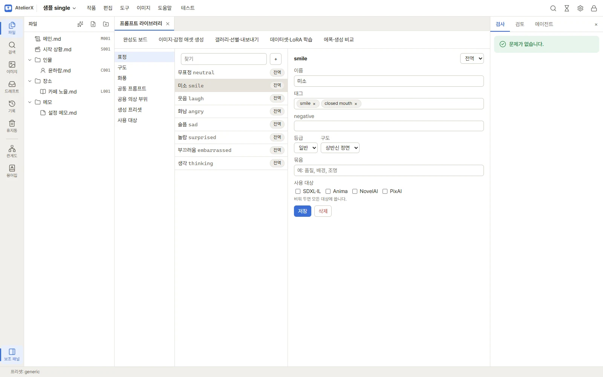
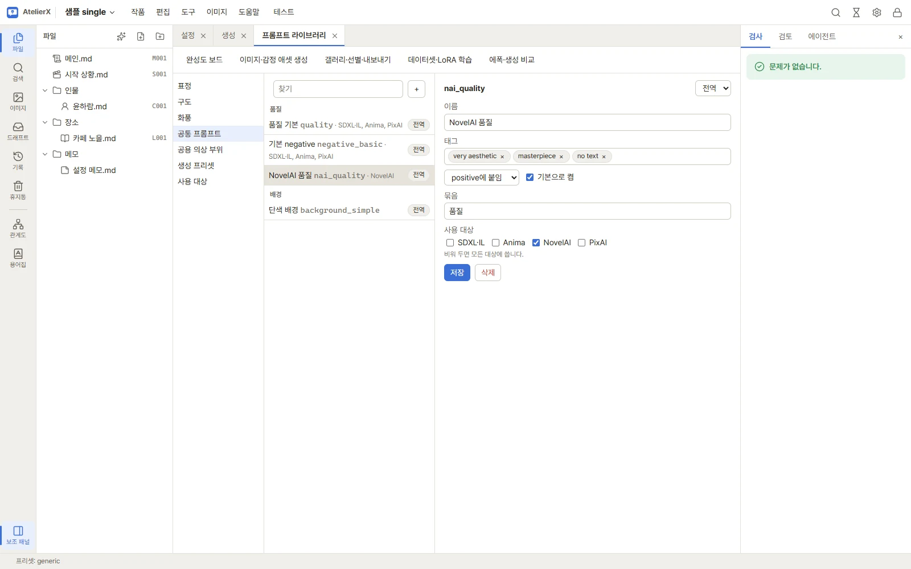

# 프롬프트 라이브러리

이미지 프롬프트는 캐릭터의 이미지 설계(외모·의상)와 **프롬프트 라이브러리**의 조각(표정·구도·배경·화풍·공통 프롬프트·공용 의상 부위)을 합쳐 만듭니다. 라이브러리는 작품 상단 **이미지** 메뉴 → **프롬프트 라이브러리**에서 엽니다.

화면은 세 칸입니다. 왼쪽에서 종류를 고르고, 가운데 목록에서 조각을 고르면 오른쪽에서 고칩니다.

## 종류

| 종류 | 담는 것 | 쓰이는 곳 |
|---|---|---|
| 표정 | 표정 태그와 negative, 등급, 어울리는 구도·배경 | 생성 화면에서 여러 표정을 한 번에 골라 의상×표정 조합을 만듭니다 |
| 구도·배경 | 프레이밍(상반신, 전신 등)과 배경 태그, 그 구도에서 보이는 의상 부위 또는 **의상 없음** | 표정이 정한 기본 구도·배경, 또는 생성 화면에서 직접 고름 |
| 화풍 | 화풍·작가 태그 | 생성 화면에서 고르거나 생성 프리셋에 넣음 |
| 공통 프롬프트 | 모든 그림에 붙는 품질·배경 태그(positive) 또는 공통 negative | **기본으로 켬**인 항목이 생성 화면에서 처음부터 켜짐 |
| 공용 의상 부위 | 여러 캐릭터가 함께 쓰는 의상 부위(교복 상의 등) | 캐릭터 이미지 설계의 의상 부위에서 참조 |
| 생성 프리셋 | 모델 계열·모델·샘플러·크기·LoRA와 기본 공통·화풍을 묶은 생성 설정 | 생성 화면의 **생성 프리셋**(ComfyUI) |
| 사용 대상 | 조각을 쓸 모델 계열·이미지 서비스 목록 | 조각의 **사용 대상** 칸 |

## 조각 만들기와 고치기

1. 왼쪽에서 종류를 고르고 목록 위 **+**를 누릅니다. 새 항목 id(영문·숫자·`_`·`-`)를 넣으면 빈 조각이 열립니다. 이미 쓰는 id는 만들 수 없습니다. id는 다른 데이터가 조각을 가리키는 이름이라, 만든 뒤에는 바꾸지 않는 것이 좋습니다.
2. **이름**은 화면에 보이는 이름입니다.
3. **태그**에 태그를 하나씩 넣습니다. 입력하면서 **Enter**를 누르면 추천 태그 목록에서 고른 태그를, **Shift+Enter**나 쉼표는 쓴 그대로 넣습니다. 쉼표나 줄바꿈으로 이어진 태그를 붙여 넣으면 여러 개가 한 번에 들어가고, 입력칸에서 고른 글자가 있으면 그 자리를 바꿉니다. 괄호로 묶은 가중치 `(upper body, straight-on:1.4)`는 안의 쉼표에서 나누지 않고 하나로 넣습니다(괄호가 열려 있는 동안에는 쉼표를 쳐도 나뉘지 않습니다). 태그 옆 **×**로 뺍니다.
4. **negative**에는 이 조각을 쓸 때 빼고 싶은 태그를 넣습니다(공통 프롬프트는 대신 **positive에 붙임 / negative에 붙임**을 고릅니다).
5. 종류별 칸을 정합니다.
   - 표정: **배포 코드**, **등급**과 **어울리는 구도·배경**. 생성 화면에서 구도를 "표정에 맞춘 구도·배경(기본)"으로 두면 이 조각을 씁니다.
     **배포 코드**는 채택 이미지를 배포 대상에 올릴 때 경로에 쓰는 코드입니다(예: `001`). 기본 표정은 `001`~`008`을 갖고 있습니다. 숫자가 아니어도 되고 비워 둘 수도 있으며, `/ \ : * ? " < > |`만 쓸 수 없습니다. 다른 표정과 같은 코드를 쓰면 편집 화면에 알려 줍니다(막지는 않음). 목록의 이름 옆에 코드가 보입니다.
   - 구도·배경: **이 구도에서 보이는 부위**. 예를 들어 상반신 구도에서는 하의·신발 태그를 넣지 않도록, 보이는 부위만 체크합니다. 하나도 체크하지 않으면 모든 부위를 넣습니다. **의상 없음**을 켜면 이 조각으로 조합할 때 의상 태그와 의상 negative를 넣지 않습니다(입은 것은 표정 태그에 씁니다). 목록 이름 옆에 **의상 없음**이 보입니다.
   - 공통 프롬프트: positive/negative와 **기본으로 켬**.
   - 공용 의상 부위: **부위**(전체·상의·하의 등).
6. **묶음**과 **사용 대상**을 정합니다(아래).
7. **저장**을 누릅니다. 저장하지 않은 변경이 있으면 탭 이름에 ●가 붙고, 탭을 닫거나 작품에서 나갈 때 알려 줍니다. 다른 조각·종류를 열거나 **+**를 누를 때도 변경을 버릴지 묻습니다.

지울 때는 조각을 고르고 **삭제**를 누릅니다.

### 표정마다 배경과 의상을 다르게: 구도·배경 조각

배경 태그는 공통 프롬프트가 아니라 **구도·배경** 조각에 둡니다. 표정은 어울리는 구도·배경을 하나 고르고, 생성 화면에서 **표정에 맞춘 구도·배경(기본)**을 쓰면 여러 표정을 한 번에 넣어도 표정마다 배경과 의상이 달라집니다.

예: 샤워 표정을 다른 표정들과 함께 만들기

1. **구도·배경**에 새 조각 "욕실"을 만듭니다. 태그 `bathroom, shower, steam, upper body`, 보이는 의상 부위에서 **의상 없음**을 켭니다.
2. 평소 쓰는 구도 조각에는 배경을 넣습니다. 예: "상반신 정면" = `upper body, straight-on, simple background, white background`
3. 공통 프롬프트의 **단색 배경**은 끄거나 지웁니다(배경은 이제 구도·배경 조각에 있습니다).
4. **표정 → 샤워**: 태그 `completely nude, showering, wet`, **어울리는 구도·배경**은 "욕실"
5. 생성 화면에서 의상(예: 사복)과 표정 미소·웃음·샤워를 함께 고르고, 구도·배경은 **표정에 맞춘 구도·배경(기본)**으로 둡니다.
6. **조합 미리보기**: 미소·웃음은 사복과 흰 배경, 샤워는 의상 태그가 빠지고 욕실 배경입니다. 샤워 조합에는 **의상 없음 (구도·배경: 욕실)**이 표시됩니다.
7. 샤워 이미지는 `사복 / 샤워` 조합으로 저장됩니다. 다른 의상의 샤워 조합이 필요 없으면 완성도 보드에서 제외합니다.

수면(침실), 식사(식당)처럼 장소만 다른 표정도 같은 방법으로 장소 조각을 만들어 고릅니다. 0.3.0부터 기본 라이브러리는 구도 조각에 단색 배경을 넣고 공통 프롬프트의 **단색 배경**을 기본으로 끕니다. 이미 쓰던 라이브러리는 그대로이므로, 위 2~3번처럼 직접 옮기세요.

### 메모(주석)

태그 칸에 `#`로 시작하는 항목을 넣으면 **메모**가 됩니다. 메모는 조각에 그대로 남지만 생성 요청과 생성 기록에는 들어가지 않습니다. 왜 이 태그를 넣었는지 적거나, 잠시 빼 둘 태그를 남길 때 씁니다.

- `#`부터 그 줄 끝까지가 메모입니다. 쉼표가 있어도 나뉘지 않고, 칩은 점선과 흐린 글자로 보입니다.
- 태그 뒤에 띄어 쓰고 `#`를 붙이면(`film grain # 너무 강하면 빼기`) 태그는 남고 `#` 뒤만 메모가 됩니다.
- 태그 안의 `#`는 태그의 일부입니다(`memories_off#5`, `ririka_(#compass)`). `#`로 시작하는 진짜 태그는 `\#compass`처럼 씁니다.
- 캐릭터 이미지 설계의 외모·의상 칸, **생성·비교**의 프롬프트, 조합 미리보기에서 고친 프롬프트, 인페인트 프롬프트도 같습니다. 조합 미리보기에는 메모를 뺀 실제 프롬프트가 보입니다.

## 전역과 작품

조각마다 오른쪽 위에서 **전역** 또는 **작품**을 고릅니다.

- **전역** 조각은 모든 작품에서 씁니다.
- **작품** 조각은 이 작품에서만 씁니다. 전역 조각과 id가 같으면 이 작품에서는 작품 조각이 전역 조각을 대신합니다(편집 칸 제목 옆에 "전역 항목을 덮어씀"이 보입니다).
- 같은 id의 작품 조각을 지우면 다시 전역 조각이 쓰입니다.
- 작품 조각을 **전역**으로 바꿔 저장하면 전역으로 옮겨지고 작품 쪽 조각은 지워집니다. 전역에 같은 id가 이미 있으면 그 조각을 바꿀지 먼저 묻습니다.
- 전역 조각을 **작품**으로 바꿔 저장하면 이 작품에서만 덮어쓰는 조각이 새로 생기고, 전역 조각은 그대로 남습니다.

생성 프리셋과 사용 대상 목록은 전역에만 있습니다.

## 묶음과 사용 대상

- **묶음**: 품질·배경·조명처럼 이름을 붙이면 목록과 생성 화면에서 같은 묶음끼리 모여 보입니다. 이미 쓴 묶음 이름은 입력할 때 추천됩니다.
- **사용 대상**: 이 조각을 쓸 모델 계열·이미지 서비스를 여러 개 고릅니다. 비워 두면 모든 대상에 씁니다.
  - SDXL·IL, Anima, PixAI는 같은 SDXL 계열 태그 프롬프트를 씁니다. 일반 태그 조각은 이 셋을 함께 고르거나 비워 두면 됩니다.
  - NovelAI는 품질 태그 등이 달라서, NovelAI용 품질 조각을 따로 만들어 NovelAI만 고르는 식으로 나눕니다.
  - 생성할 때 지금 대상에 맞지 않는 화풍·공통·구도 조각은 프롬프트에서 빠지고 미리보기 경고에 나옵니다. 표정은 빠지지 않고 경고만 합니다.
- 종류 목록의 **사용 대상**에서 대상을 더하거나 지웁니다. 대상을 지우면 그 대상만 고른 조각은 모든 대상용이 됩니다.

## 생성 프리셋

**생성 프리셋**에서는 ComfyUI로 생성할 때의 설정 묶음을 만듭니다. **+**로 새 프리셋을 만들고 이름, 모델 계열·모델·샘플러·스텝·CFG·크기·LoRA, 기본으로 켤 공통 프롬프트와 화풍을 정한 뒤 **저장**합니다. 공통 프롬프트를 비워 두면 "기본으로 켬" 공통 프롬프트를 씁니다. 생성 화면에서 프리셋을 고르면 이 값이 한꺼번에 들어갑니다. 갤러리의 이미지 정보에서 그 이미지의 설정을 프리셋으로 저장할 수도 있습니다.

## 조각이 프롬프트가 되는 순서

생성 화면은 공통 → 화풍 → 구도·배경 → 트리거 → 외모 → 표정 → 의상 순서로 태그를 합칩니다(같은 태그는 한 번만). negative는 공통 negative, 화풍·외모·의상·표정·구도의 negative를 모읍니다. 생성 화면의 **조합 미리보기**에서 실제로 합쳐진 프롬프트를 확인하고, 한 장을 만들 때는 부분별로 고쳐서 보낼 수 있습니다. → [이미지 생성](generation.md)
