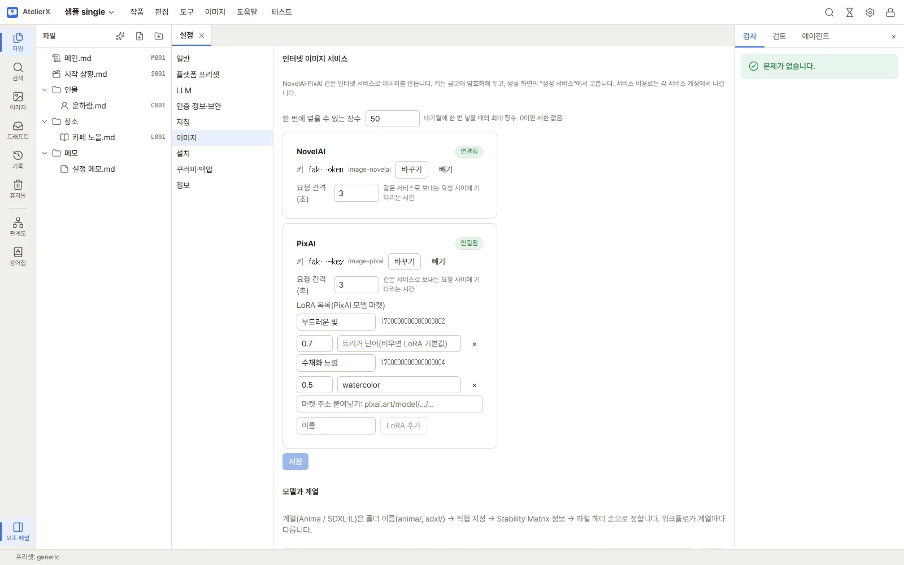
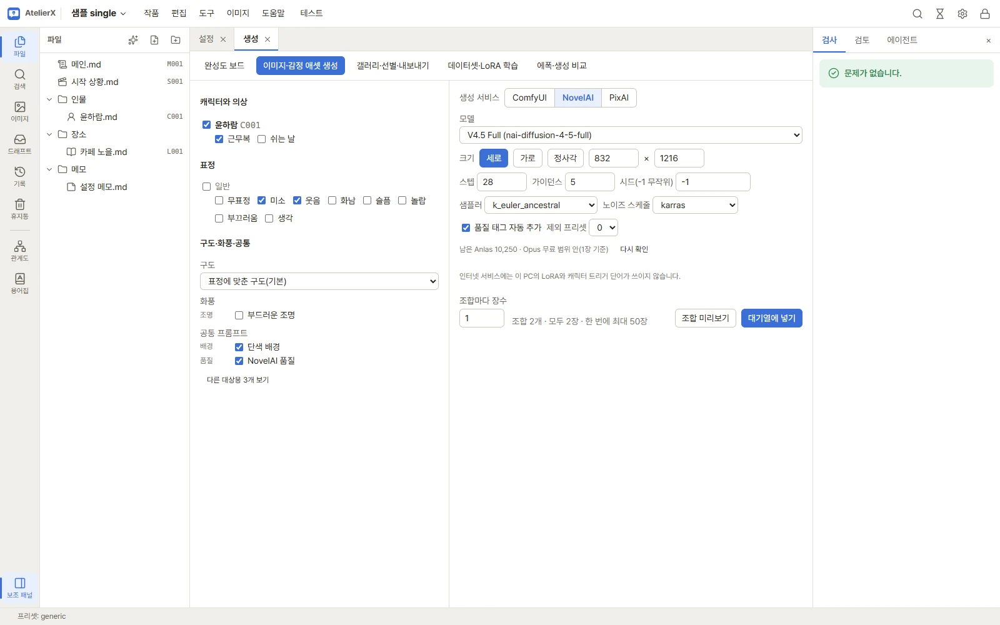
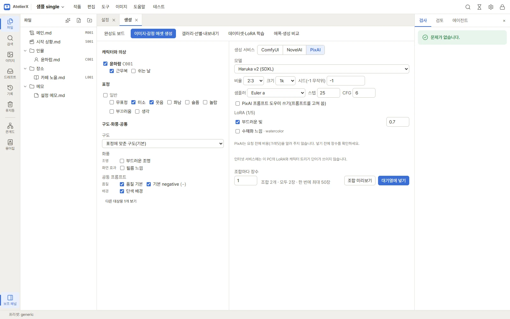

# 인터넷 이미지 서비스 (NovelAI·PixAI)

ComfyUI를 설치하지 않아도 **NovelAI**나 **PixAI**로 캐릭터·의상·표정 조합을 생성할 수 있습니다. 이미지 설계·라이브러리·갤러리·채택·내보내기는 ComfyUI로 만든 이미지와 똑같이 씁니다. 생성 비용은 각 서비스 계정에서 나갑니다.

| | ComfyUI(이 PC) | NovelAI | PixAI |
|---|---|---|---|
| 필요한 것 | ComfyUI·모델·GPU | 영구 API 토큰 | API 키(PixAI API 사용 신청 필요) |
| 모델 | 이 PC의 Anima·SDXL·IL | V4.5·V5 등 | Haruka v2·Hoshino v2(SDXL), Tsubaki.2(DiT) |
| LoRA | 이 PC의 LoRA, 캐릭터 LoRA 자동 적용 | 쓸 수 없음 | PixAI 모델 마켓 LoRA 5개까지 |
| 비용 확인 | 없음 | 남은 Anlas, Opus 무료 범위 표시 | 요청 전에 알 수 없음 |

## 키 등록과 공통 설정

**설정 → 이미지 → 인터넷 이미지 서비스**에서 합니다.

1. 서비스 카드의 **키** 칸에 키를 붙여 넣고 아래 **저장**을 누릅니다. 키는 마스터 비밀번호로 잠긴 금고에 암호화해 저장되고, 카드의 상태가 **연결됨**으로 바뀝니다. 이미 금고에 넣어 둔 키는 목록에서 고를 수 있습니다.
   - NovelAI: NovelAI 웹사이트 계정 설정의 **영구 API 토큰(Persistent API Token)**.
   - PixAI: PixAI 개발자 플랫폼(platform.pixai.art)에서 API 사용을 신청해 받은 키. 멤버십·베타 프로그램 조건은 PixAI 안내를 따르세요.
2. **한 번에 넣을 수 있는 장수**: 대기열에 한 번 넣을 때 인터넷 서비스에 요청할 수 있는 최대 장수입니다. 기본 50장이고 0이면 제한이 없습니다. 이 PC의 ComfyUI에는 적용되지 않습니다.
3. **요청 간격(초)**: 같은 서비스로 요청을 보낼 때 사이에 기다리는 시간입니다. 기본 3초입니다.

## NovelAI로 생성

1. 생성 화면 오른쪽 위 **생성 서비스**에서 **NovelAI**를 고릅니다. 작품마다 마지막으로 쓴 서비스가 기억되고, 서비스마다 마지막 설정도 따로 기억됩니다. 캐릭터 화면의 **생성** 버튼도 마지막 서비스로 엽니다.
2. **모델**에서 V4.5·V5 등 버전을 고릅니다. 목록에 없는 새 모델은 **직접 입력…**으로 이름을 넣습니다.
3. 크기(**세로**·**가로**·**정사각** 또는 64의 배수로 직접), 스텝, 가이던스, 시드(-1은 무작위), 샘플러, 노이즈 스케줄, 품질 태그 자동 추가, 제외 프리셋을 정합니다.
4. 패널 아래에 **남은 Anlas**와, Opus 구독이면 지금 설정이 무료 범위(1024×1024 이하, 28스텝 이하, 1장) 안인지가 보입니다. **다시 확인**으로 새로 읽습니다.
5. 왼쪽에서 캐릭터·의상·표정을 고르고 **대기열에 넣기**를 누르면, 요청할 장수를 확인한 뒤 대기열에 넣습니다.

## PixAI로 생성

1. 쓰고 싶은 LoRA가 있으면 먼저 설정의 PixAI 카드 **LoRA 목록**에 등록합니다. PixAI 모델 마켓에서 LoRA 페이지 주소(`pixai.art/model/<모델>/<버전>`)를 붙여 넣고 이름을 붙여 **LoRA 추가**를 누른 뒤 **저장**합니다. 주소에 버전이 있어야 합니다. 강도와 트리거 단어(비우면 LoRA 기본값)도 여기서 정합니다. PixAI API에는 LoRA 목록을 받아 오는 기능이 없어서 이렇게 직접 등록합니다.
2. 생성 화면에서 **PixAI**를 고르고 모델을 정합니다. Haruka v2·Hoshino v2(SDXL 계열)는 샘플러·스텝·CFG를, Tsubaki.2(DiT)는 모드를 정합니다. 목록에 없는 모델은 **버전 ID 직접 입력…**으로 넣습니다.
3. 비율, 크기(1k·1.5k), 시드를 정하고, 등록한 LoRA 중 5개까지 체크해 강도를 정합니다.
4. **PixAI 프롬프트 도우미**는 기본으로 꺼 둡니다. 켜면 PixAI가 프롬프트를 고쳐 써서 라이브러리로 맞춘 태그와 달라질 수 있습니다.
5. PixAI는 요청 전에 비용(크레딧)을 알려 주지 않습니다. 넣기 전 확인 창의 장수를 보고 정하세요.

## 프롬프트

- 인터넷 서비스에는 이 PC의 LoRA와 캐릭터 트리거 단어가 쓰이지 않습니다. 같은 캐릭터를 유지하려면 이미지 설계의 외모·의상 태그를 충실히 적어 두세요.
- SDXL·IL, Anima, PixAI는 같은 SDXL 계열 태그 프롬프트를 씁니다. NovelAI는 품질 태그 등이 달라서, 라이브러리 조각의 **사용 대상**으로 서비스에 맞는 조각을 나눠 두면 고른 서비스에 맞는 조각만 들어갑니다. 생성 화면은 지금 서비스에 맞는 조각만 기본으로 보이고, 나머지는 **다른 대상용 N개 보기**로 펼칩니다. → [프롬프트 라이브러리](image-library.md)

## 요청과 비용을 지키는 동작

- 요청은 하나씩, 정한 간격을 두고 보냅니다. 서비스가 잠시 요청을 거절하면(요청이 너무 많음) 기다렸다가 몇 번 더 보내고, 그래도 안 되면 멈춥니다.
- 같은 요청을 10분 안에 다시 넣으면 한 번 더 묻습니다.
- 응답을 받지 못한 요청, 키 오류, 크레딧·Anlas 부족은 작업을 실패로 표시하고 대기열을 멈춥니다. 비용이 나갔을 수 있으므로 앱이 같은 요청을 저절로 다시 보내지 않습니다. 계정을 확인한 뒤 대기열에서 **다시 시도**하세요.
- 이미 보낸 요청은 서비스에서 되돌릴 수 없어서, 중지해도 결과가 도착하면 이미지를 저장합니다.
- PixAI는 작업이 끝나는 대로 이미지를 받아 둡니다(결과가 잠시만 보관됨). 받기만 실패하면 **다시 시도**가 새로 요청하지 않고 그 결과를 다시 받고, 작업을 보낸 뒤 앱이 꺼졌다 켜지면 같은 작업의 결과를 이어서 받습니다.
- 인터넷 서비스로 만든 이미지는 자동 검수에서 떨어져도 자동으로 다시 만들지 않습니다. 갤러리의 **다시 생성**은 그 이미지를 만든 서비스로 다시 요청합니다.

## 갤러리와 기록

- 갤러리 카드에 **NovelAI**·**PixAI** 표시가 붙습니다. 채택·내보내기는 다른 이미지와 같습니다.
- 생성 기록에는 서비스, 모델, 실제로 보낸 프롬프트와 설정이 남습니다. PNG 파일에는 서비스가 넣은 정보(NovelAI의 생성 설정 등)가 그대로 남습니다.

## 오류가 났을 때

| 안내 | 할 일 |
|---|---|
| 키가 없습니다 / 키를 받아들이지 않았습니다 | 설정 → 이미지 → 인터넷 이미지 서비스에서 키를 다시 넣고 저장 |
| 크레딧(Anlas)이 부족합니다 | 서비스 계정에서 충전하거나 크기·스텝을 줄인 뒤 **다시 시도** |
| 제때 답하지 않았습니다 | 서비스 계정에서 이미지가 만들어졌는지 확인한 뒤 **다시 시도** |
| 한 번 한도를 넘습니다 | 장수를 줄이거나 설정에서 한도를 올림 |
| PixAI에 이 이미지가 더 이상 없습니다 | 결과 보관 시간이 지남. 필요하면 갤러리에서 다시 생성 |
