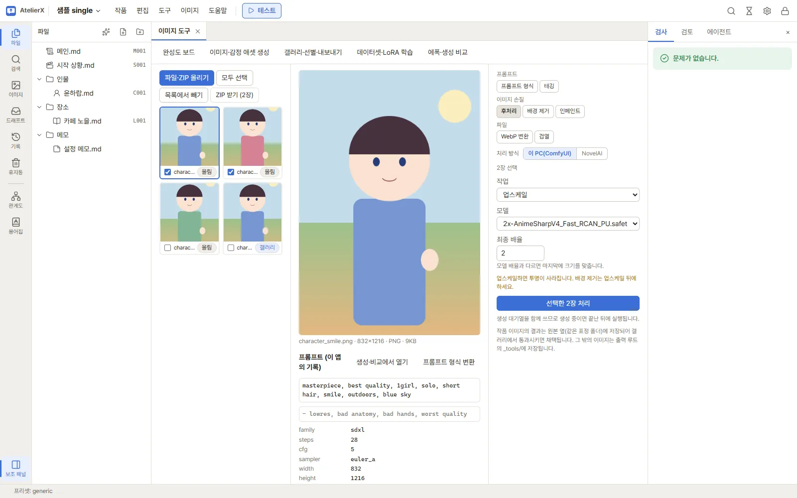
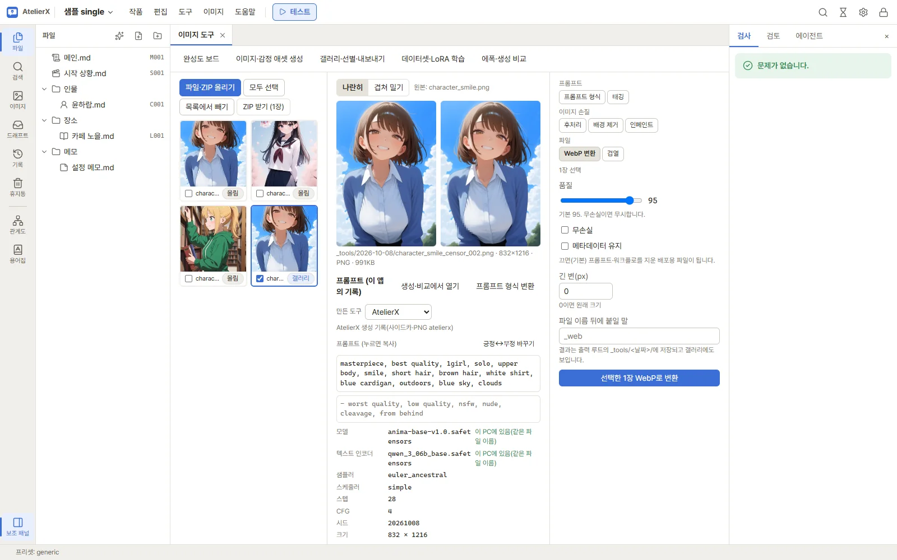
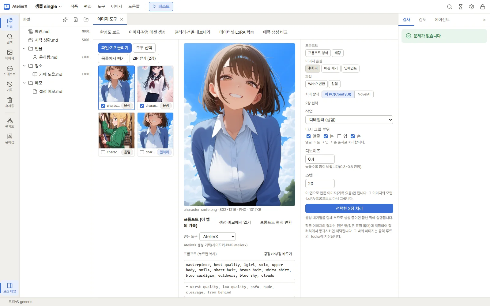
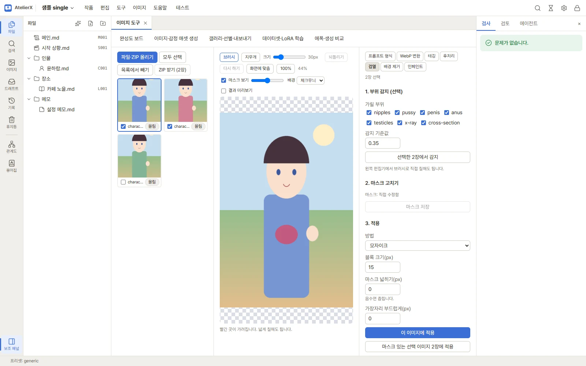
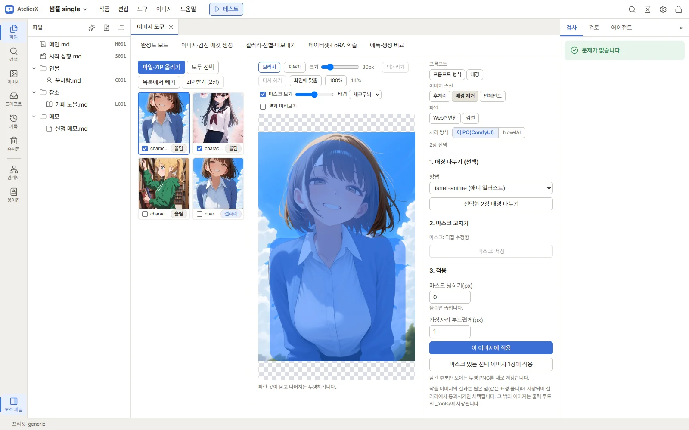
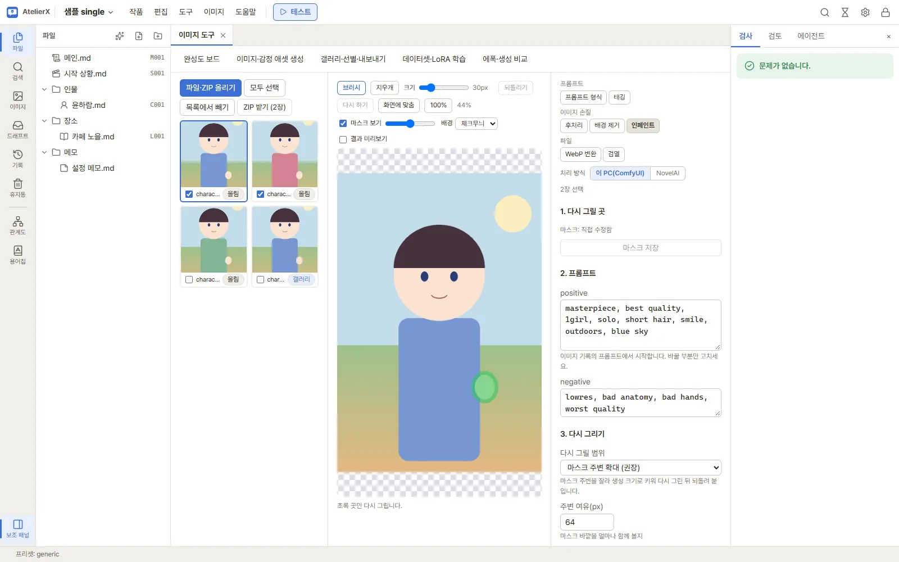
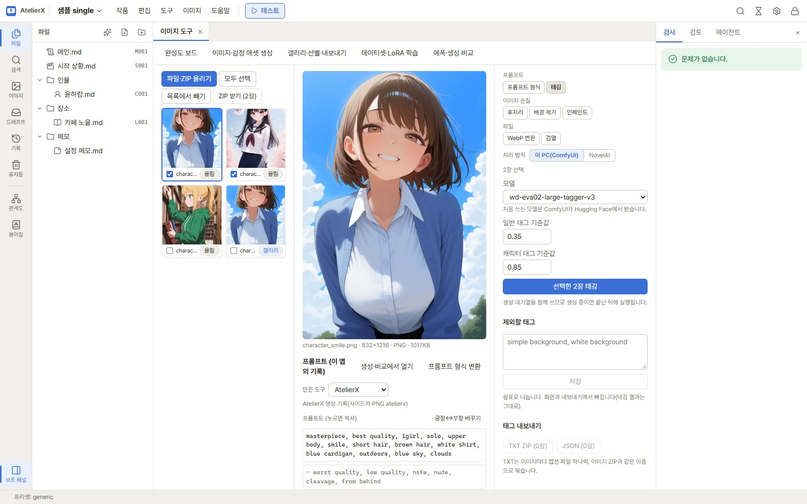
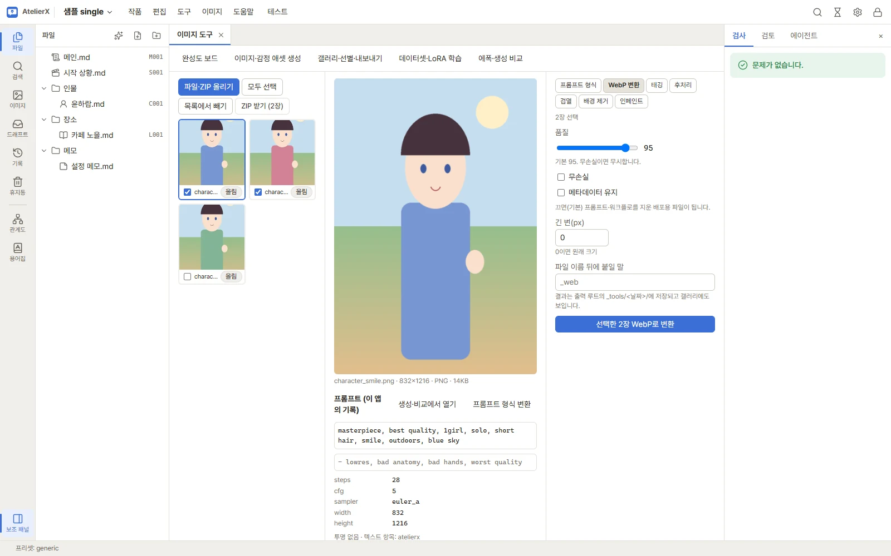

# 이미지 도구와 후처리

생성한 이미지나 가지고 있는 이미지를 다듬는 도구 모음입니다. 작품 상단 **이미지** 메뉴 → **이미지 도구**에서 엽니다. 업스케일, 디테일러, 검열, 배경 제거, 인페인트, 태깅, WebP 변환, 프롬프트 형식 변환을 한 화면에서 합니다.

이 페이지는 도구마다 쓰는 법을 설명합니다. 처음이라면 [7. 후처리](../tutorial/post-processing.md)를 먼저 따라 해 보세요.

## 준비

WebP 변환과 프롬프트 형식 변환은 앱만으로 됩니다. 나머지는 이 PC의 ComfyUI에서 실행되므로 다음이 필요합니다.

| 필요한 것 | 받는 곳 | 쓰는 도구 |
|---|---|---|
| ComfyUI 연결 | **설정 → 이미지** | 업스케일·디테일러·검열·배경 제거·인페인트·태깅 |
| 확장 노드 | **설정 → 설치 → 이미지 생성 서버 확장 노드** | 같음. 설치한 뒤 ComfyUI를 다시 시작합니다 |
| 감지 모델 | **설정 → 설치 → 모델 → 감지 모델 (디테일러·배경·검열)** | 디테일러·검열·배경 제거(사람 분할) |
| 업스케일 모델 | **설정 → 설치 → 모델 → 업스케일 모델** | 업스케일. ComfyUI의 `upscale_models` 폴더에 있는 다른 모델도 고를 수 있습니다 |

ComfyUI에 연결되지 않았거나 노드가 없으면 해당 도구 탭이 흐리게 보입니다. 탭을 누르면 오른쪽에 이유와 함께 **설정 → 이미지 열기** 또는 **설정 → 설치 열기** 버튼이 나옵니다. 연결하거나 노드를 설치하고 ComfyUI를 다시 시작한 뒤 **다시 확인**을 누릅니다. 디테일러 노드만 없으면 후처리 탭의 작업 목록에서 디테일러가 빠지고 그 아래에 안내가 나옵니다. 설치 화면은 [이미지 도구 준비](image-setup.md)에서 설명합니다.

ComfyUI에서 실행하는 도구는 **생성 대기열을 함께 씁니다**. 생성 중이면 앞의 작업이 끝난 뒤에 실행되고, 진행 상황은 **이미지 → 생성 대기열**과 상단의 작업 버튼에서 봅니다.

## 화면 구성

화면은 세 칸입니다.

- **왼쪽 목록**: 작업할 이미지. **파일·ZIP 올리기**를 누르거나 PNG·WebP·JPEG·ZIP을 끌어 놓습니다. 갤러리 이미지는 갤러리에서 고른 뒤 **이미지 도구로 보내기**를 누릅니다(**갤러리** 배지가 붙습니다). 갤러리에서는 한 번에 500장까지 보낼 수 있습니다.
- **가운데**: 누른 이미지를 크게 보여 주고, 아래에 그 이미지의 프롬프트와 **생성 정보 표**를 보여 줍니다(아래 "생성 정보 읽기"). 결과 이미지를 누르면 원본과 **나란히** 또는 **겹쳐 밀기**로 비교합니다. 마스크를 쓰는 탭(검열·배경 제거·인페인트)에서는 이 칸이 마스크 편집기가 됩니다.
- **오른쪽**: 도구 탭과 그 설정. 탭은 하는 일에 따라 세 묶음으로 나뉩니다.

  | 묶음 | 탭 |
  |---|---|
  | 프롬프트 | 프롬프트 형식, 태깅 |
  | 이미지 손질 | 후처리(업스케일·디테일러), 배경 제거, 인페인트 |
  | 파일 | WebP 변환, 검열 |

  ComfyUI에서 실행하는 탭에는 탭 목록 아래에 **처리 방식**(**이 PC(ComfyUI)** / **NovelAI**)이 보입니다. 지금은 모든 도구가 이 PC에서만 되므로 NovelAI는 흐리게 보이고, 누르면 이유를 알려 줍니다. 탭마다 마지막으로 고른 방식을 기억합니다. WebP 변환과 프롬프트 형식은 앱 안에서 처리하므로 처리 방식이 없습니다.

이미지를 **누르는 것**과 **체크하는 것**은 다릅니다. 누른 이미지는 가운데에 보이고 "이 이미지에 적용" 같은 버튼의 대상이 됩니다. 체크한 이미지는 "선택한 N장 처리" 같은 여러 장 작업의 대상입니다. **모두 선택**, **목록에서 빼기**, **ZIP 받기**도 체크한 이미지에 적용됩니다.

### 결과가 저장되는 곳

원본은 바꾸지 않고 결과를 새 파일로 저장합니다.

- 작품 갤러리에서 온 이미지: 원본 옆(같은 표정 폴더)에 저장되고 갤러리에 나타납니다. 갤러리에서 결과를 **통과**시키면 그 조합의 채택 이미지가 후처리한 이미지로 바뀝니다.
- 올린 이미지: 출력 폴더의 `_tools/<날짜>/`에 저장되고 목록에 결과로 추가됩니다.

### 권장 순서

여러 도구를 거칠 때는 다음 순서가 안전합니다.

1. **디테일러** 또는 **인페인트**: 얼굴·손 같은 부분 다시 그리기
2. **업스케일**: 크기 키우기
3. **배경 제거**: 업스케일하면 투명이 사라지므로 업스케일 뒤에
4. **검열**: 배포본에만 필요하면 마지막에
5. **WebP 변환**: 배포용 파일로 줄이기

## 생성 정보 읽기

이미지를 누르면 파일에 남은 생성 정보를 표로 보여 줍니다. LLM 없이 정해진 규칙으로 읽습니다.

- **만든 도구**: ComfyUI, WebUI·Forge, NovelAI, PixAI, AtelierX 중 무엇으로 만들었는지와 그렇게 본 근거(예: `Version: neo-2.28`, ComfyUI 그래프)가 보입니다. 틀렸으면 목록에서 고쳐 고를 수 있습니다(보기에만 쓰임).
- **프롬프트**: 누르면 복사됩니다. 긍정과 부정이 바뀌어 저장된 이미지가 있으므로, **긍정↔부정 바꾸기**로 바꿔 보고 복사할 수 있습니다.
- **생성 설정**: 모델, 텍스트 인코더, LoRA와 강도, 샘플러·스케줄러, 스텝, CFG, shift, 시드, 크기, 업스케일. 값을 누르면 복사됩니다.
- **이 PC에 있는지**: 파일 이름이 같거나 해시·Civitai 판이 맞으면 **이 PC에 있음**으로 보입니다. 이름만 비슷한 파일은 **없음 · 비슷한 파일: …**로 참고만 보여 줍니다. 판이 다른 모델일 수 있으니 직접 확인하세요.
- **이미지 생성 서버에 없는 샘플러·스케줄러**(노드 팩이 더한 것)는 가까운 기본값을 함께 보여 줍니다.
- **앱이 쓰지 않는 노드**: 그래프에 있던 커스텀 노드·보조 노드 목록입니다. 앱 생성에는 반영되지 않습니다.

그림체를 프리셋으로 남기려면 이 표를 보고 [그림체 프리셋](style-presets.md) 화면에서 직접 만드세요. 사이트에 올리며 메타데이터가 지워진 이미지는 "생성 정보가 없습니다"로 보입니다.

## 업스케일

이미지를 업스케일 모델로 키웁니다.

1. 키울 이미지를 체크하고 **후처리** 탭을 엽니다.
2. **작업**에서 **업스케일**을 고릅니다.
3. **모델**을 고릅니다. 애니 일러스트에는 AnimeSharp 계열이 잘 맞습니다.
4. **최종 배율**(0.25~8)을 정합니다. 모델의 배율(예: 2x 모델)과 다르면 업스케일한 뒤 그 배율에 맞게 줄이거나 키웁니다. 4x 모델로 2배를 원하면 2로 두면 됩니다.
5. **선택한 N장 처리**를 누릅니다.

투명 배경 PNG를 업스케일하면 투명이 사라집니다. 배경 제거는 업스케일 뒤에 하세요.

## 디테일러

얼굴·눈·입·손을 찾아 그 부분만 더 자세히 다시 그립니다. 실험 기능이며, ComfyUI에 디테일러 노드가 있어야 **작업** 목록에 나타납니다.

1. 다듬을 이미지를 체크하고 **후처리** 탭에서 **작업**을 **디테일러 (실험)**로 바꿉니다.
2. **다시 그릴 부위**를 고릅니다. 얼굴 → 눈 → 입 → 손 순서로 차례로 처리합니다.
3. **디노이즈**를 정합니다. 높을수록 많이 바뀝니다. 0.3~0.5를 권장합니다. 너무 높으면 얼굴이 다른 사람처럼 바뀔 수 있습니다.
4. **스텝**을 정하고 **선택한 N장 처리**를 누릅니다.

디테일러는 **이 앱으로 만든 이미지(생성 기록이 있는 이미지)**에만 쓸 수 있습니다. 그 이미지를 만든 모델·LoRA·프롬프트로 다시 그리기 때문입니다. 기록이 있으면 가운데 아래에 "프롬프트 (이 앱의 기록)"이 보입니다.

부위는 감지 모델(얼굴·손 YOLO, 눈 분할 모델, SAM)로 찾습니다. 찾지 못한 부위는 건너뜁니다. 특정 부분만 원하는 대로 고치려면 아래 **인페인트**를 쓰세요.

## 마스크 편집기

검열·배경 제거·인페인트는 **마스크**(칠한 영역)로 어디를 처리할지 정합니다. 마스크는 감지로 자동으로 만들거나 브러시로 직접 칠합니다. 이미지마다, 도구마다 따로 저장됩니다.

| 탭 | 칠하는 색 | 뜻 |
|---|---|---|
| 검열 | 빨강 | 칠한 곳을 가립니다 |
| 배경 제거 | 파랑 | 칠한 곳을 남기고 나머지를 투명하게 합니다 |
| 인페인트 | 초록 | 칠한 곳만 다시 그립니다 |

편집기 위쪽 도구:

- **브러시** / **지우개**: 칠하기와 지우기. **크기**로 붓 크기를 바꿉니다.
- **되돌리기** / **다시 하기**: 칠한 것을 한 단계씩 취소하거나 되살립니다.
- **화면에 맞춤**, **100%**: 보기 배율. 확대해서 가장자리를 칠할 때 씁니다.
- **마스크 보기**: 마스크를 겹쳐 보일지와 진하기.
- **배경**: 투명한 부분을 체크무늬·흰색·검정으로 보여 줍니다.
- **결과 미리보기**: 지금 마스크와 설정을 적용한 모습을 미리 봅니다.

오른쪽 칸의 **마스크:** 줄에는 상태(감지함 / 직접 수정함 / 마스크 없음)가 나옵니다. 칠한 뒤에는 **마스크 저장**을 누릅니다. 적용 버튼을 누르면 저장하지 않은 마스크도 먼저 저장합니다. 저장하지 않고 다른 이미지나 탭으로 옮기면 확인을 묻습니다.

## 검열

배포용으로 특정 부위를 모자이크·흐림·단색으로 가립니다. 원본은 그대로 두고 가린 이미지를 새로 저장합니다.

**1. 부위 감지 (선택)**

1. **가릴 부위**에서 감지할 항목을 고릅니다.
2. **감지 기준값**을 정합니다. 낮추면 더 많이(덜 확실한 곳까지) 잡고, 높이면 확실한 곳만 잡습니다. 기본 0.35.
3. 이미지를 체크하고 **선택한 N장에서 감지**를 누릅니다. 감지 결과가 각 이미지의 마스크가 됩니다.

감지는 건너뛰어도 됩니다. 편집기에서 브러시로 직접 칠해도 마스크가 됩니다.

**2. 마스크 고치기**

감지가 놓친 곳은 브러시로 더 칠하고, 잘못 잡은 곳은 지우개로 지운 뒤 **마스크 저장**을 누릅니다. 가리는 용도이므로 넉넉하게 칠해도 됩니다.

**3. 적용**

1. **방법**을 고릅니다.
   - **모자이크**: **블록 크기(px)**가 클수록 거칠게 가립니다.
   - **흐림**: **흐림 반경**이 클수록 흐려집니다.
   - **단색**: **색**과 **불투명도(%)**로 덮습니다.
2. **마스크 넓히기(px)**: 마스크를 바깥으로 넓힙니다(-64~64, 음수면 좁힙니다).
3. **가장자리 부드럽게(px)**: 경계를 부드럽게 섞습니다(0~64).
4. 누른 이미지 하나는 **이 이미지에 적용**, 여러 장은 **마스크 있는 선택 이미지 N장에 적용**을 누릅니다. 마스크가 없는 이미지는 건너뜁니다.

감지 모델은 완벽하지 않습니다. 배포 전에는 결과를 직접 확인하세요.

## 배경 제거

캐릭터만 남기고 배경을 투명하게 한 PNG를 만듭니다.

**1. 배경 나누기 (선택)**

1. **방법**을 고릅니다.
   - **isnet-anime (애니 일러스트)**: 애니풍 그림에 맞습니다. 머리카락 같은 가는 경계를 잘 살립니다.
   - **사람 분할 (YOLO person)**: 사람 모양을 찾습니다. **감지 기준값**으로 감도를 정합니다. 실사에 가까운 그림이나 isnet이 놓칠 때 써 봅니다.
2. 이미지를 체크하고 **선택한 N장 배경 나누기**를 누릅니다. 남길 부분이 파랗게 마스크로 칠해집니다.

**2. 마스크 고치기**

남길 곳은 브러시로 더 칠하고, 지울 곳은 지우개로 지웁니다. **결과 미리보기**를 켜고 **배경**을 흰색·검정으로 바꿔 보면 남은 테두리가 잘 보입니다.

**3. 적용**

**마스크 넓히기**와 **가장자리 부드럽게**(기본 1)로 경계를 맞추고 **이 이미지에 적용** 또는 **마스크 있는 선택 이미지 N장에 적용**을 누릅니다. 투명 PNG가 새로 저장됩니다.

업스케일은 배경 제거 **전에** 하세요. 투명 이미지를 업스케일하면 투명이 사라집니다.

## 인페인트

칠한 곳만 다시 그립니다. 손가락이 이상하거나 소품 하나만 바꾸고 싶을 때 씁니다. 칠하지 않은 픽셀은 그대로 둡니다.

1. 고칠 이미지를 누르고 **인페인트** 탭을 엽니다.
2. **1. 다시 그릴 곳**: 편집기에서 다시 그릴 곳을 초록으로 칠합니다. 고칠 부분보다 조금 넓게 칠하면 주변과 잘 이어집니다.
3. **2. 프롬프트**: 이미지 기록의 프롬프트가 채워져 있습니다. 바꿀 부분만 고칩니다(예: 손을 고칠 때 `holding cup` 추가).
4. **3. 다시 그리기**:
   - **다시 그릴 범위**: **마스크 주변 확대 (권장)**는 마스크 주변을 잘라 생성 크기로 키워 다시 그린 뒤 되돌려 붙입니다. 작은 부분도 자세히 그려집니다. **주변 여유(px)**로 함께 볼 바깥 범위를 정합니다. **전체 이미지**는 이미지 전체 크기로 다시 그립니다.
   - **디노이즈**: 높을수록 많이 바뀝니다. 손·얼굴은 0.5~0.7.
   - **스텝**: 0이면 이미지가 만들어진 스텝을 그대로 씁니다.
5. **이 이미지 인페인트**를 누릅니다.

인페인트도 **이 앱의 기록이 있는 이미지**에만 쓸 수 있습니다. 그 이미지의 모델·LoRA로 다시 그리기 때문입니다. 결과가 마음에 들지 않으면 마스크나 디노이즈를 바꿔 다시 실행합니다. 매번 새 파일로 저장되므로 원본은 그대로입니다.

## 태깅

WD14 태거로 이미지에서 태그를 읽습니다. 다른 도구로 만든 이미지의 프롬프트를 추정하거나 LoRA 학습용 캡션을 만들 때 씁니다.

1. 이미지를 체크하고 **태깅** 탭을 엽니다.
2. **모델**을 고릅니다. 처음 쓰는 모델은 ComfyUI가 내려받습니다.
3. **일반 태그 기준값**과 **캐릭터 태그 기준값**을 정합니다. 낮추면 태그가 많아지고, 높이면 확실한 것만 남습니다.
4. **선택한 N장 태깅**을 누릅니다. 결과는 가운데 칸의 **WD14 태그**에 나오고, 목록 카드에 **태그** 배지가 붙습니다.

**제외할 태그**에는 결과에서 뺄 태그(예: `simple background`, 워터마크)를 쉼표로 적고 **저장**합니다. 화면과 내보내기에서 빠지며, 태깅 결과 자체는 그대로 남습니다.

**태그 내보내기**:

- **TXT ZIP**: 이미지마다 캡션 파일 하나씩. 이미지 ZIP과 같은 이름으로 묶여 학습 도구에 바로 쓸 수 있습니다.
- **JSON**: 모든 이미지의 태그를 파일 하나로.

## WebP 변환

PNG를 배포용 WebP로 줄입니다. ComfyUI 없이 앱에서 바로 합니다.

1. 이미지를 체크하고 **WebP 변환** 탭을 엽니다.
2. 설정을 정합니다.
   - **품질**: 기본 95. **무손실**을 켜면 무시합니다.
   - **메타데이터 유지**: 켜면 ComfyUI 프롬프트·워크플로를 ComfyUI의 WebP 방식(EXIF)으로 남깁니다. 끄면(기본) 프롬프트·워크플로를 지운 배포용 파일이 됩니다.
   - **긴 변(px)**: 긴 쪽을 이 크기로 줄입니다. 0이면 원래 크기.
   - **파일 이름 뒤에 붙일 말**: 원본과 구분할 접미사.
3. **선택한 N장 WebP로 변환**을 누릅니다. 결과는 출력 폴더의 `_tools/<날짜>/`에 저장되고 목록에 추가됩니다.

## 프롬프트 형식

NovelAI (V4.5)·Anima·SDXL·Illustrious(ComfyUI) 사이에서 프롬프트의 가중치와 작가 표기 문법만 바꿉니다. 자연어, 태그 순서, 모르는 이름은 그대로 둡니다.

1. **프롬프트 형식** 탭을 엽니다. 이미지를 고르지 않아도 됩니다. 가운데 칸에서 이미지를 보고 있다면 그 프롬프트 옆의 **프롬프트 형식 변환**을 눌러 원문을 채운 채로 올 수도 있습니다.
2. **원래 형식**과 **바꿀 형식**을 고르고 **원문**에 positive·negative를 넣습니다.
3. SDXL 프롬프트는 작가 이름에 표시가 없으므로, 작가로 바꿀 이름을 **알려진 작가 이름**에 한 줄에 한 명씩 적습니다.
4. **변환**을 누릅니다. **변환 결과**를 **positive 복사**·**negative 복사**로 가져가거나, **생성·비교에서 열기**로 보내 바로 생성해 봅니다.

**바뀐 곳**에는 고친 부분이, **확인할 곳**에는 바꾸지 못했거나 느낌이 달라질 수 있는 부분(가중치, 맞지 않는 괄호 등)이 나옵니다.

## 문제 해결

| 증상 | 확인할 것 |
|---|---|
| 탭이 흐리고 "ComfyUI에 연결되지 않았습니다" | ComfyUI를 실행하고 **설정 → 이미지**에서 연결을 확인한 뒤 **다시 확인** |
| 탭이 흐리고 "ComfyUI에 필요한 노드가 없습니다" | **설정 → 설치**에서 확장 노드를 설치하고 ComfyUI를 다시 시작한 뒤 **다시 확인** |
| 업스케일 모델 목록이 비어 있음 | **설정 → 설치 → 모델**에서 업스케일 모델을 받거나, ComfyUI `upscale_models` 폴더에 넣고 ComfyUI를 다시 시작합니다 |
| 디테일러가 작업 목록에 없음 | 디테일러 노드가 설치되지 않았습니다. 노드를 다시 설치합니다 |
| 디테일러가 실패하거나 인페인트 버튼이 안 눌림 | 생성 기록이 없는 이미지입니다. 이 앱으로 만든 이미지만 됩니다 |
| 감지 결과가 비어 있음 | 감지 기준값을 낮추거나 브러시로 직접 칠합니다. 감지 모델이 설치됐는지 확인합니다 |
| 작업이 시작되지 않음 | 생성 대기열이 일시 정지됐거나 다른 작업이 실행 중입니다. **이미지 → 생성 대기열**을 확인합니다 |
