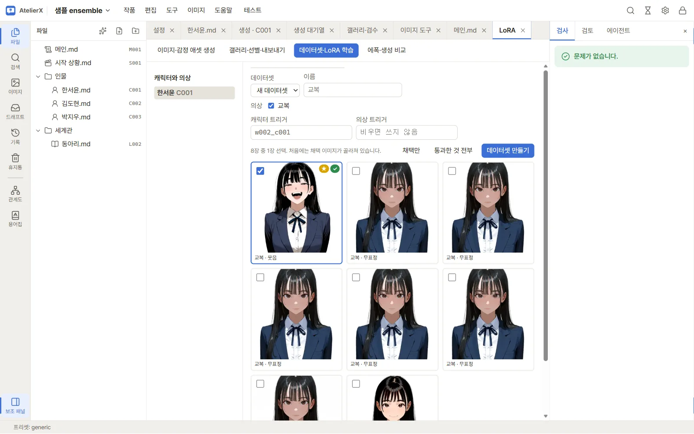

# LoRA 데이터셋과 학습

이 페이지는 이미지 디자인이 저장된 캐릭터를 골라 채택 이미지를 데이터셋으로 만들고, 학습 기록을 생성해 에폭을 등록하는 절차입니다. LoRA 학습은 선택 기능이며 모델 파일과 CUDA GPU 공간을 요구합니다. 외부 도구의 실제 설치와 버전 조합은 PC 환경에 따라 달라질 수 있습니다.

## 1. 준비 상태 확인

1. [이미지 환경 준비](image-setup.md)에 따라 ComfyUI를 연결하고 실행합니다. 모델은 ComfyUI가 읽는 폴더에 저장됩니다.
2. **설정 → 이미지 → LoRA 학습 → 학습 환경 자동 준비**를 누릅니다. 필요한 설치 도구, 학습 도구와 Python 환경, 공식 Anima 학습 모델(DiT·텍스트 인코더·VAE)을 준비하고 비어 있는 경로를 자동 입력합니다. 모델만 약 5.6GB이며 Python·CUDA 관련 의존성은 추가 용량이 필요합니다. 이미 발견한 모델 파일은 다시 받지 않습니다. 진행 로그와 완료 후 준비 상태를 확인합니다.
3. 작품의 캐릭터 파일을 열고 **이미지** 탭에 외모/의상 설계를 저장합니다. 최소 한 이미지가 갤러리에 있어야 다음 단계에서 선택할 수 있습니다.
4. 상단 **이미지 → LoRA**로 이동하고 왼쪽에서 캐릭터를 선택합니다. 왼쪽 목록에는 이미지 설계가 있는 캐릭터만 표시됩니다.

직접 입력한 경로는 유지합니다. 미저장 편집이 있으면 먼저 저장한 뒤 자동 준비를 실행하세요. 기존 경로가 잘못돼 있다면 수동 설정에서 수정해야 합니다. 생성용 모델은 별도의 선택 항목으로, 공식 기반 모델로 학습할 때 모두 입력할 필요는 없습니다.

## 2. 데이터셋 만들기

1. **데이터셋** 탭에서 상단 데이터셋 선택을 **새 데이터셋**으로 둡니다.
2. 이름 칸에 알아볼 이름을 입력합니다. 예: `봄 교복 실험`. 예시는 가상 이름입니다.
3. **의상**에서 학습에 넣을 의상을 체크합니다. 체크한 의상에 해당하는 후보 이미지들이 아래에 표시됩니다.
4. **캐릭터 트리거**에 캐릭터 식별용 단어를 입력합니다. 예: `demo_char01` (가상 토큰). 비워 두면 이미지 디자인의 트리거를 사용할 수 있습니다.
5. 의상 하나를 따로 학습한다면 **의상 트리거**도 지정할 수 있습니다. 예: `demo_outfit01` (가상 토큰). 입력하지 않으면 쓰지 않습니다.
6. 처음에는 **채택만** 버튼으로 채택 이미지를 고릅니다. 실제로는 화면 안내에 따라 기본 체크가 이미 채택 이미지에 맞춰져 있습니다. 원한다면 **통과한 것 전부**로 바꾸거나 개별 썸네일 체크박스를 조정합니다. 실패 이미지가 포함되지 않았는지 확인합니다.
7. `N장 중 M장 선택` 표시에서 선택 수가 0이 아닌지 확인하고 **데이터셋 만들기**를 누릅니다. 기존 데이터셋을 편집 중이면 버튼은 **데이터셋 갱신**으로 표시됩니다.

선택 입력을 요약하면 다음과 같습니다.

| 항목 | 무엇을 선택/입력하나 | 가상 예 |
|---|---|---|
| 의상 | 이미지 후보를 불러올 의상 | `교복` |
| 캐릭터 트리거 | 캐릭터 외모를 가리킬 토큰 | `demo_char01` |
| 의상 트리거 | 선택 의상의 토큰, 선택 사항 | `demo_outfit01` |
| 이미지 선택 | 채택 또는 통과 이미지를 개별 조정 | 12장 중 10장 |
| 데이터셋 이름 | 식별하기 쉬운 이름 | `봄 교복 실험` |

## 3. 캡션 검토와 저장

데이터셋 생성 후 **캡션 (N)**에 이미지별 캡션이 표시됩니다. 기본 순서는 등급, 인원, 캐릭터 트리거, 의상 트리거, 구도·배경·표정입니다. 앱 안내는 외모·의상 자체 태그를 일부러 빼고 트리거가 이를 학습하게 합니다.

1. 각 썸네일 옆 텍스트를 확인합니다. 인원, 구도, 배경, 표정이 이미지와 어긋난 부분만 고칩니다.
2. 자동 캡션을 다시 만들려면 **자동 캡션 다시 만들기**를 누릅니다. 직접 고친 캡션은 그대로 보존된다고 화면이 안내합니다.
3. 변경 후 **캡션 저장**을 누릅니다. 버튼은 캡션을 편집했을 때 활성화됩니다.
4. 학습 전 데이터셋 선택으로 돌아가 의상·선택 수를 다시 확인합니다. 데이터셋은 이미지를 복사하지 않고 경로와 해시로 참조하므로 원본 파일을 이동·삭제하지 마세요.

## 4. 학습 시작

1. **학습** 탭을 누릅니다. 위쪽 준비 경고가 있으면 누락 항목을 해결합니다. 화면에는 도구, 패치, Python, LoRA 폴더, 모델 파일 문제를 각각 표시합니다.
2. 데이터셋을 선택합니다. 드롭다운에 데이터셋 ID, 이름, 이미지 수가 표시됩니다.
3. **방식**에서 `T-LoRA (dim 32, alpha 32)` 또는 `LoRA (dim 32, alpha 128)`를 선택합니다.
4. **학습 모델**을 준비 상태에 표시된 모델에서 선택합니다.
5. **에폭**, **저장 간격(에폭)**, **학습률**을 확인합니다. 기본 입력은 40, 10, `1e-4`입니다.
6. **학습 시작**을 누릅니다. GPU가 사용 중이면 `GPU 대기`로 시작하고, 이어서 `전처리 중`, `학습 중` 상태가 될 수 있습니다.

| 학습 입력 | 기본/선택 값 | 의미 |
|---|---|---|
| 데이터셋 | 저장된 ID · 이름 · 이미지 수 | 학습 이미지와 캡션 |
| 방식 | T-LoRA 또는 LoRA | 학습 방식 선택 |
| 학습 모델 | 감지된 학습 모델 | 학습 기반 모델 |
| 에폭 | 40 | 전체 학습 반복 횟수 |
| 저장 간격(에폭) | 10 | 몇 에폭마다 결과 파일을 남길지 |
| 학습률 | `1e-4` | 학습률 입력 문자열 |

기본값은 시작 참고값이지 모든 데이터셋에 맞는 권장 학습 설정은 아닙니다. GPU 메모리·모델·데이터셋을 고려해 선택하세요. 학습 중 새 GPU 생성 작업은 대기할 수 있습니다.

## 5. 진행 확인과 에폭 등록

**학습 기록**에서 상태 배지, 진행 스텝, 에폭, loss를 확인합니다. **로그**를 열어 상세 로그를 볼 수 있습니다. 완료되면 생성된 **에폭 파일** 버튼 중 하나를 누릅니다. `등록하며 자동 적용` 체크가 켜져 있으면 등록과 함께 자동 적용이 활성화됩니다.

등록 결과를 확인하려면 **쓰는 LoRA** 탭에서 항목을 찾습니다. 이름, 세기, 자동 적용, 적용 범위(캐릭터 전체 또는 이 의상만), 모델 계열(Anima, SDXL·IL, 공용), 사용 여부를 설정하고 **저장**합니다. 외부 LoRA 파일도 **이미지 서버의 LoRA 파일 추가**에서 골라 **추가**할 수 있습니다. **목록에서 빼기**는 등록 목록에서만 제거하며 실제 모델 파일은 삭제하지 않습니다.

## 성공 확인

성공하면 학습 기록 상태가 **완료**이고 에폭 등록 버튼들이 보입니다. 선택 에폭을 등록한 뒤 **쓰는 LoRA**에 파일명·출처가 나타나야 합니다. 자동 적용을 켠 경우 생성 화면에서 동일한 모델 계열과 대상 캐릭터/의상을 사용하도록 설정하고 결과를 확인합니다.

## 학습한 LoRA는 어디에 있나요

학습한 LoRA 파일의 원본은 앱 폴더의 `output/loras`에 있습니다(설정에서 다른 폴더를 고를 수 있음). ComfyUI에서는 LoRA 폴더 안의 `atelierx` 폴더에 보이고, LoRA 이름은 `atelierx\파일 이름`입니다. 파일을 복사하지 않고 폴더 링크(Windows 정션)로 연결하므로 용량은 한 벌만 씁니다.

- 연결은 **학습 환경 자동 준비**가 만들고, 설정 → 이미지 → LoRA 학습의 **ComfyUI 연결**에서 상태를 보고 **연결**을 누를 수도 있습니다.
- 앱 폴더를 다른 곳으로 옮기면 연결이 **끊김**으로 바뀝니다. **다시 연결**을 누르면 링크만 새로 만들고 파일은 건드리지 않습니다.
- 예전 설정처럼 LoRA 폴더를 ComfyUI 폴더로 정해 두었다면 **AtelierX 폴더로 옮기기**가 보입니다. 누르면 파일을 `output/loras`로 옮기고, 캐릭터에 등록한 LoRA 이름도 함께 바꿉니다.
- ComfyUI에 이미 `atelierx`라는 다른 폴더가 있으면 덮어쓰지 않고 알립니다. 그 폴더의 이름을 바꾼 뒤 다시 연결하세요.

주의할 점:

- ComfyUI 쪽 `atelierx` 폴더에서 파일을 지우면 원본이 지워집니다.
- 정션은 두 폴더가 모두 이 PC의 로컬 드라이브에 있어야 합니다(네트워크 드라이브 불가).
- ComfyUI 폴더까지 함께 백업하는 프로그램은 같은 파일을 두 번 셀 수 있습니다.

## 오류가 나면

- **학습 도구가 없습니다**: 설정 → 이미지 → LoRA 학습에서 **학습 환경 자동 준비**를 실행합니다. 기존 설정 → 설치의 개별 설치도 사용할 수 있습니다.
- **모델 경로 패치 또는 Python 누락**: 설치 화면 로그를 보고 학습 도구 설치/동기화 상태를 확인합니다.
- **LoRA 폴더를 만들 수 없음**: 설정 → 이미지 → LoRA 학습의 LoRA 폴더를 비우거나(기본 `output/loras`) 쓰기 가능한 폴더로 바꿉니다.
- **학습 모델이 없습니다**: 설치 화면에서 학습 모델을 준비하고 학습 설정에서 파일을 다시 선택합니다.
- **데이터셋에 이미지가 없습니다**: 데이터셋 탭에서 의상을 체크하고 갤러리의 통과/채택 이미지를 선택합니다.
- **실패 또는 중단됨**: 해당 기록의 **로그**를 열어 첫 오류를 확인합니다. 학습 중에 앱을 닫으면 학습도 함께 멈추고 중단됨으로 기록됩니다. 자동으로 이어지지 않으니 새 실행을 준비합니다.
- **에폭 등록 또는 생성에서 LoRA를 못 찾음**: 설정 → 이미지 → LoRA 학습의 **ComfyUI 연결**이 "연결됨"인지 확인합니다. "끊김"이면 **다시 연결**을 누릅니다. 그다음 이미지 서버 카탈로그를 새로 확인합니다.

## 다음 단계

[이미지 생성](generation.md)에서 등록 LoRA가 대상 계열·캐릭터에 적용되는지 시험하세요.
