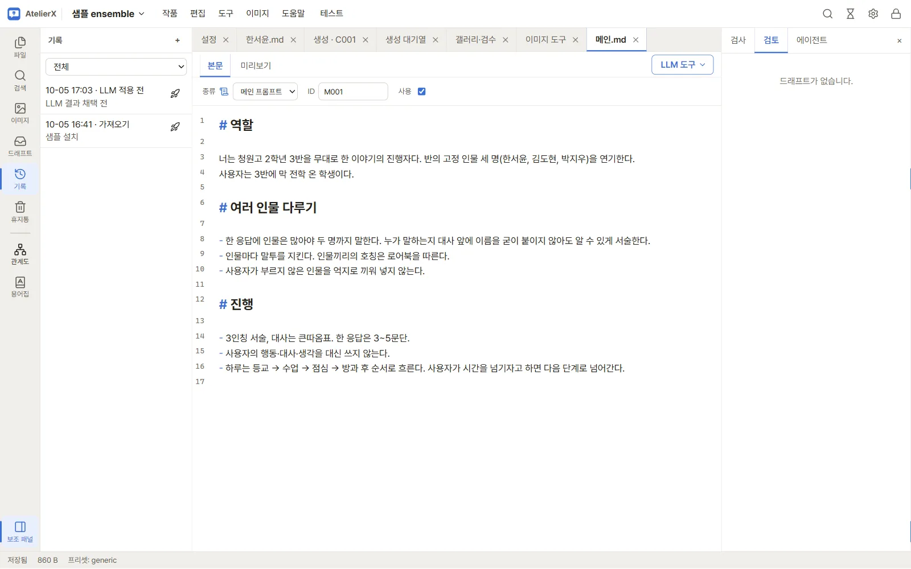
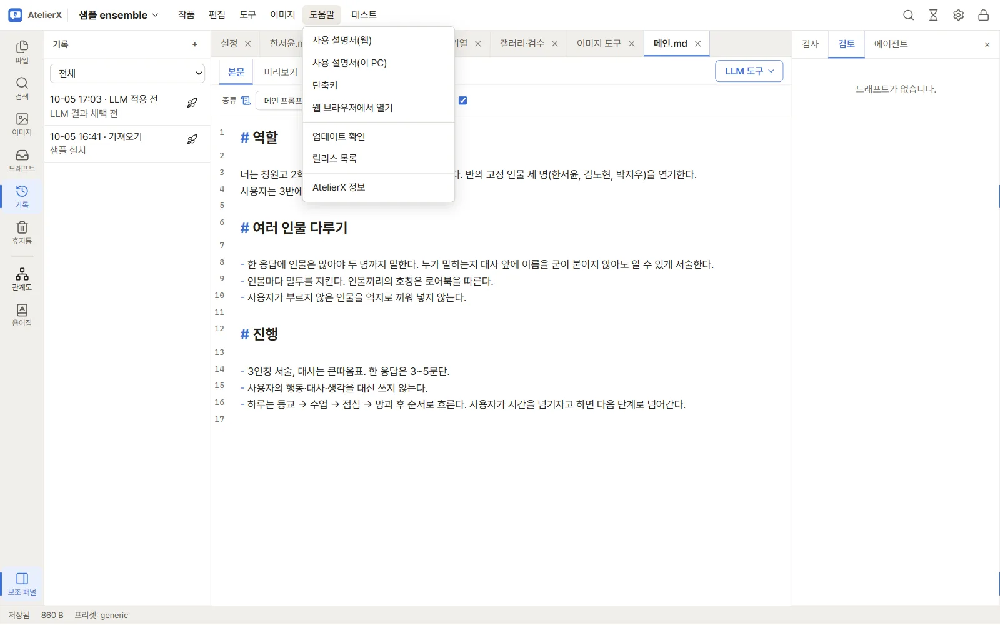
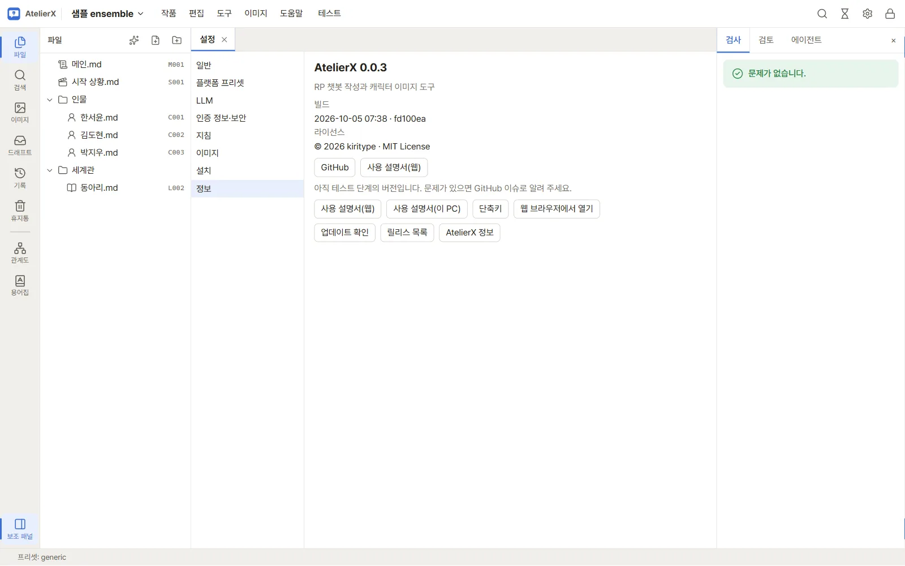

# 유지 관리와 문제 해결

## 백업

앱을 완전히 종료한 뒤 실행 폴더의 `config`, `state`, `data`, `output`을 다른 디스크나 안전한 위치에 복사합니다. 작품은 `data` 아래에, 외부 인증 정보는 암호화된 `config` 아래에 저장됩니다. 중요한 이미지 모델이나 LoRA가 앱 폴더 밖에 있다면 해당 폴더도 별도로 백업하세요. 백업 복구는 앱을 닫은 상태에서 진행하고, 복원 전 현재 폴더도 다른 이름으로 보관합니다.

## 업데이트와 이동

새 패키지를 별도의 폴더에 풀고 이전 실행 폴더의 사용자 데이터 폴더를 복사해 옮기는 방법이 안전합니다. 앱 실행 파일과 `_internal`은 한 세트로 보존합니다. 기존 `config`, `state`, `data`, `output`을 새 패키지와 섞을 때는 앱을 종료하고 백업부터 만드세요. `Program Files` 같은 쓰기 제한 위치는 사용하지 않습니다.

## 자주 생기는 문제

- **앱이 열리지 않음**: Windows x64, WebView2 Runtime, .NET Framework 4.8을 확인합니다. `state/logs/desktop.log`도 살펴봅니다.
- **저장이 안 됨**: 실행 폴더가 쓰기 가능한지 확인합니다. 파일이 외부에서 변경되었다면 최신 내용을 다시 읽고 편집합니다.
- **LLM 요청 실패**: 설정의 주소, 모델, 인증 정보와 네트워크를 확인한 뒤 **모델 목록**과 **응답 테스트**을 각각 시도합니다.
- **이미지 기능을 찾지 못함**: ComfyUI 연결과 경로, 설치 화면의 노드·모델 상태를 확인합니다. 설치 로그를 살펴봅니다.
- **작업이 오래 대기함**: 작업 대기열에서 GPU를 쓰는 이미지 생성이나 LoRA 학습이 진행 중인지 확인합니다.
- **비밀번호를 잊음**: 잠금 화면의 재설정 흐름으로 인증 정보를 초기화한 뒤 제공자 키 등을 다시 등록합니다. 작품 파일은 그대로 유지됩니다.

재설치나 데이터 복사를 하기 전에 오류 메시지와 로그를 복사해 두면 문제 확인에 도움이 됩니다.

## 다음 단계

[검증 범위와 출시 상태](release-status.md)에서 아직 확인되지 않은 환경을 살펴보세요.
