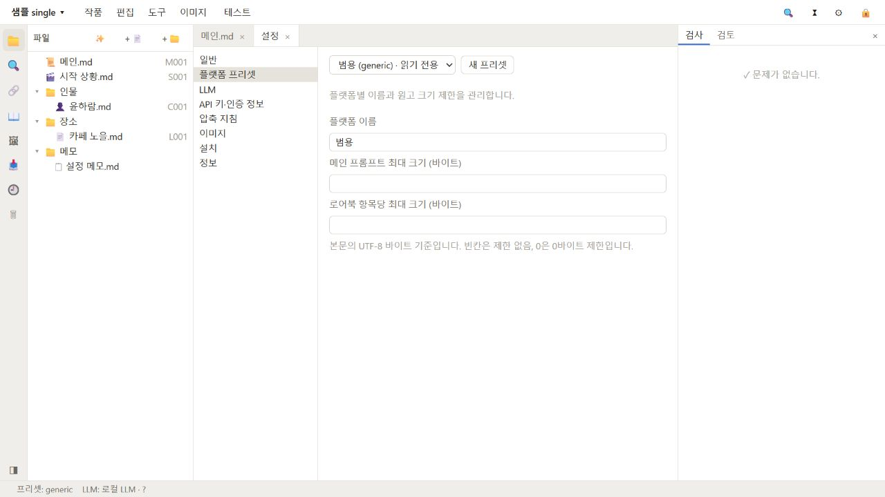

# 플랫폼 프리셋

## 프리셋 관리

설정의 **플랫폼** 화면에서 프리셋을 선택합니다. **generic**은 읽기 전용 기본값입니다. 다른 서비스를 위한 프리셋은 **새 프리셋**으로 ID와 이름을 지정해 만듭니다. 이 화면에서 바꿀 수 있는 항목은 프리셋 이름과 메인·로어북 항목별 길이 제한이며, **저장**을 눌러 반영합니다. 작품이나 앱 기본값에서 사용 중인 프리셋은 삭제할 수 없습니다. 플랫폼 지침 파일을 편집하는 UI는 제공하지 않습니다.

작품에는 작품 설정의 태그로 프리셋을 연결합니다. 새 작품에는 설정에서 지정한 기본 프리셋이 태그로 미리 들어갈 수 있습니다. 작품 설정은 적용된 규칙과 규칙별 출처를 표시합니다. 프리셋을 바꾸려면 작품 설정에서 태그를 수정해 저장하세요.

## 길이 제한 설정과 적용 순서

프리셋의 길이 계산 단위는 UTF-8 바이트입니다. **메인 프롬프트 최대 길이**와 **로어북 항목별 최대 길이**는 별도로 정합니다. 제한을 비우면 제한 없음이며, 값은 0 이상의 정수여야 합니다.

이 제한은 파일마다 따로 검사됩니다. 메인과 로어북 항목 길이를 더한 총량 제한과 혼동하지 마세요. 한글은 UTF-8에서 보통 한 글자가 여러 바이트를 차지하므로 문자 수와 바이트 수는 같지 않습니다. 앱의 검사 결과와 편집기 크기 표시를 기준으로 확인하세요.

작품 설정 화면에는 현재 적용된 규칙 값과 각 값의 출처가 표시됩니다. 규칙은 기본값에서 시작해 작품 태그에 연결된 프리셋을 태그 순서대로 적용하고, 작품의 재정의 값이 있으면 마지막에 적용합니다. 키워드 매칭, 로어북 선택 예산, JSX 응답 형식 등 추가 값은 프리셋 JSON에 저장되지만 플랫폼 화면에서 직접 편집할 수 없습니다. 저장 시 화면에 없는 값도 서버가 기존 JSON에서 보존합니다. 작품 태그를 바꾸면 연결 프리셋이 달라질 수 있으므로 저장 후 작품 설정의 값·출처를 다시 확인하세요.

`platform.md` 같은 플랫폼 가이드라인 파일은 프롬프트 생성 작업에 적용될 수 있지만 플랫폼 화면에서 편집할 수 없습니다. 적용되는 길이 제한은 아래 그림처럼 메인·로어북 항목별 입력칸으로 조정합니다.

## 다음 단계

[대화 테스트](chat-test.md)에서 규칙에 따라 선택되는 로어북 맥락을 확인하거나 [유지 관리](maintenance.md)를 읽으세요.
