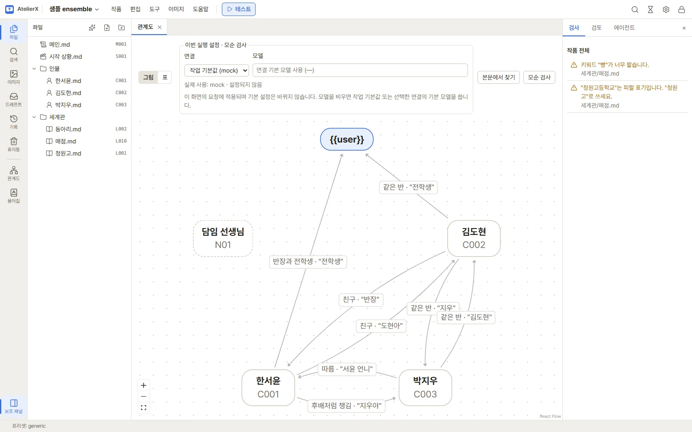
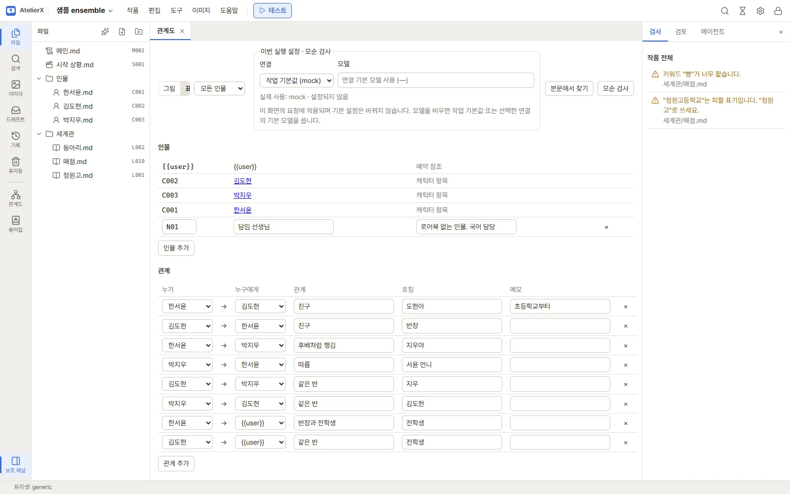
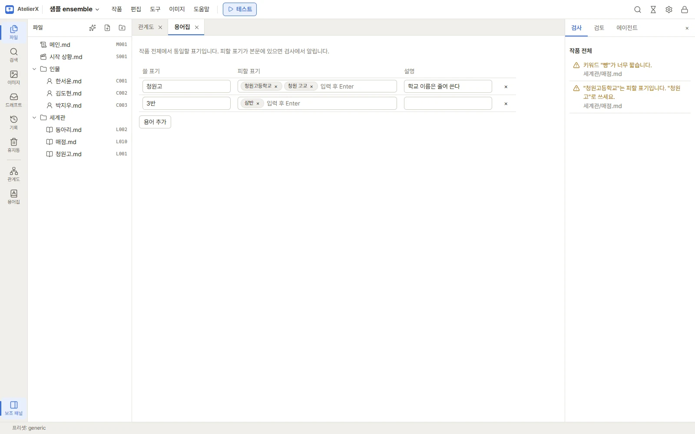

# 관계도·용어집·모순 검사

인물이 여럿인 작품에서 누가 누구를 어떻게 부르는지, 어떤 표기로 통일할지 정리하고, 원고끼리 어긋나는 곳을 찾는 도구입니다.
관계도와 용어집은 **참고용**이라 내보내기와 대화 테스트에는 들어가지 않습니다. 관계의 원본은 각 로어북·캐릭터 문서와 메인
프롬프트입니다.

## 관계도

작품 창의 **도구** 메뉴 → **관계도**(또는 왼쪽 활동 막대의 관계도)로 엽니다. 위쪽에서 **그림**과 **표**를 오갑니다. 고치면 잠시 뒤
자동으로 저장합니다.

### 그림

- 인물이 상자, 관계가 화살표입니다. 화살표 위에 관계와 호칭("반장" 등)이 적힙니다. 서로 다른 두 방향의 관계는 따로 그려집니다.
- `{{user}}`(사용자)는 늘 있고 다른 색으로 보입니다. 로어북이 없는 인물은 점선 테두리입니다.
- 상자를 끌어 옮기면 위치가 저장됩니다. 상자를 누르면 그 인물의 관계만 진하게 보입니다.
- 왼쪽 아래 버튼으로 확대·축소하고 전체를 화면에 맞춥니다.

### 표

위쪽 **모든 인물** 목록에서 인물을 고르면 그 인물이 나오는 관계·사실만 걸러 봅니다.

- **인물**: `{{user}}`와 캐릭터 항목은 자동으로 들어옵니다(이름은 파일 이름, 여기서 고칠 수 없음). 이름을 누르면 그 로어북이
  열립니다. 로어북이 없는 인물(담임 선생님 등)은 **인물 추가**로 ID(`N01` …)·이름·메모를 적습니다.
- **관계**: 한 줄에 한 방향입니다. **누가** → **누구에게**, **관계**(친구, 같은 반 …), **호칭**(그 사람을 부르는 말), **메모**.
  서로 부르는 말이 다르면 두 줄로 적습니다. **관계 추가**로 줄을 더합니다.
- **기준 사실**: 인물별로 바뀌면 안 되는 값(나이 17, 학년 2, 소속 3반 …)을 **항목**과 **값**으로 적습니다. **사실 추가**로 더합니다.

### 본문에서 찾기

관계도 위쪽의 **본문에서 찾기**는 LLM이 캐릭터 본문을 읽고 관계·호칭·사실 후보를 뽑습니다. 끝나면 오른쪽 보조 패널의 **검토**와
**드래프트**에 나옵니다.

1. 검토 화면에서 줄마다 상태를 확인합니다: **새로움**(관계도에 없음), **같음**, **다름**(이미 있는 줄과 값이 다름).
2. 더할 줄만 체크하고 **관계도에 더하기**를 누릅니다. 관계도에 없는 이름은 로어북 없는 인물로 더해진다고 미리 알려 줍니다.

어떤 연결·모델로 보낼지는 위쪽 **이번 실행 설정**에서 고릅니다(기본은 설정의 작업별 모델). → [LLM 연결](connections.md)

## 용어집

**도구** 메뉴 → **용어집**으로 엽니다. 작품 전체에서 통일할 표기를 적습니다. 고치면 잠시 뒤 자동으로 저장합니다.

- **쓸 표기**: 쓰기로 한 표기(예: 청원고).
- **피할 표기**: 쓰지 않을 표기들. 입력하고 Enter로 하나씩 더합니다(예: 청원고등학교, 청원 고교).
- **설명**: 왜 그렇게 쓰는지.

피할 표기가 원고에 있으면 오른쪽 **검사** 패널에 "○○는 피할 표기입니다. △△로 쓰세요."가 나옵니다. 한꺼번에 고치려면
[이름 일괄 변경](editing.md)을 씁니다.

## 모순 검사

**도구** 메뉴 → **모순 검사**(또는 관계도 위쪽의 **모순 검사**)는 LLM이 작품 전체를 읽고 서로 어긋나는 곳을 찾습니다. 관계도의
관계·기준 사실과 캐릭터 본문도 함께 봅니다. 끝나면 **검토**에 "모순 검사 · 남은 문제 N개"로 나옵니다.

- 문제마다 종류(**어긋남**, **빠짐**, **모호함**), 관련 파일, 근거 인용, 설명, 고칠 제안이 보입니다. 근거를 원고에서 찾지 못한
  문제는 **근거 확인 안 됨**으로 표시됩니다.
- **제안 적용**: 제안한 고친 글을 본문에 넣습니다. 적용 전 스냅숏을 남깁니다. 그 사이 본문이 바뀌었으면 적용할 수 없으니 직접 고칩니다.
- **해결됨**: 직접 고쳤거나 문제가 아니면 표시합니다.
- **무시**: 이유를 적을 수 있고, 같은 근거의 문제는 다음 검사에서 접혀 나옵니다.
- **처리한 문제도 보기**로 처리한 것까지 보고, 다 보면 **검토 끝내기**를 누릅니다.

LLM 없이 바로 알 수 있는 문제(없는 인물을 가리키는 관계, 피할 표기 등)는 검사를 따로 돌리지 않아도 오른쪽 **검사** 패널에
나옵니다. → [파일과 편집기](editing.md)

## 다음 단계

원고에서 이름을 한꺼번에 바꾸려면 [파일과 편집기](editing.md)의 이름 일괄 변경을, 바꾸기 전 상태로 돌아가려면
[기록과 휴지통](history.md)을 보세요.
