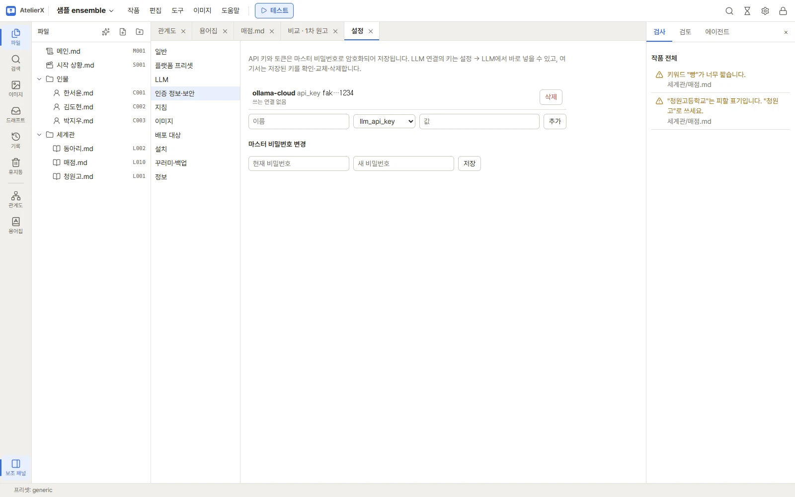

# 설정 한눈에 보기

작품 창 오른쪽 위 톱니바퀴(또는 작품 목록의 설정)를 누르면 설정 탭이 열립니다. 왼쪽 목록에서 영역을 고릅니다. 설정은 앱 전체에
적용되고, 작품 하나에만 적용할 것은 작품 창의 **작품 → 작품 설정**에서 정합니다. → [작품 목록과 작품 설정](works.md)

| 영역 | 하는 일 | 자세히 |
|---|---|---|
| 일반 | 화면 언어, 자동 저장, 시작할 때 업데이트 확인, 새 작품의 기본 플랫폼 프리셋, 자동 스냅숏 간격 | 아래 |
| 플랫폼 프리셋 | 챗봇 플랫폼별 규칙(용량 제한, JSX 규칙 등) | [플랫폼 프리셋](platforms.md) |
| LLM | LLM 연결, 작업별 모델, 사용량 | [LLM 연결](connections.md) |
| 인증 정보·보안 | 저장된 API 키 목록, 마스터 비밀번호 변경 | 아래 |
| 지침 | LLM 작업·에이전트 모드의 지침 | [지침](guidelines.md) |
| 이미지 | ComfyUI 연결, 모델 폴더, GPU, 인터넷 이미지 서비스, 자동 검수, LoRA 학습 | [이미지 환경 준비](image-setup.md), [인터넷 이미지 서비스](image-services.md) |
| 배포 대상 | 채택 이미지를 올릴 R2 버킷 | [배포 대상에 올리기](deployment.md) |
| 설치 | 보조 도구, 확장 노드, 모델, LoRA 학습 도구 받기 | [이미지 환경 준비](image-setup.md) |
| 꾸러미·백업 | 설정 꾸러미 내보내기·가져오기 | [유지 관리](maintenance.md) |
| 정보 | 버전, 빌드, 라이선스, 문제·의견을 보내는 곳 | [유지 관리](maintenance.md) |

설정 화면에서 고친 뒤 저장하지 않고 다른 탭으로 가거나 작품에서 나가려 하면 먼저 묻습니다.

## 일반

- **언어**: 화면 언어(한국어·English). 바로 바뀝니다.
- **자동 저장**: 기본으로 켜져 있습니다. 편집기에서 입력을 멈추고 약 1초 뒤 저장합니다. 끄면 `Ctrl+S`로 저장합니다.
- **시작할 때 업데이트 확인**: 켜면 앱을 열 때 GitHub에 최신 릴리스를 한 번 묻습니다. 내려받거나 설치하지는 않습니다. 업데이트는
  **도움말 → 업데이트 확인**에서 합니다. → [유지 관리](maintenance.md)
- **새 작품의 기본 플랫폼 프리셋**: 고르면 새 작품의 태그에 그 프리셋이 미리 들어갑니다.
- **자동 스냅숏 간격 (분)**: 저장할 때 생기는 스냅숏을 몇 분 간격으로 묶을지. → [기록과 휴지통](history.md)

## 인증 정보·보안

API 키와 토큰은 마스터 비밀번호로 암호화해 금고(`config/vault.json`)에 저장합니다. 작품 파일은 암호화하지 않습니다.

- **저장된 키 목록**: 이름과 가린 값(앞뒤 몇 글자), 어느 연결이 쓰는지(**사용 중** / **쓰는 연결 없음**)가 보입니다.
  - **삭제**: 금고에서 지웁니다. 쓰는 연결이 있으면 어느 연결인지 알려 주고 한 번 더 묻습니다. 지우면 그 연결은 키 없이 요청합니다.
  - **추가**: 이름·종류·값을 적어 키를 직접 넣습니다. LLM 연결이나 이미지 서비스의 키는 각 설정 화면에서 바로 넣어도 여기에
    저장됩니다.
- **마스터 비밀번호 변경**: **현재 비밀번호**와 **새 비밀번호**를 넣고 **저장**합니다. 이후 잠금 해제와 금고는 새 비밀번호로 엽니다. 저장한 키는 그대로 남습니다.
- 비밀번호를 잊었다면 잠금 화면의 재설정으로 금고를 비우고 새로 시작합니다(저장한 키는 다시 넣어야 함, 작품은 그대로). →
  [유지 관리](maintenance.md)
- 자리를 비울 때는 오른쪽 위 자물쇠(또는 `Ctrl+Shift+L`)로 잠급니다.

## LLM 사용량

설정 → **LLM** 아래쪽 **사용량**에서 답을 받은 요청 수와 입력·출력 토큰을 봅니다.

- **달**과 **묶는 기준**(작업별 / 작품별 / 연결·모델·작업별)을 고릅니다. 작품·작업으로 걸러 볼 수도 있습니다.
- **요청별 기록 보기**로 요청 하나하나(시각, 작품, 작업, 연결·모델, 토큰)를 봅니다.
- **CSV로 내보내기**로 표를 파일로 받습니다.
- 토큰 수를 알려 주지 않는 서버의 요청은 "토큰 모름"으로 세고 합계 토큰에는 넣지 않습니다. 요금은 각 서비스의 결제 화면을
  기준으로 보세요.
