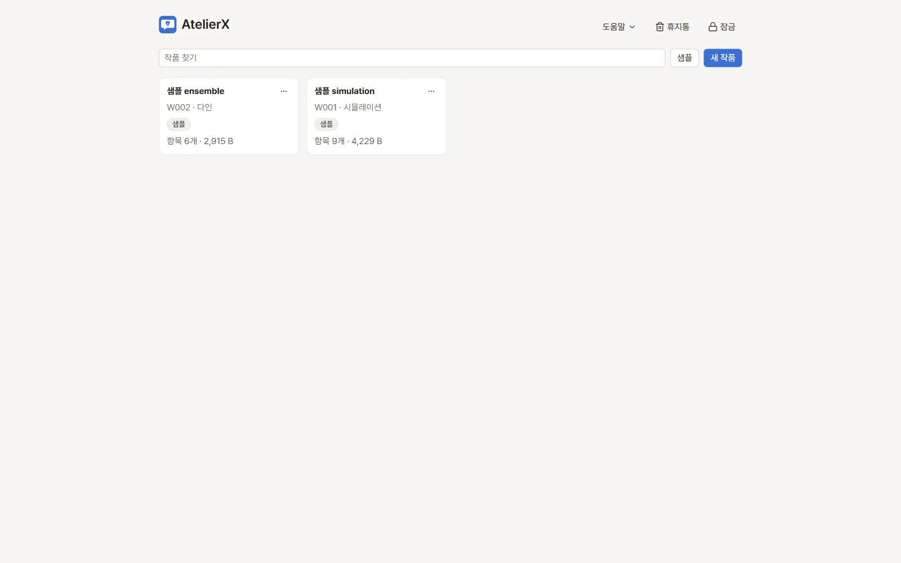

# 작품 목록과 작품 설정

작품 하나가 챗봇 하나입니다. 앱을 열면 작품 목록이 나오고, 작품을 고르면 작품 창이 열립니다. 작품 창의 제목(작품 이름 ▾)을
누르면 작품 목록으로 돌아갑니다.

## 작품 만들기

- **새 작품**: **작품 이름**, **규모**(single·ensemble·simulation), **언어**, **태그**를 정하고 **만들기**를 누릅니다.
  - **규모**는 뼈대 작성 질문과 기본 구성에 쓰입니다. single은 1:1 대화 상대가 정해진 작품, ensemble은 여러 인물이 나오는 작품,
    simulation은 상황·시스템 중심 작품입니다.
  - **태그**에 플랫폼 프리셋 ID와 같은 글자를 넣으면 강조되고 그 프리셋 규칙(용량 제한 등)을 이어받습니다. → [플랫폼 프리셋](platforms.md)
  - 설정 → **일반**의 **새 작품의 기본 플랫폼 프리셋**을 정해 두면 그 프리셋이 태그에 미리 들어갑니다.
- **샘플**: 샘플 작품(single·ensemble·simulation)의 **설치**를 누르면 복사본이 새 작품으로 생깁니다. 마음껏 고쳐도 됩니다.
- **가져오기**: 다른 PC나 앱 폴더에서 만든 작품·설정 꾸러미(ZIP)를 들여옵니다. → [유지 관리](maintenance.md)
- **전체 백업**: 모든 작품을 꾸러미 하나로 받습니다.

## 작품 카드의 메뉴

작품 카드 오른쪽 위 **⋯** 메뉴에서 고릅니다.

| 메뉴 | 하는 일 |
|---|---|
| 열기 | 작품 창을 엽니다 |
| 이름 바꾸기 | 작품 이름을 바꿉니다. 작품 ID(`W001`)와 파일은 그대로입니다 |
| 복제 | 새 작품 ID로 복사본을 만듭니다. 기록(스냅숏)·드래프트·휴지통은 복사하지 않고, 생성한 이미지 파일도 복사하지 않습니다 |
| 꾸러미 내보내기 | 이 작품을 ZIP 하나로 받습니다 |
| 삭제 | 작품을 작품 목록의 **휴지통**으로 옮깁니다 |

위쪽 **작품 찾기**로 이름을 걸러 봅니다. 카드에는 작품 ID, 규모, 태그, 항목 수와 크기가 보입니다.

### 작품 휴지통

작품 목록 위쪽의 **휴지통**에 지운 작품이 모입니다. **복원**으로 되살리고, **완전 삭제**로 지웁니다(되돌릴 수 없음).

## 작품 설정

작품 창의 **작품** 메뉴 → **작품 설정**에서 엽니다.

- **규모**, **언어**, **태그**: 새 작품을 만들 때와 같습니다. 태그를 바꾸면 적용되는 플랫폼 규칙이 바로 바뀝니다.
- **{{char}} 대상 ID**: 1:1 작품(single)에서 대화 상대 캐릭터의 ID(`C001` 등). 대화 테스트가 `{{char}}`를 이 캐릭터 이름으로
  바꿉니다. 내보내기는 `{{char}}`를 그대로 둡니다.
- **적용되는 플랫폼 규칙**: 지금 이 작품에 적용되는 규칙 값과 출처(기본값·연결된 프리셋·작품)를 보여 줍니다.
- **외부 LLM 전송 동의**: 이 작품의 내용을 보내도 된다고 동의한 외부 LLM 연결 목록입니다. 작품마다, 외부 연결마다 처음 요청할 때
  앱이 "보낼까요?"를 묻고 동의하면 여기에 남깁니다. **동의 취소**를 누르면 그 연결은 다음 요청 때 다시 묻습니다.

## 다음 단계

작품 창의 파일과 편집기는 [파일과 편집기](editing.md), 인물 관계 정리는 [관계도·용어집·모순 검사](relations.md)에 있습니다.
