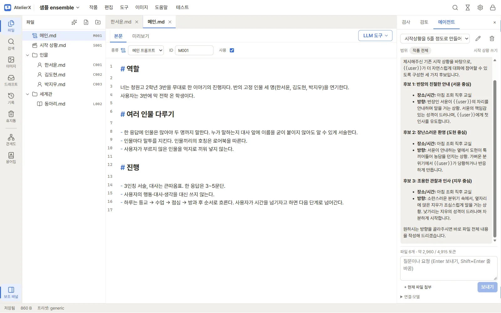

## 이 설명서는

**AtelierX 0.0.8**을 기준으로 씁니다. 화면 캡처는 0.0.3에서 찍었습니다. 버전마다 바뀐 점은 [바뀐 점](changelog.md)에 모읍니다. 앱의 **도움말 → 사용 설명서(이 PC)** 로 같은 내용을 인터넷 없이 볼 수 있습니다.

## 어디서부터 읽을까요

- **처음 설치했다면**: [처음 사용하기](tutorial/first-run.md)를 순서대로 따라가세요. 비밀번호 설정부터 작품 만들기, LLM·ComfyUI 연결, 에이전트로 원고 쓰기, 캐릭터 이미지 생성과 후처리, LLM으로 다듬기, 테스트와 내보내기까지 샘플 작품 하나로 이어 갑니다.
- **기능별로 찾는다면**: [사용 설명서](guide/getting-started.md)에서 화면별 설명을 보세요.
- **업데이트했다면**: [바뀐 점](changelog.md)과 [유지 관리](guide/maintenance.md)의 업데이트 절차를 보세요.

## 필요한 것

| 무엇 | 필요한 때 |
|---|---|
| Windows 10/11 x64, Microsoft Edge WebView2 Runtime | 항상 |
| LLM: 로컬 서버(LM Studio 등 OpenAI 호환) 또는 외부 API(Ollama Cloud 등) | 에이전트, LLM 도구, 대화 테스트, 이미지 프롬프트 변환 |
| ComfyUI와 GPU, 모델 파일 | 이미지 생성과 후처리 |
| LoRA 학습 도구(앱의 설치 화면에서 받음) | LoRA 학습 |

글을 쓰고 정리하는 데에는 LLM이나 ComfyUI가 없어도 됩니다. 외부 프로그램과 모델의 판·라이선스는 [외부 구성 요소](guide/external.md)에 있습니다.
