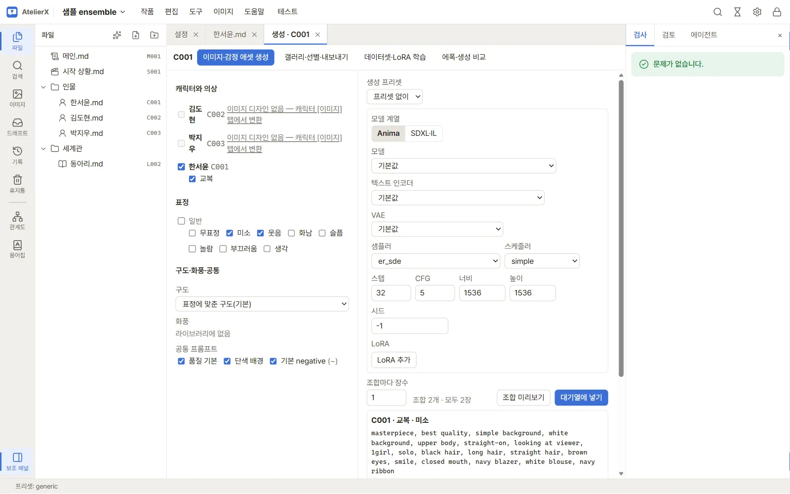

# 6. 캐릭터 이미지 만들기

캐릭터 파일의 외모·의상 설명을 이미지 프롬프트로 바꾸고, 표정 조합을 정해 ComfyUI로 생성한 뒤 갤러리에서 검수합니다. 이 장에서는 샘플의 **한서윤**(`C001`)으로 진행합니다.

## 이미지 프롬프트 만들기

1. `인물/한서윤.md`를 열고 **이미지 프롬프트** 탭을 누릅니다.
2. **다시 변환**을 누르면 LLM이 본문의 외모·의상 설명을 이미지 태그로 바꿉니다. 결과는 검토 탭으로 갑니다(8장에서 자세히 다룹니다).
3. 외모와 의상(교복 등)마다 태그가 정리되어 보입니다. **트리거**는 LoRA 학습에 쓰는 캐릭터 이름표입니다.

## 생성하기

1. **이미지·감정 애셋 생성**을 누르면 생성 화면이 열립니다(상단 메뉴 **이미지 → 생성**에서도 열 수 있습니다).

2. 왼쪽에서 캐릭터와 의상, **표정**(무표정, 미소, 웃음 …), 구도·공통 프롬프트를 고릅니다. 오른쪽에서 그림체 프리셋(artist 태그가 함께 채워짐), 모델 계열, 모델, 샘플러, 스텝, 크기, 시드, LoRA를 정합니다.
3. **조합 미리보기**로 실제로 보낼 프롬프트를 확인합니다. 아래 "조합 2개 · 모두 2장"처럼 만들 장수가 보입니다.

4. **대기열에 넣기**를 누릅니다. 알림의 **생성 대기열**을 누르면 진행 상황이 보입니다. 이미지 생성과 후처리, LoRA 학습은 GPU를 차례로 나눠 씁니다.

## 검수하기

1. 상단 메뉴 **이미지 → 갤러리·검수**를 엽니다. 왼쪽에서 작품·캐릭터·의상별로 거르고, 위쪽에서 표정·내 판정·AI 판정으로 거릅니다.

2. 이미지를 누르면 크게 보입니다. **통과**(키 1)·**실패**(키 2)·**미검수**(키 3)로 판정하고, **새 시드로 다시 생성**(R)할 수도 있습니다. 오른쪽에 프롬프트와 생성 설정이 기록되어 있습니다.

3. **통과**한 이미지가 그 조합(캐릭터·의상·표정)의 **채택** 이미지(★)가 됩니다. 조합마다 하나만 채택되며, 다른 이미지를 통과시키면 채택이 그 이미지로 바뀝니다. 채택 이미지는 **채택 이미지 내보내기**와 LoRA 데이터셋에 쓰입니다. AI 판정(자동 검수)은 참고용이고, 채택은 사람이 통과를 눌러야 합니다.

자세한 내용: [캐릭터 이미지 설계](../guide/character-images.md), [이미지 생성](../guide/generation.md), [갤러리와 내보내기](../guide/gallery-export.md)

## 다음

[7. 후처리](post-processing.md)
