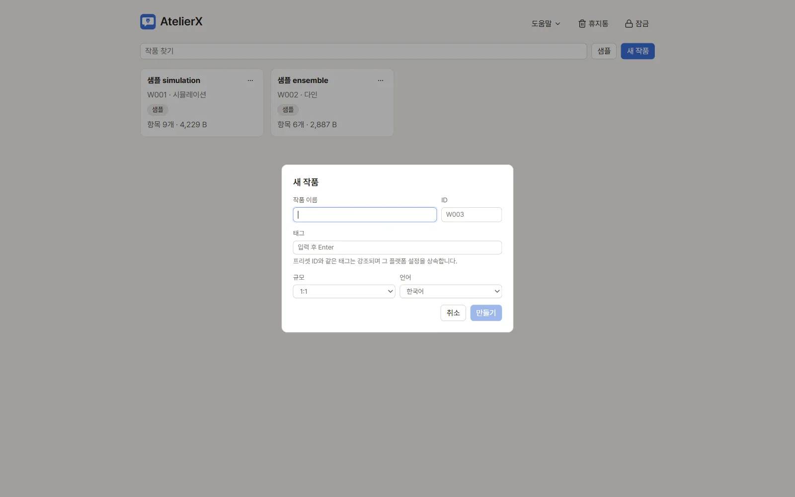

# 2. 작품 만들기

작품 하나가 챗봇 하나입니다. 이 장에서는 샘플 작품을 설치해 화면 구성을 익힙니다. 빈 작품으로 시작하는 방법도 함께 봅니다.

## 샘플 설치하기

1. 작품 목록 위쪽의 **샘플**을 누릅니다.
2. **ensemble**(여러 인물이 나오는 학원물) 옆의 **설치**를 누릅니다. 샘플은 복사본으로 설치되므로 마음껏 고쳐도 됩니다.

3. 작품 목록에 **샘플 ensemble** 카드가 생깁니다. 카드를 눌러 엽니다.

## 작품 창 둘러보기

- **왼쪽 활동 막대**: 파일, 검색, 이미지, 드래프트, 기록(스냅숏), 휴지통, 관계도, 용어집. → [기록과 휴지통](../guide/history.md), [관계도·용어집·모순 검사](../guide/relations.md)
- **파일 트리**: 작품 폴더의 파일. 오른쪽 글자(`M001`, `C001` …)는 파일의 ID입니다. 파일 종류는 아이콘으로 구분합니다(메인 프롬프트, 시작 상황, 등장인물, 로어북 …).
- **편집기**: 위쪽 폼에서 종류·ID·키워드·사용 여부를 정하고, 아래에 본문을 씁니다. 자동 저장을 켜지 않았다면 `Ctrl+S`로 저장합니다.
- **상단 메뉴**: 작품, 편집, 도구, 이미지, 도움말. **테스트**는 대화 테스트 화면으로 바꿉니다.
- **오른쪽 보조 패널**: 검사(규칙·용량 문제 → [검사 패널](../guide/editing.md)), 검토(LLM 결과 대기열 → [드래프트와 검토](../guide/ai-tools.md)), 에이전트.

캐릭터 파일은 본문 외에 **이미지 프롬프트**와 **이미지 갤러리** 탭이 더 있습니다.

## 빈 작품으로 시작하려면

작품 목록의 **새 작품**에서 이름, ID, 태그(플랫폼 프리셋과 같은 태그는 그 규칙을 상속), 규모(1:1·다인·시뮬레이션), 언어를 정하고 **만들기**를 누릅니다. 규모에 맞는 빈 파일 구성이 만들어집니다.

## 다음

[3. LLM 연결](connect-llm.md)
