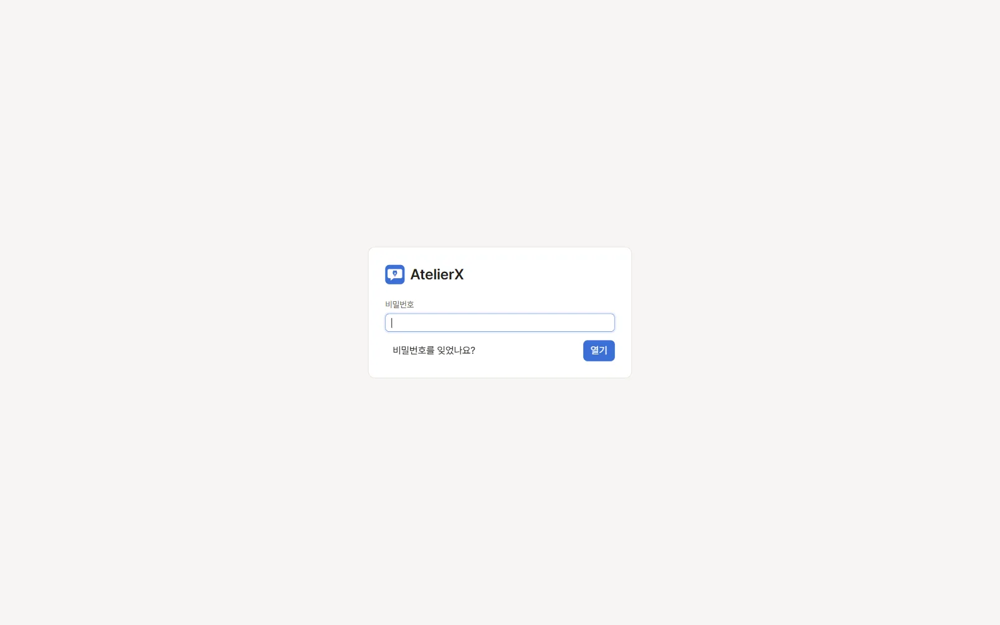

# 1. 설치와 첫 실행

이 튜토리얼은 앱에 들어 있는 **샘플 ensemble** 작품으로 처음부터 끝까지 따라 합니다. 비밀번호 설정 → 작품 만들기 → LLM·이미지 연결 → 에이전트로 원고 쓰기 → 캐릭터 이미지 생성과 후처리 → LLM으로 다듬기 → 테스트와 내보내기 순서입니다. 이 장에서는 앱을 풀고 처음 실행해 마스터 비밀번호를 정합니다.

## 준비

- Windows 10/11 x64 PC
- [릴리스 페이지](https://github.com/kiritype/AtelierX/releases/latest)의 `AtelierX-<버전>-windows-x64.zip`
- Microsoft Edge WebView2 Runtime(Windows 11에는 보통 이미 있습니다)

## 따라 하기

1. ZIP을 쓰기 가능한 새 폴더에 **모두** 풉니다. 예: `D:\Apps\AtelierX`. `Program Files`처럼 쓰기가 막힌 폴더는 피합니다.
2. 폴더의 `AtelierX.exe`를 실행합니다. `AtelierX.exe`와 `_internal` 폴더는 같은 자리에 있어야 합니다.
3. 첫 실행 화면에서 **언어**를 고르고, **마스터 비밀번호**와 **비밀번호 확인**을 입력한 뒤 **시작**을 누릅니다.

4. 작품 목록이 열립니다. 다음 실행부터는 잠금 화면에서 이 비밀번호를 입력합니다.

## 알아 둘 것

- 마스터 비밀번호는 앱을 열고, LLM API 키 같은 인증 정보를 암호화하는 데 씁니다. 잊으면 저장한 키를 되살릴 수 없습니다(작품 파일은 그대로 남습니다).
- 앱은 실행 파일 옆의 `config`, `state`, `data`, `output` 폴더에 모든 것을 저장합니다. 백업이나 다른 PC로 옮길 때 이 네 폴더를 함께 옮깁니다.
- 실행 중 잠깐 자리를 비울 때는 오른쪽 위 자물쇠(또는 `Ctrl+Shift+L`)로 잠급니다.

## 다음

[2. 작품 만들기](create-work.md)
