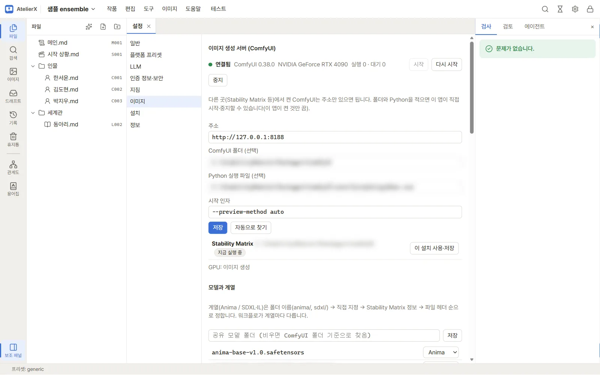
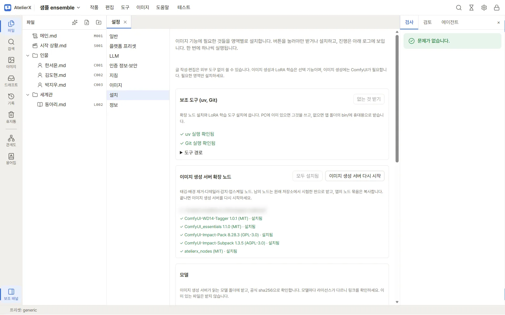

# 4. 이미지 환경 준비

캐릭터 이미지 생성과 후처리는 ComfyUI로 합니다. 이 장에서는 ComfyUI를 연결하고, 필요한 확장 노드·모델·보조 도구를 앱의 설치 화면에서 받습니다. 글만 쓸 거라면 이 장과 6·7장은 건너뛰어도 됩니다.

> ComfyUI 없이 NovelAI나 PixAI로만 이미지를 만들 수도 있습니다. 그렇다면 이 장 대신 [인터넷 이미지 서비스](../guide/image-services.md)에서 키를 등록하고 6장으로 넘어가세요(후처리·LoRA 학습은 ComfyUI가 필요합니다).

## 준비

- NVIDIA GPU가 있는 PC와 설치된 ComfyUI(Stability Matrix로 설치한 것도 됩니다). AtelierX는 ComfyUI를 함께 배포하지 않습니다.

## ComfyUI 연결

1. 설정 → **이미지**를 엽니다.
2. ComfyUI **주소**(기본 `http://127.0.0.1:8188`)를 확인합니다. 앱에서 ComfyUI를 켜고 끄려면 **ComfyUI 폴더**와 **Python 실행 파일**을 지정하거나 **자동으로 찾기**를 누릅니다.
3. **저장**하고 **시작**(또는 이미 켜져 있으면 연결 확인)을 누릅니다. 위쪽에 **연결됨**과 ComfyUI 버전, GPU 이름이 보이면 됩니다.
4. 아래 **모델과 계열**에서 모델마다 계열(Anima / SDXL·IL)을 확인합니다. 계열에 따라 워크플로가 다릅니다.

## 필요한 것 받기

1. 설정 → **설치**를 엽니다. 영역마다 버튼이 있고, 한 번에 하나씩 실행됩니다.
2. **보조 도구 (uv, Git)**: PC에 없으면 **없는 것 받기**로 앱 폴더에 받습니다.
3. **이미지 생성 서버 확장 노드**: **모두 설치**로 태깅·배경 제거·디테일러·업스케일에 필요한 노드를 받고, **이미지 생성 서버 다시 시작**을 누릅니다.
4. **모델**: 감지·업스케일 모델을 받습니다. 모델마다 라이선스가 다르니 링크를 확인하세요(일부는 비상업 조건).

## 확인

설치 화면의 각 항목에 초록 체크(설치됨)가 보이면 준비가 끝났습니다. 받은 판과 라이선스는 [외부 구성 요소](../guide/external.md)에 정리되어 있습니다.

자세한 내용: [이미지 환경 준비](../guide/image-setup.md)

## 다음

[5. 에이전트로 원고 쓰기](write-with-agent.md)
