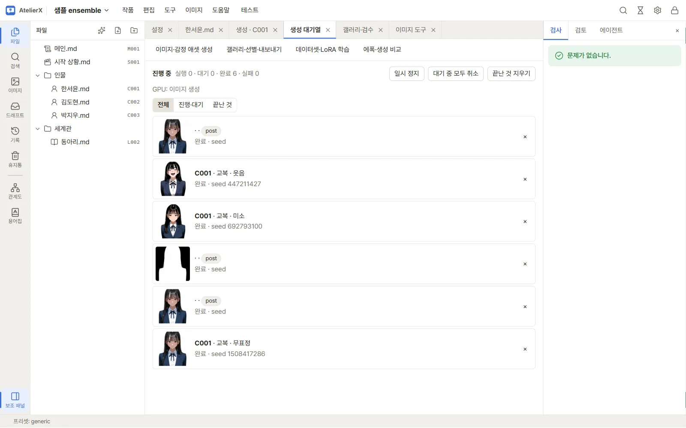

# 7. 후처리

생성한 이미지를 업스케일하거나 디테일러로 얼굴·손을 다듬고, 배경을 지우거나 검열 처리합니다. 모두 상단 메뉴 **이미지 → 이미지 도구**에서 합니다.

## 따라 하기

1. **이미지 → 이미지 도구**를 엽니다. 왼쪽 목록에 작업할 이미지가 있습니다. 갤러리 이미지는 **갤러리** 배지가 붙고, 다른 이미지는 **파일·ZIP 올리기**로 넣을 수 있습니다.
2. 이미지를 누르면 가운데에 원본과 결과가 **나란히**(또는 **겹쳐 밀기**) 보이고, 아래에 프롬프트와 생성 설정이 나옵니다.

3. 처리할 이미지의 체크 상자를 고르고, 아래 도구 탭에서 **후처리**를 누릅니다.
4. **작업**에서 **업스케일** 또는 **디테일러**를 고릅니다. 업스케일은 모델과 **최종 배율**을 정합니다.
5. **선택한 1장 처리**를 누릅니다. 생성 대기열을 함께 쓰므로, 생성 중이면 끝난 뒤에 실행됩니다.

6. 결과는 원본 옆(같은 표정 폴더)에 저장되고 생성 대기열과 갤러리에 보입니다. 갤러리에서 결과 이미지를 **통과**시키면 그 조합의 채택 이미지가 후처리한 것으로 바뀝니다.

## 그 밖의 도구

| 탭 | 하는 일 |
|---|---|
| 프롬프트 형식 | 다른 도구의 프롬프트 형식을 바꿔 적기 |
| WebP 변환 | 배포용 WebP로 줄이기(메타데이터 지우기 선택) |
| 태깅 | WD14로 이미지의 태그 읽기 |
| 검열 | 감지 모델로 가릴 부분 처리 |
| 배경 제거 | 투명 배경 만들기(업스케일 뒤에 하세요) |
| 인페인트 | 마스크를 그려 일부만 다시 그리기 |

도구마다 쓰는 법: [이미지 도구와 후처리](../guide/image-tools.md)

## 다음

[8. LLM으로 다듬기](refine-with-llm.md)
