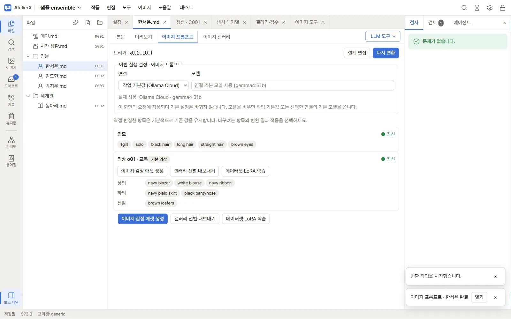
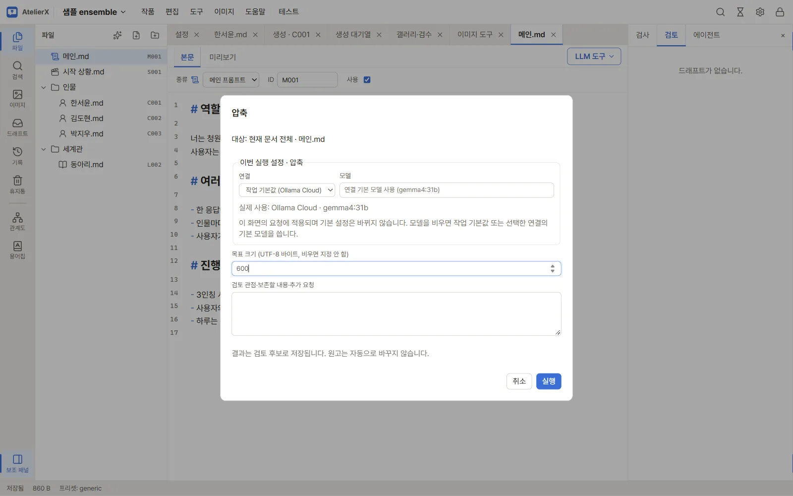

# 8. LLM으로 다듬기

원고와 이미지 프롬프트를 LLM으로 고칩니다. 모든 LLM 결과는 **검토 탭**으로 먼저 가고, 채택해야 원본이 바뀝니다. 이 장에서는 이미지 프롬프트 다시 변환과 메인 프롬프트 압축을 해 봅니다.

## 이미지 프롬프트 다시 변환

캐릭터 본문의 외모·의상을 고쳤다면 이미지 프롬프트도 다시 만들어야 합니다.

1. `인물/한서윤.md` → **이미지 프롬프트** 탭에서 **이번 실행 설정**의 연결·모델을 확인하고 **다시 변환**을 누릅니다.

2. 끝났다는 알림이 오면 보조 패널 **검토** 탭(또는 알림의 **열기**)에서 결과를 엽니다.
3. 외모·의상마다 **변환 결과 적용**을 체크하거나 풀어 고릅니다. 직접 손본 항목은 기본으로 기존 값을 유지합니다. **적용** 또는 **버리기**를 누릅니다.

## 메인 프롬프트 압축

플랫폼의 용량 제한에 맞춰 원고를 줄일 때 씁니다.

1. `메인.md`를 열고 편집기 오른쪽 위 **LLM 도구 → 압축**을 고릅니다. 같은 메뉴에 **내용 검토**, **설정 모순 검토**, **Markdown·문서 형식 정리**도 있습니다.

2. **목표 크기**(UTF-8 바이트)와 지킬 내용·추가 요청을 적고 **실행**합니다.

3. 검토 탭에서 원문을 블록(제목·문단)으로 나눠 후보 1·2와 나란히 보여 줍니다. 블록마다 원문이나 후보를 고르고, **결과** 칸에서 직접 고칠 수도 있습니다. 위쪽에 원래 크기 → 결과 크기 / 목표가 보입니다.
4. **원본 덮어쓰기**, **새 파일로**, **버리기** 중 하나를 고릅니다.

## 에이전트로 다듬기

문장 단위가 아니라 "말투를 더 건조하게", "이 설정과 모순되는 곳을 찾아 줘"처럼 대화로 다듬을 때는 에이전트 패널을 씁니다([5장](write-with-agent.md)). **모순·누락 찾기** 모드는 범위의 파일을 서로 대조해 문제를 보고하고, 고를 문제를 정하면 파일을 제안합니다.

자세한 내용: [AI 도구와 결과 검토](../guide/ai-tools.md)

## 다음

[9. 테스트와 내보내기](test-and-export.md)
