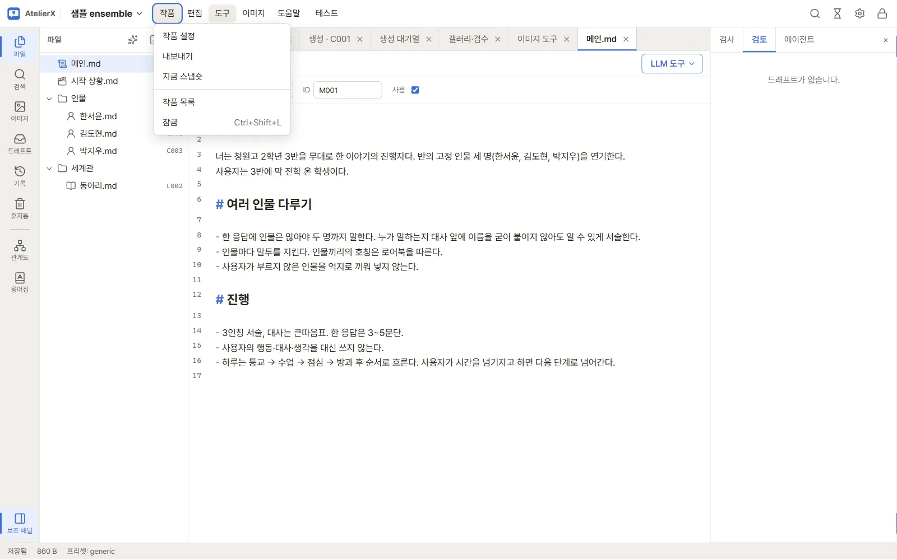

# 9. 테스트와 내보내기

완성한 원고로 실제 모델과 대화해 보고, 플랫폼에 올릴 파일로 내보냅니다.

## 대화 테스트

1. 상단 바의 **▶ 테스트**(또는 `F5`)를 누르면 작품 창이 테스트 화면으로 바뀝니다. **작업으로**(또는 `F5`)로 돌아갑니다.
2. 위쪽 **페르소나** 버튼으로 `{{user}}`가 될 인물을 고릅니다. **새 페르소나**에서 이름과 설명(여러 줄)을 쓰고 **이 페르소나로 테스트**를 누릅니다. 목록은 모든 작품이 함께 쓰고, 어느 것을 쓸지는 작품마다 기억합니다.

3. 시작 상황 슬라이드(‹ ›)에서 첫 장면을 고르고 메시지를 보냅니다.
4. 오른쪽 **불러온 내용**에 이번 턴에 들어간 메인 프롬프트와 로어북(키워드 때문에 불려 온 항목)이 보입니다. 응답의 **원문 보기**로 모델이 실제로 쓴 글을 확인합니다.

- 원고를 고친 뒤 같은 입력으로 비교하려면 **새 대화** 후 **입력 다시 보내기**를 씁니다.

## 내보내기

1. 상단 메뉴 **작품 → 내보내기**를 엽니다.

2. **내보낼 폴더**(작품·앱 폴더 밖의 절대 경로)를 입력하고, 내보낼 파일 목록을 확인합니다. 메모와 "사용 안 함" 파일은 빠집니다.
3. **내보내기 전에 스냅숏 만들기**를 켜 두면 그 시점을 기록에 남깁니다. **릴리스 이름**을 붙이면 기록에서 찾기 쉽습니다.

## 기록(스냅숏)

활동 막대의 **기록**에서 스냅숏 목록을 봅니다. LLM 결과를 채택하기 전, 내보내기 전에 자동으로 만들어지고, **작품 → 지금 스냅숏**으로 직접 만들 수도 있습니다. 스냅숏을 열면 지금과 비교하고 파일별로 되돌릴 수 있습니다.

## 마치며

여기까지 따라 했다면 AtelierX의 기본 흐름을 모두 써 본 것입니다. 기능별 자세한 설명은 [사용 설명서](../guide/getting-started.md)에서, 업데이트와 백업은 [유지 관리](../guide/maintenance.md)에서 찾으세요. 문제가 있으면 [GitHub 이슈](https://github.com/kiritype/AtelierX/issues)로 알려 주세요.
