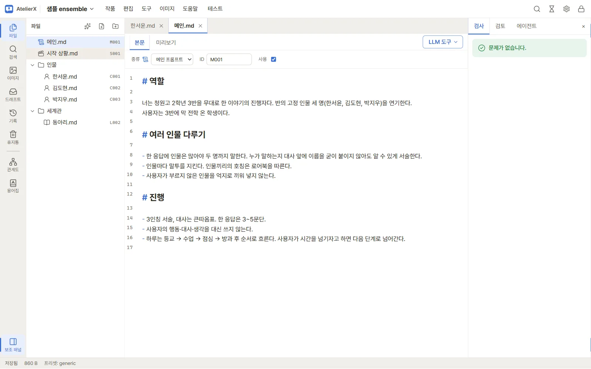
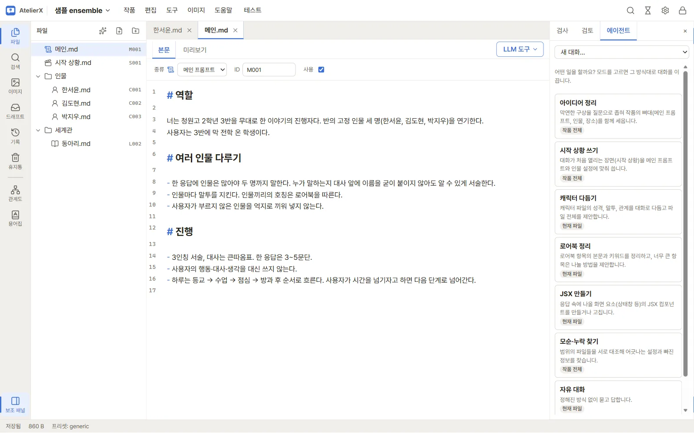
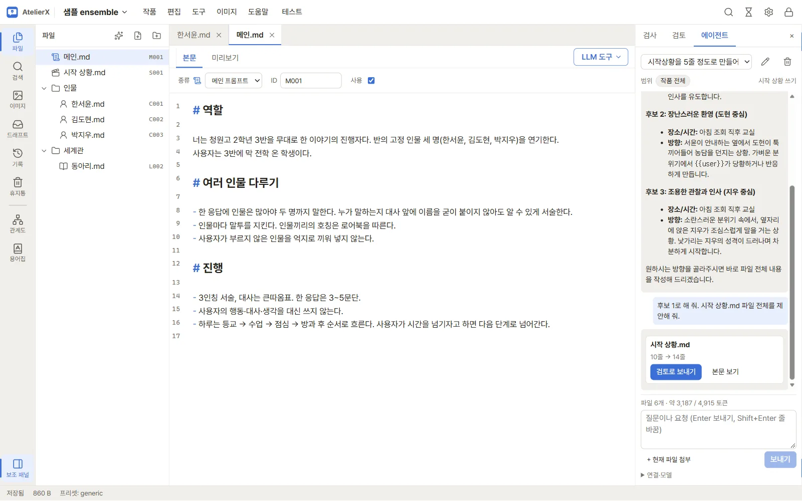
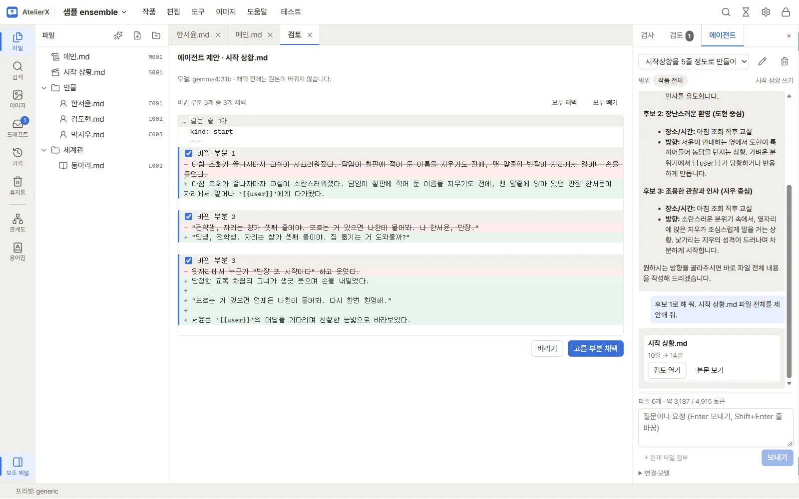
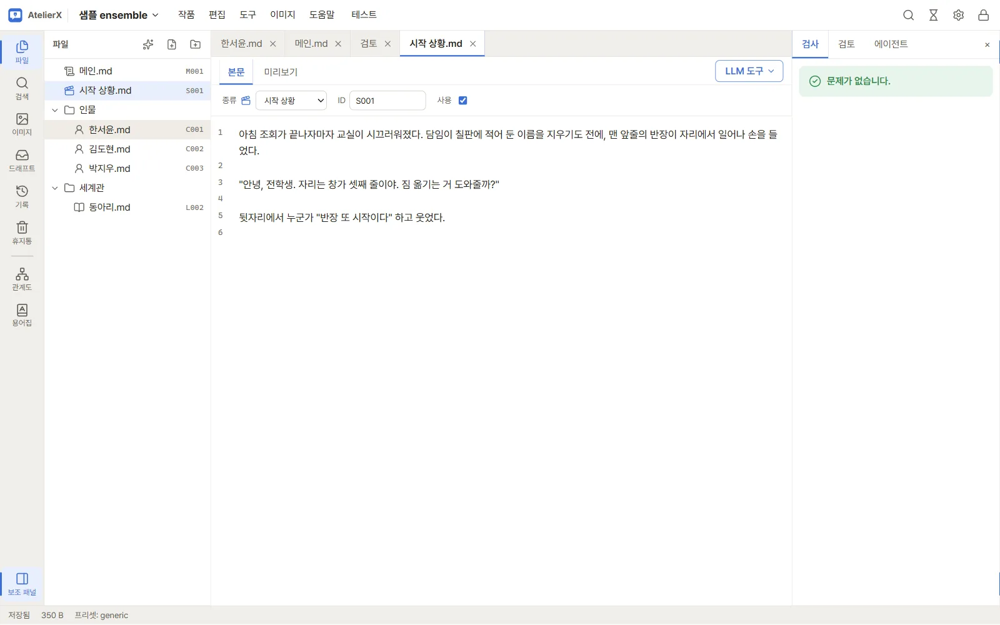
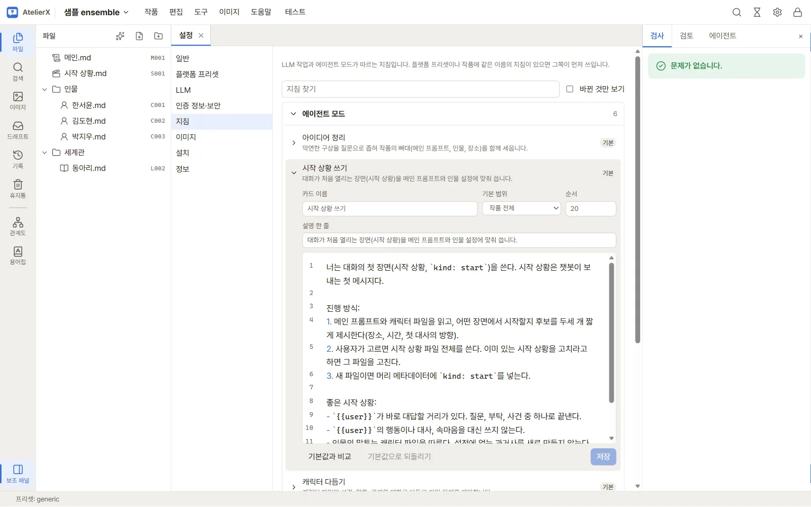

# 5. 에이전트로 원고 쓰기

메인 프롬프트와 캐릭터, 시작 상황을 LLM 에이전트와 대화하며 씁니다. 에이전트는 파일을 직접 고치지 않습니다. 새 내용 전체를 **제안**하면, 내가 바뀐 부분을 보고 골라 채택합니다. 이 장에서는 샘플의 시작 상황을 에이전트로 다시 써 봅니다.

## 메인 프롬프트와 캐릭터 살펴보기

먼저 파일 트리에서 `메인.md`(이야기의 규칙)와 `인물/한서윤.md`(캐릭터)를 열어 봅니다. 캐릭터 파일은 **식별·성격·외모·의상** 같은 제목으로 나뉩니다. 외모와 의상은 6장에서 이미지 프롬프트로 바뀝니다. 직접 고쳐도 되고, 아래처럼 에이전트에게 맡겨도 됩니다.

## 따라 하기

1. 오른쪽 보조 패널(없으면 활동 막대 아래 **보조 패널**)에서 **에이전트** 탭을 누릅니다.
2. 모드 카드 중 **시작 상황 쓰기**를 고릅니다. 카드 아래 배지는 기본 범위(작품 전체 / 현재 파일)입니다.

3. 요청을 쓰고 Enter로 보냅니다. 예: "시작 상황을 5줄 정도로 만들어 줘. 대화 포함". 입력창 위에 함께 보낼 파일 수와 토큰 양이 보입니다.
4. 에이전트가 장면 후보를 제시하면, 마음에 드는 쪽을 골라 다시 요청합니다. 예: "후보 1로 해 줘. 시작 상황.md 파일 전체를 제안해 줘."

5. 응답에 **제안 카드**(파일 경로와 줄 수 변화)가 나오면 **검토로 보내기**를 누릅니다.

6. 검토 탭에서 원본과 제안의 차이가 **바뀐 부분**마다 나뉘어 보입니다. 채택할 부분만 체크하고 **고른 부분 채택**을 누릅니다. 채택 직전에 스냅숏이 만들어지므로 언제든 되돌릴 수 있습니다.

7. 파일에 고른 부분만 반영됩니다.

## 팁

- 편집기에서 글을 고르고 `Ctrl+L`을 누르면 그 줄이 대화에 첨부됩니다. "이 부분 말투를 바꿔 줘"처럼 짚어 말할 때 씁니다.
- **범위**를 눌러 대화에 함께 보낼 파일을 정합니다(작품 전체 / 파일 고르기). 범위가 클수록 모델의 맥락 길이를 많이 씁니다.
- 모드의 대화 방식은 설정 → **지침**에서 고치거나 새 모드를 만들 수 있습니다.

자세한 내용: [에이전트 패널](../guide/agent.md)

## 다음

[6. 캐릭터 이미지 만들기](character-images.md)
